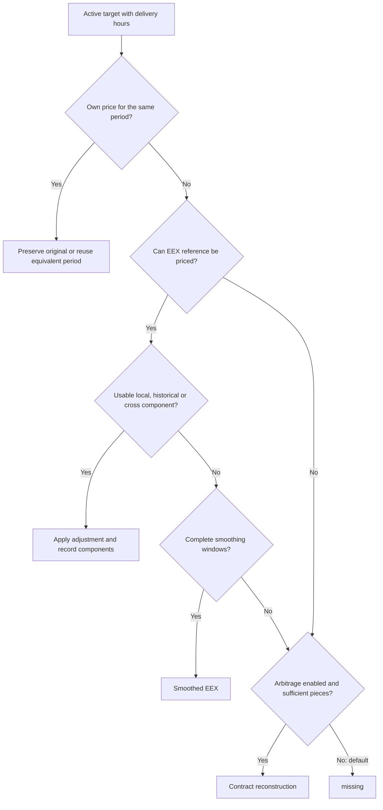

# Power curve filling algorithm


[Output dictionary](OUTPUT.md) · [Diccionario en español](OUTPUT.es.md)
[Versión en español](ALGORITMO.md)

How a complete product curve (for example DE Base) is generated each day from **your VWAPs**,
which cover only some contracts, and **EEX settlements**, which provide much of the curve.

> Section 0 contains teaching examples with explicit assumptions. Older numerical tables later
> in this document came from a run using DE Base on 29 September 2026 and synthetic VWAPs;
> they have not been recalculated. None demonstrates predictive accuracy on real data:
> explanations of the mechanics must be distinguished from validated backtest results.

---

**Quick navigation:** [cases step by step](#09-every-case-explained-step-by-step) · [complete configuration](#14-complete-configuration-reference-what-controls-each-decision) · [audit a row](#12-auditing-a-row).

## What to configure and what to leave at its initial value

The 58 entries in `config.toml` are not 58 parameters you must optimize: 19 are paths,
column names and time zones. For a first run, review paths, identity mappings and target
tenors, and keep the `auto` calculation mode. The `correlation`, `cross` and `arbitrage` layers stay
disabled. Advanced controls are documented so changes are deliberate and auditable,
not because every setting needs manual tuning. By default, `tune` compares only `auto`,
`ratio` and `additive`; expanding the grid to its other five controls requires explicit
options. All other TOML settings remain fixed.

**Fallback change:** without usable own adjustments, EEX is smoothed over complete publication windows; it is never copied directly as the fallback. Section 16 explains averages, monthly cascading, controls and audit.

**Shape layer:** section 17 and [SHAPE.md](SHAPE.md) document the implemented optional stage after refill. The cases and formulas below describe the pre-shape calculation (also the final result with default `shape.mode="off"`). Raw input is always retained; final original prices may move only with explicit `shape.adjust_originals=true`. Active shape adds its own trace and before-values.

## 0. Understand the product before reading the formulas

### 0.1. The problem it solves

Imagine your price table contains M+1, M+2 and M+4 on a date, but M+3 is absent. The gap is
**a missing row**, not necessarily an empty cell. The program reconstructs target points
using own prices and a comparable EEX reference. Estimates always remain identified as
estimates; they never become trades.

A curve belongs to a date and an exact **product + region + unit** identity.
`Base load / DE / EUR/MWh` and `Base load / GB / GBP/MWh` are independent curves: prices are
not pooled and currencies are not converted. The mapping controls scope and EEX sources.
New mapping rows start disabled: review and explicitly activate `fill` or `helper`, with an
assigned EEX file.

There are two views: a **calculated curve**, with one point per target, and the **enriched
input**, containing originals, added rows and trace information. Consume prices from
`curve_price`; `data_origin` distinguishes `original`, `estimated` and `missing`, and
`estimation_method` explains the estimate. An invalid original VWAP is not overwritten:
any estimate belongs in `curve_price`.

| Term | Business meaning |
|---|---|
| Target or tenor | Delivery period to value, such as next month, M+1 |
| Gap | Unobserved price: an absent row or unusable original value |
| Anchor | Own observation comparable with EEX that passes the filters for measuring a difference |
| Adjustment or basis | Own difference from EEX: a percentage in ratio, price units in additive |
| Local | What anchors on this date say, giving nearby anchors more influence |
| History | Memory of earlier differences; not copying yesterday's price |
| Local weight `w` | Share of the local adjustment versus its fallback; not a probability of being correct |
| Strip | Compose a period from pieces that cover its hours exactly |
| Residual | Infer one part by subtracting another known part from the full period |

Section 14 covers **all of `config.toml`**, defaults and effects of changing them. Sections
1–13 develop the formulas, files and audit procedure.

### 0.2. One date, one curve and three different outcomes

Teaching example for `Base load / DE / EUR/MWh`, using default layers:

| Tenor | Own input | Reference | Result |
|---|---:|---:|---|
| M+1 | 105 | EEX 100 | 105, `original`: own price is preserved |
| M+2 | Absent row | EEX 120 | 125.28, `estimated`, under the weight/history assumptions in the next section |
| M+3 | Absent row | No EEX or sufficient contract combination | `missing`: no invented price |

The 105 may help other points if it passes the filters. Preserving an original and allowing
it to influence estimates as an anchor are separate decisions: zero, negative values or
low volume do not remove the original, although they may exclude it from estimating others.

### 0.3. The same explanation with numbers: how much today and how much history

Assume an own anchor **105** against **EEX 100**, target **EEX 120**, aggregate local evidence
**W=4** and `shrink_k=1`: `w=W/(W+k)=4/5=0.8`. W depends on anchor weights;
**4 is a teaching assumption, not a fixed program value**. Cross is disabled.

In **ratio**, the anchor says `105/100−1=0.05`: +5%. If current, permitted history says +2%,
the blend is `0.8×5% + 0.2×2%=4.4%`. Price: **`120×1.044=125.28`**.

In **additive**, the anchor says `105−100=5` units. If current, permitted additive history
is +2, the blend is `0.8×5 + 0.2×2=4.4`. Price: **`120+4.4=124.4`**. Percentages are not added
to prices: the modes maintain separate memories and statistics.

| Permitted evidence | Ratio | Additive |
|---|---:|---:|
| Apply the entire anchor without shrinkage: teaching comparison | `120×1.05=126` | `120+5=125` |
| Local W=4 + history, k=1: implemented calculation for this example | **125.28** | **124.4** |
| Local W=4 without history: zero adjustment fallback | `120×(1+0.8×0.05)=124.8` | `120+0.8×5=124` |
| No anchors, only permitted history | `120×1.02=122.4` | `120+2=122` |
| No usable local, historical or cross adjustment | Smoothed EEX fallback in section 16; without a window, optional arbitrage/missing | Same: ratio/additive does not transform this fallback |

Copying one known month's entire factor therefore does not always describe the calculation.
`shrink_k` reduces the local adjustment. As W increases relative to k, the result approaches
the full local adjustment. Without history, w is not forced to 1: the remaining share goes
to a zero adjustment. Enabled cross contributes to the fallback before blending.

### 0.4. Nine situations for interpreting prices

These are case families, not nine mandatory steps. Auto selection in row 8 operates within
cases that use EEX.

| Case | Available information | Program behavior | What to review |
|---|---|---|---|
| 1. Valid original | Numeric, finite own VWAP | Preserves its price, including zero/negative | It may be excluded as an anchor. Zero-hour delivery receives no calculated curve price, but its original is preserved |
| 2. Gap with today's anchors | EEX and admissible observations | Blends local adjustment with permitted history/cross, or zero | Mode, weight, anchors, filters and EEX age |
| 3. Gap with history | EEX, no local adjustment, current/permitted memory | Applies memory; optional cross may contribute | Memory precedes the date and has not expired |
| 4. EEX reference only | EEX, no usable adjustment | Smooths EEX over complete windows; otherwise optional arbitrage/missing | Historical prices/spreads; not a copy of the latest settlement |
| 5. Exact EEX quote absent | Sufficient EEX pieces | Constructs EEX by strip/residual, then applies adjustment logic | Hour coverage and residual amplification |
| 6. EEX cannot be obtained | Sufficient own or already calculated contracts | With `arbitrage=true`, constructs by strip/residual | Not every combination is possible; global consistency is not forced |
| 7. Insufficient information | Neither reference nor valid construction, or no delivery hours | Leaves `missing` with a reason | A result without a price can be correctly processed |
| 8. Ratio fails selection rules | Small target EEX, additive anchors only, or permitted additive history only | Auto selects additive with a reason; forced modes retain their formula | Auto neither detects every outlier nor searches for the lowest-error mode |
| 9. Outside activated scope | Unmapped, `off`, or empty `eex_file` | No estimated curve; originals remain in the requested enriched scope | Review mapping. An absent tenor outside targets is not created either |

An EEX path **assigned but lacking data** keeps a curve active: originals and, if enabled, arbitrage may
be used. **No assigned source** excludes it. When today's EEX publication is unavailable,
the latest earlier publication may be used under `[eex]`, never a future one. Its age is
recorded and that date does not train memory using the stale reference.

A strip requires complete contiguous coverage and weights prices by hours. A residual values
the tail as `(parent_price×parent_hours−head_value)/tail_hours`. A small tail amplifies errors
by `parent_hours/tail_hours`; there is currently no dedicated limit on that amplification.
The refill diagnostics report inconsistencies without forcing aggregates to agree. Optional shape subsequently optimizes soft aggregate penalties; originals remain fixed unless movement is explicitly enabled.

### 0.5. The decision tree as a human review

1. **Scope and calendar.** Check activated identity and assigned source. Resolve tenor, time
   zone and delivery hours before price. Without hours, the curve price remains missing.
2. **Original.** A valid own price for the period takes precedence. An invalid original
   remains unchanged while the program seeks an estimate for `curve_price`.
3. **Reference.** Try exact EEX, strip or residual, allowing past publication under the
   configuration. Without usable EEX, try permitted arbitrage; without information, `missing`.
4. **Formula.** `ratio` and `additive` force a mode. In `auto`, the first matching rule wins:
   `abs(target EEX)<ratio_eex_floor` → additive; no ratio anchors and some additive anchors →
   additive; no anchors in either mode and only current/permitted additive history → additive;
   otherwise → ratio.
5. **Adjustment.** Combine local, permitted history and enabled cross using w. Record price,
   origin, method and evidence; a valid original is not adjusted.
6. **Subsequent learning.** After predicting the date, update memories with admissible
   originals and EEX from that same date. Never learn from estimates.

By default, a ratio anchor requires `abs(EEX)>=1`, `Own/EEX>0` and `abs(Own/EEX−1)<=1`.
Thus −10 against −12 may work; 2 against 0, own zero or opposite signs do not. Excessive
ratio deviation also excludes it. Additive admits finite differences passing common filters.
`max_ratio_deviation` protects ratio; enabled `max_anchor_dev` protects both.

Near-zero example: own 2 and EEX 0 give an additive difference of +2. Target EEX 1 would give 3
**if the entire adjustment were applied**; the engine retains blending with w and history.
Target EEX 0 triggers additive in auto. With an available ratio adjustment, `0×(1+adjustment)=0`; without components, section 16 applies:
the anchor denominator filter does not modify the target EEX price.

### 0.6. History and the two meanings of “auto”

History remembers **differences** by kind, group and curve, separately by mode. It does not
carry yesterday's own price forward. With a previous ratio mean of +2%, new daily observation
of +4%, and half-life 10, the new weight is about 0.066967: the mean becomes **2.133934%**.
Applied later to current EEX 150, this gives **153.200901**. Current EEX supplies the price
level; memory supplies the usual difference.

This half-life counts days **with valid observations**: ten days without data are not ten
updates. In contrast, `hist_max_age_days=60` expires each mean after more than 60 calendar
days since its last valid observation. Estimates, future EEX and a stale publication reused
for today do not train these memories.

`basis_mode=auto` selects **the formula**. `hist=auto` decides **whether to permit memory
for a mode/group**, comparing prior errors with EEX alone; during warmup it permits current
history. It may reject ratio memory but allow additive memory, influencing the third
basis-auto branch. Prediction uses earlier memory; today's own observation is learned
afterwards. Section 7 explains comparisons and section 14 their controls.

### 0.7. Cross-curve help without confusing it with a price proxy

`cross=false` by default. Enabling it requires the target's own memory, target EEX and
sufficient relationships between **adjustment surprises**. It is not “ES price = alpha + beta
× FR price”, and it does not solve a curve that has never had comparable own history.

Ratio example: target mean −0.8%; a helper surprises today by −1 percentage point relative
to its mean, with beta 0.8. Its contribution is −0.8 points. Without local adjustment and
with permitted history, total adjustment is −1.6%; target EEX 100 gives **98.4**. This
illustrates the formula, not a demonstrated market relationship. If hist is off/rejected,
its mean is not added, although cross may use current internal memory to measure surprises.
Ratio and additive remain separate.

Correlation, beta regression and exponential means are standard statistical techniques;
their combination, filters and processing here are a custom implementation. Relationships
pair curves on the **same date**; this is not lagged cross-correlation searching for one
market to anticipate another. The other extension, `correlation=false`, would change weights
between tenor groups; it is distinct from cross. Validate both before enabling them.

### 0.8. Read a price's evidence and choose how to run

To audit **125.28** above, these fields must agree:

| Enriched field | Teaching value | What it checks |
|---|---|---|
| `data_origin` / `estimation_method` | `estimated` / `ratio_local_history` | Local estimate with history |
| `curve_configured_basis_mode` / `curve_basis_mode` | `auto` / `ratio` | Configured and actually applied choices |
| `curve_eex_settle` | 120 | Reference before adjustment |
| `curve_basis_local` / `curve_basis_hist` | 0.05 / 0.02 | Fractions, not prices |
| `curve_local_weight` / `curve_basis` | 0.8 / 0.044 | Blend weight and final adjustment |
| `curve_price` | 125.28 | `120×(1+0.044)` |

Also review identity, delivery, EEX date/method and flags. `curve_anchors` shows only three
anchors: reconstructing W requires input, EEX, mapping and configuration for the run.
`confidence` is heuristic: 0.8 does not mean an 80% probability of being correct.

| Operational need | Command | What is recalculated |
|---|---|---|
| Today or a specified date | `python run.py daily` or `daily --date 2026-09-30` | The date, even if results already exist |
| Recover pending runs | `python run.py catchup` | Only pending date/identity groups through today; accepts `--from` and `--to` |
| Rebuild an interval | `python run.py refill --from 2026-09-01 --to 2026-09-30` | The entire range, even if already processed |

Catchup considers a group pending when a resolvable target is absent from either calculated
or enriched history. An existing `missing` record already counts as processed; use daily/refill
to revisit it with new information. Catchup exports only pending `fill` curves and preserves
other existing results; daily/refill can enrich all originals in the range. All need accumulated
original input: output CSVs do not train the model. Section 5 details these three uses.

---

### 0.9. Every case explained step by step

**How to read this section.** Every example assumes an exact identity activated as `fill`,
an assigned EEX file and positive delivery hours. Numbers are teaching examples, not actual
trades. To make each addition visible, adjustment examples force `basis_mode="additive"`;
the supplied default remains `auto`.

These are not nine competing models trying to produce the best price. The engine follows an
**availability sequence**. Preserve own prices; if absent, try EEX with permitted components;
without components, try smoothing; only a still-pending target can enter arbitrage if enabled.
**`arbitrage=false` is the default.**



`ratio`, `additive` and `auto` determine **how an adjustment is expressed**. Local, history
and cross determine **where its information comes from**. Ratio +10% with EEX 100 and local
weight 0.6 gives 106; additive +10 price units also gives 106 in that example, but they differ
at EEX 200. Auto chooses a formula by its rules, not whichever predicts each point best.
EEX smoothing and contract reconstruction are other routes: they do not apply a basis formula.

`source` summarizes the route or dominant component. `estimation_method` lists the available
components involved; mentioning `history` does not imply its numerical value is nonzero.
Enriched `data_origin` classifies the **physical input or added row**.

#### FAQ: “What are the two modes, and what does auto decide?”

Three similarly named controls perform different jobs:

| Control | Choices | Decision |
|---|---|---|
| `method.basis_mode` | `ratio`, `additive`, `auto` | Own-adjustment formula; auto selects one of the two formulas |
| `eex_fallback.price_method` | `simple`, `ewma` | How to average EEX prices without adjustment components; explicit choice, **no auto option** |
| `layers.hist` | `on`, `off`, `auto` | Whether memory for a mode/group is permitted; its auto compares earlier errors |

Formula selection uses **the first matching rule**, in this order:

1. `abs(target EEX) < ratio_eex_floor`, default 1 → **additive**.
2. No valid ratio anchors remain, but an additive anchor exists → **additive**.
3. Neither mode has anchors, and only additive history is current and permitted by hist
   → **additive**.
4. Otherwise → **ratio**.

With target magnitude at least 1 and one admissible anchor, Own 110 / EEX 100 permits ratio;
Own −110 / EEX −100 can also permit it: two negative prices produce a positive factor.
Own 3 / EEX 0 cannot supply a ratio anchor but may supply a valid additive difference.
Own zero or opposite signs also disqualify a ratio anchor. If **other** valid ratio anchors
remain, rejecting one does not by itself trigger additive; the first target-price rule
still takes precedence.

Auto checks availability and guards, **not an unknown gap's error or whichever price seems
more convincing**. Forced ratio retains its filters and does not automatically switch to
additive when an anchor fails. The common filter can reject an observation in both modes.
Section 3, step 3b, details limits, flags and selection cases; section 16 explains simple/EWMA,
and section 7 explains hist-auto.

#### Case 1. A valid original exists: preserve it during refill

The optional final shape stage keeps it fixed by default. With `shape.mode="adjust"` and `shape.adjust_originals=true`, its final curve price may change within limits; its input VWAP remains intact. See section 17.

**Meaning and trigger.** The row contains a numeric, finite VWAP. Suppose own M+1 is **110**
although EEX for that period is **100**. Enriched output keeps 110 in `vwap` and `curve_price`:
it does not reduce it to 100 or an average. Finite zero and negative values remain originals.
Low volume or anchor rejection does not authorize replacing the observation.

**Steps and output.** Resolve date/identity/delivery, recognize the own price and preserve the
observation. In this single-observation example: `data_origin=original`, `curve_source=own`,
`estimation_method=none`, `curve_price=110`. The internal curve may aggregate duplicates/aliases;
enriched output preserves each individual row and its own value.

**Limit and next step.** Original does not mean validated as a market price. An invalid cell
remains unchanged but no longer supplies a usable price: estimation is attempted for
`curve_price`. An absent row is a gap. Zero-hour delivery is not estimated in the calculated
curve, although its physical original remains preserved.

#### Case 2. The row is missing, but an equivalent own period exists

**Meaning and requirements.** Reuse an own observation with the same date, product, region
and unit, whose delivery interval matches exactly. No statistical similarity between
contracts is needed and no price is copied from another reference date.

**Example.** For reference **2026-09-29**, Base profile and calendar-day convention, `D+1`
delivers on 2026-09-30. `BOM` also delivers from September 30 through exclusive October 1.
There is an original D+1 row at **80**, and no BOM row.

1. Resolve both labels to the same interval.
2. Find its own observed price, 80.
3. Add BOM at 80 if BOM is a configured target; no ratio, history or EWMA is calculated.

**Output.** D+1 remains `original / own / none`. The added BOM row has
`data_origin=estimated`, `curve_source=own`, `estimation_method=own_equivalent_period`
and `curve_price=80`. The calculated engine curve treats the period as own; the enriched
row is estimated because **that physical row contained no original observation**, not because
80 is a statistical prediction. An invalid original BOM row can receive the same treatment
in `curve_price` while retaining its original `vwap` cell.

**Limit and next step.** Delivery and hours must truly match. A Weekend is not automatically
reused as a zero-hour Peak BOW. Without an equivalent own period, proceed to EEX.

#### Case 3. Local adjustment exists, without permitted history or cross

The [anchor research note](ANCHORS.md) compares family/horizon relevance, weak-anchor route
changes and controlled counterexamples. It distinguishes current LOCAL from proposed
eligibility policies; no universal winning anchor or new production policy is established.

**Meaning and requirements.** Other own contracts today can be compared with EEX. Their
admissible differences can shift the target even when that target was not traded.
Assume target EEX **100**, weighted local basis `b_local=10`, evidence `W=1.5` and
`shrink_k=1`. Then `w=1.5/(1.5+1)=0.6`. These weights are example assumptions.

1. Anchors in other periods produce a local difference of +10 price units; for example,
   own 210 versus its EEX 200 contributes +10.
2. Without permitted history/cross, the **adjustment's** fallback is zero.
3. `basis=0.6×10+0.4×0=6`; price **100+6=106**.

**Output.** `estimated / eex+local / additive_local`; `curve_basis_local=10`,
empty `curve_basis_hist`, `curve_local_weight=0.6`, `curve_basis=6`.

**Limit and next step.** It does not transfer the full +10: local evidence is moderated.
Smoothed EEX does not supply the other 40%; that share goes to a zero adjustment. If anchors
are absent/rejected or local is disabled, try permitted history/cross; without any component,
try smoothing. Without target EEX, even +10 cannot produce a price through this route.

<a id="local-month-quarter-example"></a>

##### Worked note: why a quarter can outweigh a month

The same-kind factor is a preference, not a rule that months can use only months. Consider
this synthetic run for **2026-09-30, DE Base, EUR/MWh, Europe/Berlin**:

| Anchor | Absolute delivery | Own | EEX | Volume | Additive / ratio basis |
|---|---|---:|---:|---:|---|
| M+1 | October 2026 | 110 | 100 | 100 | +10 / +10% |
| Q+2 | January–March 2027 | 120 | 150 | 100 | −30 / −20% |

Only the local layer is active in this experiment: history, cross, correlation and arbitrage
are disabled. There are no earlier own observations. Parameters are `tau_log=0.5`,
`shrink_k=1`, and `other_kind_weight=0.6`; production configuration was not changed.

For each target/anchor pair:

```text
t = days from the reference date to the delivery period's midpoint
L = ln(1 + max(t, 0.5))
distance_factor = exp(−abs(L_target − L_anchor) / 0.5)
raw_weight = ln(1 + volume) × kind_factor × distance_factor
local_share = raw_weight / sum(raw_weights)
```

The kind factor is **1 for the same kind and 0.6 for a different kind**, applied before
normalization. Both volume factors are `ln(101)=4.615121`. Actual midpoint times are
**M+1: 16.5 days; M+2: 47; M+3: 77.5; Q+2: 138**. This is not a distance between label
numbers such as 1 and 2, nor a test of whether delivery periods overlap.

| Target | Anchor | Kind factor | Distance factor | Raw weight | Share of local blend |
|---|---|---:|---:|---:|---:|
| M+2 | M+1 | 1 | 0.132921007 | 0.613446466 | 65.00755% |
| M+2 | Q+2 | 0.6 | 0.119248486 | 0.330207681 | 34.99245% |
| M+3 | M+1 | 1 | 0.049697757 | 0.229361136 | 20.61616% |
| M+3 | Q+2 | 0.6 | 0.318940531 | 0.883169393 | 79.38383% |

**For M+2**, the distance factors are similar, so M+1's same-kind factor gives it the larger
share. **For M+3**, Q+2's much larger distance factor overcomes its 0.6 kind penalty.
December M+3 is outside the January–March Q+2 period. Their midpoints are almost equally far
apart in ordinary days: 61 days from M+3 to M+1 and 60.5 to Q+2. However, logarithmic distances
are `ln(78.5/17.5)=1.500897744` and `ln(139/78.5)=0.571375308`. Relative position on this
logarithmic time scale, not overlap or ordinary day distance alone, produces the different weights.
Those expressions compare ratios of `1+t`: approximately **4.486** versus **1.771**.

These percentages are **shares inside the local blend**, not percentages of the price or
net contributions after signs and shrinkage. M+1 has a positive basis while Q+2 has a negative
one. Their signed mixture is then moderated by `w=W/(W+1)`. With history/cross absent, the
remaining share goes to zero adjustment, not to a smoothed EEX price.

| Target | EEX | Local weight w | Remaining zero-adjustment weight | Additive price | Ratio price |
|---|---:|---:|---:|---:|---:|
| M+2 | 110 | 0.485505 | 0.514495 | 108.059446 | 109.734182 |
| M+3 | 120 | 0.526634 | 0.473366 | 108.543848 | 111.269366 |

For example, M+3's additive local basis is
`0.206161656×10 + 0.793838344×(−30) = −21.753534`; multiplying by w gives −11.456152,
then adding EEX 120 gives 108.543848. Ratio uses the same shares with bases +0.10 and −0.20,
giving a local basis of −0.138151503, a final basis of −0.072755287, and price 111.269366.
Weights match because both modes admit the same anchors here; changing eligibility can change
the weights. Auto selects ratio for these admissible positive anchors.

This run verifies how the implementation behaves, not which mode predicts real prices best.
Adding permitted history retains the same local calculation under the same mode and eligible
anchors, but replaces the zero prior as explained in Case 4.

With `other_kind_weight=0` and `correlation=false`, quarters stop contributing local basis
to months, including their own component months. In this experiment additive M+3 becomes
121.865694, using only M+1. This does not guarantee better accuracy or quarterly consistency.
History and other layers retain their own rules; enabled correlation can supply a measured
between-group weight. Both admissible anchors participate in the default example: the
larger share is a result of the weighting rule, not evidence that one is a better predictor.

The normal output's `curve_anchors` lists at most three influential anchor names, not all
weights. The table above exposes the arithmetic for this example; it does not introduce new
output columns. Reconstructing a real row requires its inputs, EEX, mapping, configuration and
the formulas above, including any additional eligible anchors.

The [consistency note](#quarter-month-consistency-example) shows another consequence of
this same experiment: preserving a quarter does not force its estimated months to match it.

#### Case 4. Local adjustment and permitted history both exist

Keep EEX **100**, local **+10** and `w=0.6`; now earlier additive history **+4** is current
and permitted. Cross is disabled.

1. Today's signal contributes `0.6×10=6`.
2. Earlier memory contributes `0.4×4=1.6`.
3. Total adjustment **7.6**; price **107.6**.

**Output.** `estimated / eex+local / additive_local_history`; local 10, history 4, weight 0.6,
basis 7.6. Source remains local because its weight dominates, while method reveals both parts.

**What it does not mean.** It does not add the full 10+4, or average unrelated own contract
prices without EEX. History is a comparable difference for that identity/mode, not yesterday's
price. If history expires or hist-auto rejects it, return to local with zero prior: 106 under
these assumptions. If local disappears but history remains valid, use the next case.

The [month/quarter worked example](#local-month-quarter-example) still applies to the local
part when history is enabled: history does not restrict today's anchors to the target's
contract kind. With the same eligible anchors and parameters, local shares, W and w stay
the same, provided the selected mode is also unchanged. With cross still off, the formula
becomes `basis = w×local_basis + (1−w)×permitted_history` instead of
using zero for the second term. In that example, history would receive weight 0.514495 for
M+2 and 0.473366 for M+3; it does not replace or relabel either anchor.

#### Case 5. No local adjustment today, but permitted history exists

**Requirements.** Target EEX **100**, earlier additive memory **+4**, unexpired and allowed by
`hist=on` or hist-auto; cross disabled. No own trade today is required.

With `w=0`, `basis=4`, price **104**. Output:
`estimated / eex+hist / additive_history`; `curve_basis_hist=4`,
empty `curve_basis_local`, `curve_local_weight=0`.

Memory was learned from original Own/EEX pairs on the same dates, after predicting those
earlier dates. Its EWMA learns differences on observed days; expiry uses calendar days.
**History +4 without target EEX produces neither 4 nor 104**: the price level to adjust is
absent. The last price is not carried forward. Without usable history, try enabled cross with
sufficient evidence; without components, smooth EEX. Without EEX, only optional reconstruction
or missing remains.

**How much history is used, and how to configure it.** This is not “keep only the last ten
days.” These `config.toml` controls answer different questions:

| Control | Default | Meaning and effect of changing it |
|---|---|---|
| `method.ewma_halflife_days` | `10` | Exponential memory, counting updates on days with valid observations. After 10 updates, the previous state's influence halves; after 20, it is one quarter. Larger values retain more older influence and react more slowly; smaller values react faster. Not a fixed ten-day window |
| `method.hist_max_age_days` | `60` | Expires each kind/group/global mean, per identity and mode, after more than 60 calendar days since its latest admissible original paired with same-date EEX. Larger allows memory to remain unrefreshed longer; smaller retires it sooner. It does not individually remove every observation older than 60 days |
| `run.warmup_days` | `0` | Rebuilds the state before the calculated interval by replaying all supplied original history. Only admissible pairs with same-day EEX update these means. Positive N limits startup to N preceding calendar days; among positive values, larger adds context and smaller removes it. Does not fetch absent data and can make daily differ from a long refill; see section 5 |

Learning example: previous mean **+4**, and valid anchors on a new date produce daily adjustment
**+10**. With half-life 10, `alpha=1−2^(−1/10)≈0.066967`; the update is
`(1−alpha)×4+alpha×10 = 4.401802`. This new state is available for **later dates**:
first predict the date using earlier memory, then learn its observation. Days without valid
pairs do not count as updates, although they count toward calendar expiry. Older influence
decays while the mean remains current; ten observations do not automatically cut it off.

`method.hist_auto_min_obs=10` is a separate threshold: effective prior comparison mass before
hist-auto decides whether to permit history against the EEX benchmark. Increasing it delays
the decision; decreasing it allows an earlier decision. It does not store a ten-price window
or independently change expiry; during this warmup, current history is permitted.

This differs from `eex_fallback.price_window=5` and `eex_fallback.ewma_halflife=2`: those
controls average **EEX prices** in a finite window of five publications. Own history learns
**differences between Own and EEX** through recursive memory. Section 16 explains that separate
fallback.

#### Case 6. Cross contributes information from other curves

**Meaning.** `cross=false` by default. When enabled, historical relationships between surprises
in Own−EEX differences — or Own/EEX−1 in ratio — can modify the prior. It requires target EEX,
current internal target memory, and sufficient joint evidence from an active helper.
It does not copy a foreign price or perform currency conversion.

**Example with all three components.** Target EEX 100, local +10, permitted history +4, w=0.6.
A helper has a +4 surprise relative to its own basis mean; learned beta 0.5 contributes
`cross_adj=0.5×4=2`. These are teaching assumptions for an already admissible relationship.

1. Corrected prior: `history+cross=4+2=6`.
2. Blend: `0.6×10+0.4×6=8.4`.
3. Price **108.4**. Output `estimated / eex+local / additive_local_history_cross`.

`source=eex+local` does not deny cross participation: local has weight 0.6 and the method
lists all three components. Without local, history+cross gives **106** with
`source=eex+cross` and `additive_history_cross`.

**Switches and limits.** With hist off/rejected, +4 is not added; cross can still use internal
memory to calculate surprises. With local 10 and w=0.6, a cross-only prior of +2 gives
**106.8**, method `additive_local_cross`. Without valid cross, return to local/history;
without any component, smoothing. Also disabled by default, `correlation` modifies weights
between tenor groups; it is distinct from cross, which uses other identities. Neither
guarantees an improvement.

#### Case 7. No usable own adjustment: smoothed EEX fallback

**Trigger.** No own price for the period; an EEX reference is allowed, but no usable local,
permitted history or cross exists. It does not copy the latest settlement. Complete windows
from section 16 are required: no skipping a required publication or using a partial window.

**Price example.** For an anchor month, its latest five publications price the same absolute
month at **100,102,104,106,108**. With `price_method=ewma` and half-life 2 observations,
oldest-to-latest weights are approximately **0.088947,0.125790,0.177894,0.251580,0.355788**.
Their weighted sum is **105.318945**. Simple averaging gives **104**.

**Farther-month example.** Default anchor months are M0 and M1 counted from the reference
date's calendar month, each averaged separately. M2 starts from the M1 average, not a pooled
M0/M1 average. If nine simultaneous M2−M1 differences are 10,11,…,18, their simple mean is 14:
**M2=105.318945+14=119.318945**. Spreads always use raw same-publication prices; the latest spread
is not smoothed again. A quarter is averaged as a quarter, not forced to match its months.

**Output.** `estimated / eex+smooth / eex_price_ewma` for the anchor month;
`eex_month_cascade_ewma` for M2. Empty basis/local weight; JSON
`curve_eex_fallback_trace` contains all evidence. Raw EEX remains the reference in
`curve_eex_settle`; selected ratio/additive mode is not applied to this average.

**Two different EWMAs.** Own history recursively averages **relative or additive differences between Own and EEX**, and expires.
This fallback averages **EEX prices of the same contract** over a finite window with normalized
weights. They share neither memory nor learning observations. Previous estimates do not
become observations in the fallback.

**When evidence is missing.** Set `eex_fallback_unavailable`; with arbitrage disabled, leave
missing. Enabling arbitrage allows the next case to try contract pieces. Complete windows
can reduce coverage and smoothing can lag actual changes: better predictions are not guaranteed.

#### Case 8. Optional contract reconstruction: arbitrage

**Initial setting.** `[layers].arbitrage=false`. Setting it to `true` enables another route
for **still-pending targets**: EEX cannot value them, or no own adjustment was usable and
smoothing lacked a complete window. It does not compete with history or replace every price
with one considered more consistent.

Enabling this layer therefore does not automatically correct the [original quarter at 120
whose estimated months average 130.637302](#quarter-month-consistency-example): those prices
are already resolved. Reconstructing a missing point and reconciling the entire curve are
different operations; this layer does not implement the latter.

**Example without usable EEX.** Own October, November and December prices all equal **120**;
Q4 is absent. The months exactly cover Q4 and have positive hours. Even if memory says +4,
without EEX Q4 that adjustment cannot produce a price.

- Default `false`: Q4 stays **missing**.
- With `true`: combine by hours, not by number of months:
  `(120×H_oct+120×H_nov+120×H_dec)/(H_oct+H_nov+H_dec)=120`.
  Output `estimated / arbitrage / contract_strip`, price **120**.
- If instead EEX Q4 **100** and permitted history **+4** exist, without local/cross,
  the result is **104**, `eex+hist / additive_history`, even with arbitrage=true.
  It does not compare 104 with 120 or replace the already resolved price.

**Pieces and limits.** Pieces can be own or already estimated prices from that date.
A strip requires contiguous full coverage, weighted by delivery-profile hours. A residual
subtracts a covered head from a parent contract to value its tail; it is not a general
solver for arbitrary systems of contracts. A small tail amplifies errors. Construction
may inherit errors from estimated pieces and does not make the entire curve arbitrage-free.

**Two distinct constructions.** `arbitrage=false` **does not disable** Pricer obtaining the
EEX reference by exact/strip/residual before adjustment, or pricing each publication in the
smoothed fallback. It disables final reconstruction from own/already filled prices.
If disabled or without admissible pieces, the target remains missing. A result obtained after
smoothing failed can retain `eex_fallback_unavailable`, recording the preceding attempt.

#### Case 9. No justifiable price: missing

**Example.** Target VWAP is absent; EEX is unusable even though additive history +4 remains;
arbitrage is disabled. Or EEX exists but there are no adjustments and only three publications
where the window requires five. There is no final price.

Calculated curve: `source=missing`, `data_origin=missing`, `estimation_method=unavailable`,
empty price. Enriched output: `data_origin=missing`, `estimation_method=none`, empty
`curve_price`. Window failure carries its flag; zero-hour delivery has `zero_delivery_hours`.

Missing **does not mean zero**, a technical failure, or permission to invent a settlement.
Other curve points may still be priced. An existing missing record counts as processed for
catchup; use daily/refill to revisit it when new evidence arrives. To expand coverage,
review inputs, mapping, windows and — only if that route is wanted — enable arbitrage.

| Case under the assumptions above | Price | Enriched origin | Source | Method |
|---|---:|---|---|---|
| Original M+1 | 110 | original | own | none |
| BOM reused from equivalent D+1 | 80 | estimated | own | own_equivalent_period |
| Local | 106 | estimated | eex+local | additive_local |
| Local + history | 107.6 | estimated | eex+local | additive_local_history |
| History only | 104 | estimated | eex+hist | additive_history |
| Local + history + cross | 108.4 | estimated | eex+local | additive_local_history_cross |
| Anchor-month EWMA | 105.318945 | estimated | eex+smooth | eex_price_ewma |
| Next month by cascade | 119.318945 | estimated | eex+smooth | eex_month_cascade_ewma |
| Q4 from own months, arbitrage enabled | 120 | estimated | arbitrage | contract_strip |
| Insufficient evidence / route disabled | empty | missing | missing | none |


---

## 1. Inputs and outputs

**Inputs**

| Source | What it is | What it contributes |
|---|---|---|
| Your VWAPs | The day's traded average for each contract | **Your observed level**, where you traded |
| EEX | Each contract's daily settlement | **The curve shape**: November relative to October, Q1 relative to Cal, etc. |

**Calculated curve**: one price per target tenor for each date and **`(product, region, unit)`**
combination with `use = fill` and an assigned `eex_file`:

```text
D+1..D+3 | WE..WE+3 | BOW, W+1..W+4 | BOM, M+1..M+10 | Q+1..Q+8 | Sum+1..3, Win+1..3 | Cal+1..3
```

Each cell also records its `source`, confidence score and contributing anchors.

**Enriched file for daily/refill**: preserves all original columns and rows within the requested date range,
including order, duplicates, tenors outside the targets, and unmapped or disabled products.
Calculated tenors whose date/product/region/unit/label key was absent from the input are appended at the
end. The calculated curve may aggregate observations of the same delivery period; the enriched
file keeps each original observation separately. Throughout this guide, a processed product
or curve means the complete identity, not just its `product` name.

For example, `("Base load", "DE", "EUR/MWh")` and `("Base load", "FR", "EUR/MWh")` are
different curves; changing only `unit` also creates another identity. Their observations,
anchors, volumes and memories are not pooled because their names match. Each combination
has its own mapping and results. Assistance between curves requires the explicit cross layer.

Internally, surrounding whitespace is trimmed from the three identity components, preserving
case and spelling. Original input values remain unchanged. An empty `region` or `unit` is
the literal value `""`, never a wildcard matching every value. An empty `product` is an input error.

- `data_origin`: `original` when the row's VWAP was numeric and finite, `estimated` when the
  engine supplies a missing price, or `missing` when no usable price is available.
- `estimation_method`: the actual method, such as `ratio_local_history`, `eex_price_ewma` or
  `contract_strip`; `none` for valid originals and gaps without an estimate.
- `curve_price`: the usable price. If an original VWAP is empty or invalid, the original cell
  remains unchanged and any available estimate is recorded here.
- `curve_row_type`: `original`, `original_invalid` or `added`. Other trace fields use the
  `curve_*` prefix: source, EEX data, delivery dates, anchors, adjustments and flags.

New rows do not invent volumes or trade identifiers. They use their exact identity's `region`
and `unit`, inheriting only unambiguous other attributes from that same curve. An empty unit
is not invented and is flagged.

### 1.1. Your file: one row per observation, rather than one column per maturity

The input uses a **long format**. The example input contains these columns:

| Column | Role in the program |
|---|---|
| `reference_date` | VWAP observation date. Dates are parsed day first: `02/01/2025` means 2 January 2025 |
| `weekday` | Descriptive weekday text; does not determine the date or delivery calendar |
| `product` | Product name; together with `region` and `unit`, forms the exact mapping key |
| `country` | Preserved product attribute |
| `region` | Curve identity component; required column, although a literal empty value is allowed |
| `classification` | Preserved product attribute |
| `unit` | Declared price unit and identity component; required column, no automatic conversion; empty is literal |
| `periodicity_2` | Periodicity label; does not replace tenor resolution |
| `tenor2` | Relative tenor of the observation, for example `M+1` |
| `vwap` | Observed price, preserved on original rows |
| `total_volume` | Volume for weighting and optional anchor filtering; may be absent |
| `n_trades` | Original information; not used in estimation or invented for new rows |
| Optional index or other columns | Preserved as input data; not used as the engine's contract identity |

Column names are assigned in `[vwap_columns]`. The current configuration maps `tenor` to
`tenor2`, `volume` to `total_volume`, `region` to `region`, and `unit` to `unit`.
Date, product, region, unit, tenor and VWAP columns are required. If an older input lacks
region/unit columns, add the correct values or assign their actual column names in configuration;
they are not silently inferred. An invalid date stops loading. An empty or nonfinite VWAP remains in the enriched output and
is not used as an engine observation.

A typical gap is **an absent row**. If DE Base on 2 January 2025 has `M+1`, `M+2`, `M+3` and
`M+5`, the missing row is `M+4`; the input does not need a pre-existing empty `M+4` VWAP cell.
Gaps are detected against `[targets].tenors` by date/product/region/unit/label. If an empty VWAP row
already exists, that row is preserved and its usable price goes into `curve_price`, without
adding a duplicate. Existing duplicate rows are all preserved.

The current configuration creates `D+1..D+3` and `WE..WE+3`, along with the other targets above.
Input rows for `D+4` and `WE+4..WE+6` **are preserved when present**, and valid observations can
help the engine, but absent rows for those tenors are not created automatically. Add their
labels to `[targets].tenors` to include them in the target curve.
This `config.toml` list is editable by hand: keep the targets you want and add or remove labels
to change the scope. No code change is required.

### 1.2. EEX files and available coverage

The program reads the **long CSV**, for example `DE/Base.csv`, under `eex_curves_dir`.
The inspected file contains:

```text
tradeDate,relativeTenor,tenor,maturityType,deliveryStart,shortCode,maturity,
settlPx,totVolTrdd,grossOpenInt,netOpenInt,currency,uOM
```

The reader uses only `tradeDate`, `maturityType`, `deliveryStart` and `settlPx`. It reconstructs
delivery periods from their type and start date; it does not join VWAPs to `relativeTenor` or
the EEX label. Files named `*_wide` are not the input format for this reader.

In the local files inspected during implementation, DE Base covers **10 August to
30 September 2026**; the inspected ES, FR and GB files start on **17 August 2026**. These dates
describe that local copy, not guaranteed provider coverage. The example input from **January
2025 has no contemporaneous EEX history in that copy**. Filling it with an EEX curve shape
requires the corresponding historical files; the program does not use 2026 EEX prices to
reconstruct 2025.

Currency and units also require review: the inspected GB curve declares **GBP/MWh**. The
reader does not convert currencies or check `currency`/`uOM` against the VWAP unit. The mapping
must connect comparable prices; preserving `unit` in the output does not perform that check.

---

## 2. The core idea

Start with EEX and adjust it using your observations. There are **three configurable modes**:

| `[method].basis_mode` | Behaviour |
|---|---|
| `auto`, the default | Selects ratio or additive for each gap using its EEX price, eligible anchors and available history; the exact decision tree is in step 3b |
| `ratio` | When adjustment exists, uses a relative adjustment: `basis = Own/EEX − 1`, `price = EEX × (1 + basis)` |
| `additive` | When adjustment exists, uses a price-unit difference: `basis = Own − EEX`, `price = EEX + basis` |

`auto` is not a third pricing formula: it selects one of the other two and records which.
Original VWAPs remain unchanged. The following introductory examples explain the ratio branch:

```text
gap_price = EEX_gap × factor        with factor ≈ own_VWAP / EEX where an own VWAP exists
```

- **EEX supplies the shape and level.** The engine uses that day's curve or, if unavailable,
  the latest earlier publication allowed by configuration, recording its date.
- **Your VWAPs supply the adjustment**: how far your prices differ from EEX settlements.

This generalizes the formula from the paper:

```text
Own_M2 = Own_M1 × (EX_M2 / EX_M1) = EX_M2 × (Own_M1 / EX_M1) = EX_M2 × ratio_M1
```

Here `ratio_M1` is the **factor** `Own_M1/EX_M1`. In the code and `basis` columns, the ratio is
the **deviation from 1**: `Own_M1/EX_M1 − 1`.

The implementation does not necessarily reproduce the pure formula: it combines anchors,
shrinks their influence according to `shrink_k`, and may use history. For example, with
`Own_M1 = 100`, `EEX_M1 = 102` and `EEX_M2 = 110`:

```text
Pure formula:       100 / 102 × 110 = 107.843137...
Local ratio:        100 / 102 − 1   = −0.019607843...

With no history, W = 1 and shrink_k = 1:
    w = 1 / (1 + 1) = 0.5
    final ratio = 0.5 × (−0.019607843...) + 0.5 × 0
    M2 price = 110 × (1 − 0.009803921...) = 108.921568...
```

`W = 1` is a teaching assumption about the sum of weights, not a fixed M+1 weight. In an
actual run it depends on volume, delivery distance and contract type. With no history, the
estimate approaches `107.843137` as `w` approaches 1; at `w = 0.9` it is `108.058824`.
It also matches the pure formula if the historical prior has exactly the same ratio as the
local estimate. This difference from the paper is an algorithm choice to evaluate in the
backtest, rather than a rounding effect.

VWAP and EEX can differ because VWAP is a daily average while EEX is a closing settlement.
An afternoon rise may leave VWAP below the close across much of the curve. This is why the
ratio of one contract can inform its neighbours on the same day. This is a hypothesis, not a
universal rule: it depends on what traded, when, and where along the curve, and requires validation.

**There are no fixed tables of EEX product relationships.** In the illustrative data, the
November/October EEX ratio moved from 1.094 on 10 August to 1.037 on 29 September; a fixed
table would have missed by around €9/MWh. Relationships come from the curve available on
each date. History estimates **your difference from EEX**, relative in ratio mode and in price
units in additive mode.

> `[method].basis_mode = "auto"` chooses the formula. `[layers].hist = "auto"` decides whether
> to use that formula's historical adjustment. These are independent decisions, explained below.

---

## 3. The algorithm, step by step

For each date T, area and profile:

### Step 0 — Convert tenors to delivery dates

Your relative labels (`M+3`, `Q+1`) and EEX labels **do not always mean the same thing**.
Everything is converted to delivery intervals `[start, end)`, and matched by those dates.

Rules for trading date T = Tuesday 29 September 2026:

| Tenor | Rule | Example |
|---|---|---|
| D+n | T + n calendar days, or business days according to configuration | D+1 = 30 September |
| WE+n | Next Saturday–Sunday weekend + n weeks | WE = 3–4 October; WE+3 = 24–25 October |
| BOW | T+1 through this week's Sunday | 30 September → 4 October |
| W+n | ISO week of T + n | W+1 = 5–11 October |
| BOM | T+1 through month end; absent on the last day of the month | 30 September |
| M+n | Month of T + n | M+3 = December 2026 |
| Q+n | Quarter of T + n | Q+1 = October–December 2026 |
| Sum+n / Win+n | nth summer (April–September) / winter (October–March) that has not started yet | Win+1 = Win-26/27 |
| Cal+n | Year of T + n | Cal+1 = 2027 |

**Why this matters: EEX cascading.** In the example data, EEX Q4-26 is quoted until
28 September and disappears on 29 September as the quarter gives way to its three months
before delivery. Your `Q+1` (October–December 2026) then has no direct EEX quote. The EEX
`Q+2` label that day (Q1-27) becomes your `Q+1` two days later. Joining labels would mix
different contracts; matching delivery dates avoids that ambiguity.

### Step 1 — Select the EEX curve

- Use EEX settlements for date T.
- **If EEX has not published T**, use the latest earlier publication and log the selected
  date and its age, for example 1 October unavailable, using 29 September, two days earlier.
  At `warn_stale_days`, the log level becomes ERROR. That level alone does not fail the run;
  `max_stale_days` decides whether the curve is accepted.
- Add fixings for already delivered Day contracts within 45 days before the selected curve's
  date (`asof`). For each delivery, select the latest publication **on or before `asof`**, even
  if it was published after delivery. Future revisions are never used. These fixings support
  residual calculations such as BOM and BOW.

### Step 2 — Obtain an EEX price for any period

For each anchor or gap, try these methods in order:

| Method | When it applies | Example |
|---|---|---|
| `exact` | EEX quotes that delivery period | M+3 = December 2026 → 159.66 |
| `strip` | Contiguous EEX pieces cover the period; hours-weighted average with the fewest pieces | Q4-26: October 157.70 × 745 h + November 163.61 × 720 h + December 159.66 × 744 h, divided by total hours → **160.29** |
| `residual` | The target is the tail of a larger contract | BOM on 1 September = (September M+0 × month hours − delivered days × their hours) / remaining hours |

This can build Q+1 after cascading, Seasons missing from the example DE files
(Win = Q4 + Q1; Sum = Q2 + Q3), BOW and BOM.

Base uses actual hours in the delivery time zone, including clock changes: October in the
example has 745 hours. Under `Peak`, **Day and Weekend contracts count 12 hours per delivery
day**, including Saturdays and Sundays; Week, Month and other contracts count 12 hours per
Monday–Friday day. `Peak7` counts 12 hours every day. A strip or residual follows the **target
contract's** calendar: a Saturday Peak Day does not contribute hours to a Monday–Friday Peak Month.

A target with zero delivery hours is not estimated: the engine returns `missing` with
`zero_delivery_hours`. For example, a Peak BOW covering only Saturday and Sunday does not
inherit a Peak Weekend price merely because its dates match. Any original BOW observation
is still preserved in the enriched output for review.

Residuals can amplify errors. If `H_parent / H_tail = 30`, a one-unit error in the parent price
moves the residual by 30, holding the head fixed. The method does not impose a specific limit
on this amplification. A BOM with few remaining hours requires checking its component prices
and fixings even if the arithmetic is internally consistent.

### Step 3 — Anchors: your difference from EEX where a VWAP exists

A daily VWAP with an EEX price can become an **anchor** if it passes the filters:

```text
anchor_ratio    = own_VWAP / EEX − 1    # Unitless, for example 0.02 = +2%
anchor_additive = own_VWAP − EEX        # Price units, for example +2 EUR/MWh
```

`min_volume` excludes anchors whose known volume is below the threshold. `max_anchor_dev`,
when enabled, excludes extreme deviations. Ratio mode also requires
`abs(EEX) >= ratio_eex_floor`, a positive factor `VWAP/EEX > 0`, and an absolute deviation
from 1 no greater than `max_ratio_deviation`. Additive mode does not divide by EEX.
**These filters never replace or remove an original VWAP.**

**Zero and negative prices.** Any finite original VWAP, including zero or a negative value,
is always preserved in the enriched file. Whether it can supply a ratio is a separate decision:

| Ratio-mode check | Rule | Example |
|---|---|---|
| Anchor EEX denominator | `abs(EEX) >= ratio_eex_floor`, default 1 | Own = 10, EEX = 0.1: excluded because division would create an unstable factor |
| Anchor factor | `Own/EEX > 0` | Own = 0 with nonzero EEX, or opposite price signs: excluded |
| Factor deviation | `abs(Own/EEX − 1) <= max_ratio_deviation`, default 1 | Factors too far from 1 are excluded |
| Both prices negative | The same checks apply | Own = −10, EEX = −12 gives factor 0.833333, accepted if the other filters pass |
| Target EEX price with forced `ratio` | The floor does not alter or clip the target price | With a usable ratio adjustment, target EEX = 0 gives `0 × (1 + basis) = 0`; without components section 16 applies; `auto` selects additive |

Two anchor lists are prepared. Both pass the common volume and configured deviation filters;
additive then accepts finite Own/EEX pairs, while ratio also requires the checks in the table.
An anchor rejected for ratio can remain eligible for additive. A percentage is never added
directly to a price: each formula uses its own anchors and history with consistent units.

| Anchor | Own VWAP | EEX | Ratio | Volume |
|---|---|---|---|---|
| M+1 | 155.995 | 157.70 | −1.081% | 71 |
| M+2 | 162.183 | 163.61 | −0.872% | 20 |
| M+4 | 170.734 | 172.23 | −0.869% | 41 |
| M+5 | 165.441 | 166.06 | −0.373% | 60 |
| W+3 | 152.004 | 152.40 | −0.260% | 93 |
| WE+4 | 130.525 | 131.39 | −0.658% | 175 |

Inside the engine, observations of the same period **and complete curve identity**, including
differently labelled aliases, are combined into one volume-weighted quote. Different regions
or units are never aggregated. The enriched file preserves all original rows
and their individual values.

### Step 3b — Select the formula: `auto`, `ratio` or `additive`

Forced `ratio` or `additive` always uses that mode, without automatic switching. With
`basis_mode = "auto"`, a gap with an EEX price follows this exact order:

```text
1. Is abs(target EEX) < ratio_eex_floor?
   Yes → additive; flag auto_additive_low_eex.
2. Otherwise, are there no ratio anchors today but some additive anchors?
   Yes → additive; flag auto_additive_no_ratio_anchors.
3. Otherwise, are both anchor lists empty, with no allowed/current ratio history
   and some allowed/current additive history for the target?
   Yes → additive; flag auto_additive_history_only.
4. Otherwise → ratio.
```

Thresholds use absolute prices: EEX = −12 is not small merely because it is negative.
With floor = 1, EEX = 1 or −1 does not trigger the first branch because the comparison is
strictly `<`. The floor protects anchor divisions and, in auto, selects the formula for
near-zero targets; it does not change the original settlement.

The anchors in this tree are that product's eligible anchors for the day, after filtering.
Rejecting **some** ratio anchors does not itself select additive: if other ratio anchors
remain and the target EEX is above the floor, ratio can remain selected. Formula selection
does not compare past mode errors: it is a deterministic rule, not a learned mode selector.
The backtest evaluates that rule's results.

Ratio rejection can also come from `max_ratio_deviation`, not only zero or opposite signs.
That bound does not apply to additive; `max_anchor_dev` is the common filter, disabled by
default. Auto can use a large additive difference if it passes those filters: it is not an
outlier detector or an automatic selector of the lowest-error local model.

The `history_only` branch checks history that is current **and allowed by `[layers].hist`**.
With `hist = off`, neither history is allowed; with `hist = auto`, each mode's own score is
checked. With no anchors, a non-small EEX and history disabled, ratio is selected;
without usable cross, the smoothed EEX fallback is attempted even if additive memory remains internally. Local/cross switches still apply:
choosing a mode does not enable a disabled layer. Cross can use its internal history for a
surprise even when hist does not add its mean, as described in section 10.

At the pre-shape stage, original observations are preserved without estimation or automatic-selection flags. A later explicit shape original adjustment has its own provenance.
Without a target EEX price, `missing` applies unless you enable contract construction (`arbitrage`);
auto does not create an absent EEX curve. Zero-hour targets remain `missing` in the engine.

**Auditable examples.** The three local-anchor rows assume total weight `W = 1` in the chosen
mode, `shrink_k = 1`, no history/cross, and the local layer enabled, giving `w = 0.5`.
In real runs W is calculated, not fixed at 1.

| Case | Auto decision | Gap calculation |
|---|---|---|
| Anchor Own = 100, EEX = 102; target EEX = 110 | ratio: an eligible anchor and a non-small target | `b_local = 100/102 − 1`; `b = 0.5 × b_local`; price `108.921568...` |
| Anchor Own = 102, EEX = 100; target EEX = 0 | additive, `auto_additive_low_eex` | `b_local = 2`; `b = 1`; price `0 + 1 = 1` |
| Anchor Own = 2, EEX = 0; target EEX = 1 | additive, `auto_additive_no_ratio_anchors` | `b_local = 2`; `b = 1`; price `1 + 1 = 2`; the pure difference without shrinkage would give 3 |
| No anchors, no allowed ratio history, allowed/current additive history = 2; target EEX = 150 | additive, `auto_additive_history_only` | `w = 0`; `b = 2`; price `150 + 2 = 152` |
| No anchors or history; target EEX = 150 | ratio, final branch | Without cross, smoothed fallback `eex+smooth`; its price cannot be inferred from today's 150 alone |

Forced `ratio` would leave the zero-EEX target in the second example at 0. Forced `additive`
uses differences for gaps with usable adjustment components, even when ratio is stable. Automatic selection
avoids unsuitable divisions in its branches, but does not guarantee that additive differences
predict well: with `max_anchor_dev = 0`, large differences may be accepted. Predictive value
requires a backtest, rather than merely observing that a price can be produced.

### Step 4 — Estimate the adjustment in the selected mode

There are four components:

Formulas and example tables using `ratio` describe that branch. Additive uses the same
weighting and blending with `Own − EEX`, then adds the result to EEX rather than multiplying.
Anchors, historical means and surprises are never mixed across these different units.

**a) Local ratio: today's anchors.** A weighted average of their ratios:

```text
L(t) = ln(1 + max(t, 0.5))
weight_i = ln(1 + volume_i) × kind_i × exp(−abs(L(t_gap) − L(t_i)) / tau_log)
```

- `ln(1+volume)`: positive volume increases weight more slowly than linear weighting;
  it does not cap an anchor's normalized influence. Unknown/nonpositive volume uses weight 1.
- `kind_i`: 1 for the same contract kind, such as Month with Month; otherwise
  `other_kind_weight`, which defaults to 0.6.
- `t`: days to the midpoint of delivery. Logarithmic distance compares relative distance
  along the curve, rather than treating every additional calendar day equally.
  D+1 versus D+3 and M+1 versus M+3 are therefore not generally equal-distance pairs:
  resolved dates and period lengths matter. The
  [worked month/quarter note](#local-month-quarter-example) shows how this can outweigh
  the different-kind penalty.

Earlier illustrative M+3 gap (reference 2026-09-29, December 2026, t = 78.5 days):

| Anchor | ln(1+vol) | Kind | Distance | Weight | Share of total |
|---|---|---|---|---|---|
| M+4 | 3.74 | 1 | 0.518 | 1.935 | 31% |
| M+5 | 4.11 | 1 | 0.322 | 1.326 | 21% |
| M+2 | 3.04 | 1 | 0.380 | 1.157 | 19% |
| WE+4 | 5.17 | 0.6 | 0.183 | 0.567 | 9% |
| W+3 | 4.54 | 0.6 | 0.095 | 0.259 | 4% |
| M+1 | 4.28 | 1 | 0.054 | 0.232 | 4% |
| … | | | | | |

```text
local_ratio = −0.723%        total evidence W = sum of weights = 6.19
```

**b) Historical adjustment: earlier observations.** For each contract kind (Day, Weekend,
Week, Month, Quarter, Season, Year), maintain **two separate exponential means** from earlier
days: one for `Own/EEX − 1` and another for `Own − EEX`. The selected mode reads only its own
history. For the ratio branch:

```text
daily_ratio(kind) = ln(1 + volume)-weighted mean of that day's anchor ratios for the kind
historical_ratio = α × daily_ratio + (1 − α) × previous_historical_ratio
α = 1 − 0.5^(1 / ewma_halflife_days)
```

- **It is a ratio to EEX, not a remembered price.** History means “your Months are typically
  0.76% below EEX”, rather than “today's M+3 equals yesterday's price”. The price uses the EEX
  curve available for today, with its age recorded.
- Only **observed own VWAPs** update history; filled prices never feed back into the model.
- Only observations with **same-day EEX** update history. Stale EEX would mix market movements
  into the estimated ratio.
- If kind history is unavailable, try the group (short = Day/WE/Week/BOW, month, quarter,
  long = Season/Year), then the global history.
- Each mean expires after more than `hist_max_age_days` calendar days since its latest real
  observation, default 60. A still-valid group/global fallback can then be used; if none exists,
  no historical factor is applied.
- The ratio EWMA advances on valid observations; expiry uses calendar time. An accepted anchor
  with missing or nonpositive volume gets weight 1.

Example: `historical_ratio(Month) = −0.759%`.

**Learning history with simple numbers.** Suppose the previous historical ratio was +2% and
valid anchors from a later, still prior, day produced a daily ratio of +4%. With
`ewma_halflife_days = 10`, `α = 1 − 0.5^(1/10) ≈ 0.066967`:

```text
new historical ratio = (1 − α) × 0.02 + α × 0.04 = 0.02133934...
                     = +2.133934%
If today's EEX is 150 and only that history is used:
estimated price = 150 × (1 + 0.02133934...) = 153.200901...
```

The model retains a smoothed relative difference, not the last observed price. Additive mode
uses the same mechanics for `Own − EEX` differences, adding the result to current EEX. Only
earlier original observations with same-day EEX enter history; estimates and future information
do not. `hist = auto` decides whether to use this memory by comparing earlier prediction errors
with unadjusted EEX. History expires after 60 calendar days by default, as described above.

In additive mode, if the earlier mean was +2 and the new daily adjustment is +4, the same α
produces +2.133934 in price units. Applied alone to EEX = 150, it gives
`150 + 2.133934 = 152.133934`, not `153.200901`, which belonged to the percentage example.
Auto preserves this separation of units.

**Exact learning order.** Before predicting a day, expire old means and prepare both anchor
lists. Select the formula for each gap and predict using earlier memory only. Then, separately
for each mode/group, compare the historical prediction and unadjusted EEX on that mode's
eligible anchors; update its `hist = auto` scores and surprise relationships. Finally update
both EWMAs using that day's original anchors, only when EEX is from the same date. The first
observation initializes a mean; later observations apply α. Both modes learn even if that
day's gaps used only one mode, and also when ratio or additive is forced.

Ratio history, additive history, hist-auto scores, between-group covariances and cross-product
relationships are stored separately by mode, identifying each curve by `(product, region, unit)`.
Filled prices do not become tomorrow's anchors.
Originals without contemporaneous EEX do not update this memory.

**Example with no own VWAP today.** Think of `own price = EEX × factor`; the factor is your
relative multiplier against EEX. Using illustrative own prices and December 2026 EEX prices:

- 22 September: EEX 165.26, own VWAP 163.77 → factor **0.991**.
- 23 September: EEX 162.40, own VWAP 161.26 → factor **0.993**.
- 24 September: EEX 167.40, own VWAP 166.06 → factor **0.992**.
- 25 September: EEX 163.11, own VWAP 161.81 → factor **0.992**.

Prices move between 162 and 167, but **the factor barely changes, around 0.992**. The model
remembers the factor rather than the price.

On 28 September, you do not trade December:

- EEX publishes December at **165.94**.
- The remembered factor is **0.992**.
- The estimated price is 165.94 × 0.992 = **164.61**.

EEX supplies today's price level; history supplies only the factor. Repeating the previous own
price, 161.81, would leave the result about €4 below the now higher market.

**c) Cross adjustment (optional improvement 2).** If a product has few or no anchors, its prior
can be adjusted using today's deviations in **other correlated products**. See section 10.

```text
adjusted_historical_ratio = historical_ratio + β × other_product_surprise_today
```

**d) Blend.** The weight assigned to today's anchors depends on their total evidence:

```text
w = W / (W + shrink_k)
ratio = w × local_ratio + (1 − w) × historical_ratio_or_adjusted_prior
Without permitted history, the prior basis is zero; a local component still produces an adjustment. If no components exist, use the smoothed fallback in section 16.
```

Example: `w = 6.19 / (6.19 + 1) = 0.861`, then
`ratio = 0.861 × (−0.723%) + 0.139 × (−0.759%) = −0.728%`.

```text
M+3 = 159.66 × (1 − 0.00728) = 158.50
```

### Step 5 — Final price and source

In this table, `adjusted_price` means `EEX × (1 + basis)` for the applied ratio mode or
`EEX + basis` for additive. `basis_mode` records the applied mode; `configured_basis_mode`
records the requested setting. They can differ when auto is configured.

| Situation | Price | `source` |
|---|---|---|
| Valid own VWAP and positive delivery hours, regardless of volume | Own VWAP, aggregated by period in the calculated curve | `own` |
| EEX and local anchors; `w ≥ 0.5` or no historical/cross prior | adjusted_price | `eex+local` |
| EEX, few/no local anchors, and a correlated product with observations today | adjusted_price | `eex+cross` |
| EEX, few/no local anchors, and usable history | adjusted_price | `eex+hist` |
| EEX with no local, historical or cross adjustment available | Complete-window fallback (section 16); otherwise optional arbitrage/missing | `eex+smooth` when priced |
| No EEX reference or complete smoothing window, and arbitrage enabled | Strip/residual from prices already available that day | `arbitrage` |
| None of the above | Empty | `missing` |

Zero-hour targets remain `missing` in the calculated curve before this cascade is applied;
original input rows remain preserved in the enriched output.

Ratio mode limits the final adjustment to `±max_ratio_deviation`, setting
`ratio_adjustment_limited` when clipped. `source` summarizes the dominant contribution;
`estimation_method` and adjustment columns expose the actual combination. The enriched file
always preserves each valid original row's raw VWAP, even if the aggregated curve differs. Its final `curve_price` changes only when the optional shape stage explicitly permits original adjustment.

### Step 6 — Consistency checks

Compare each Q with its months, each Season with its quarters and each Cal with its quarters,
using the filled curve. Deviations go to `consistency_history.csv`. **With shape off they are
reported, not corrected**: observed VWAPs need not agree exactly. Active shape adds before/after
stages and soft penalties, without guaranteeing equality.

<a id="quarter-month-consistency-example"></a>

The [synthetic month/quarter example](#local-month-quarter-example) makes the distinction
concrete. Its starting EEX monthly and quarterly prices agree by delivery hours. Own Q+2,
however, is 120 and remains an original, while each missing January–March month receives its
own local weights and shrinkage:

| Delivery month | EEX | Base Europe/Berlin hours | Estimated additive price | Estimated ratio price |
|---|---:|---:|---:|---:|
| January 2027, M+4 | 150 | 744 | 132.239522 | 132.447322 |
| February 2027, M+5 | 150 | 672 | 128.569541 | 128.664736 |
| March 2027, M+6 | 150 | 743 | 130.903094 | 130.987924 |

EEX is **150 in each of the three months**, as well as 150 for the quarter. The resulting
aggregates in this experiment are:

| Mode | Preserved own Q+2 | Estimated months' hours-weighted price | Q+2 minus price from months |
|---|---:|---:|---:|
| Additive | 120 | 130.637302 | −10.637302 |
| Ratio / auto in this example | 120 | 130.767734 | −10.767734 |

The component price is `sum(month_price×delivery_hours)/sum(delivery_hours)`, not an
unweighted three-month mean. A quarterly anchor can strongly influence its months without
imposing an equality constraint. This experiment ran without shape. Its diagnostic exposes the discrepancy without changing
the original 120 or forcing the estimated months to match it. Section 17 documents optional shape. Enabling arbitrage would not
reconcile already resolved prices: [Case 8](#case-8-optional-contract-reconstruction-arbitrage)
explains that it handles pending targets. These synthetic discrepancies demonstrate mechanics,
not a predictive ranking or a guarantee of economic consistency.

For this Base Europe/Berlin delivery, January has 744 hours, February 672 and March 743;
the component weights account for the daylight-saving transition.

---

## 4. Cases and outcomes

| # | Case | Outcome |
|---|---|---|
| 1 | Own contract VWAP exists | Preserve it in enriched output; the calculated curve uses `own` when delivery hours are positive |
| 2 | Valid VWAP with volume below `min_volume` | Preserve the original; positive-hour contracts remain `own` in the curve but cannot act as adjustment anchors |
| 3 | Missing contract, other own VWAPs today | EEX adjusted by eligible anchors in the chosen mode (`eex+local`) |
| 4 | **No own VWAPs for the product today** | Select a mode, then `[layers] hist` allows its historical adjustment (`eex+hist`) or attempts smoothed EEX (without a window: optional arbitrage/missing); hist-auto compares prior errors by mode/group |
| 4b | No own VWAPs, but a correlated product has observations | If enabled and eligible, use EEX × (1 + history + β × other surprise) in ratio mode (`eex+cross`) |
| 5 | No own history yet | Smoothed EEX `eex+smooth`; insufficient windows lead to optional arbitrage/missing |
| 6 | EEX lacks the contract: cascading, Seasons, BOW/BOM | Build from EEX pieces, then apply cases 3/4/5; `eex_method` is strip/residual |
| 7 | EEX has not published today | Latest allowed earlier curve, logged age, confidence ×0.9; no history update |
| 8 | An EEX file is assigned but absent or has no quotes for the date | Own VWAPs; contract construction only if arbitrage is enabled; logged warning |
| 8b | Empty `eex_file`, even with `use = fill` or `helper` | Unassigned identity is reported and excluded from the engine; originals retained, no calculated curve |
| 9 | Dates before local EEX coverage, before 10 August 2026 in the DE example | Own VWAPs; construction only if arbitrage is enabled; other cells `missing` |
| 10 | EEX horizon is too short, such as Sum+3 without Q3-29 | Try available contract pieces if `arbitrage` is enabled; otherwise `missing` |
| 11 | BOM on month end, BOW on Sunday | Engine does not create the tenor; existing input rows are preserved |
| 12 | Same contract with two labels | One internal quote/anchor; both original rows remain in the enriched output |
| 13 | Unexpected error for a product/date | Engine records `RunResult.errors` and continues diagnosis; CLI returns 1 without writing run results |
| 14 | Identity unmapped, `use = off`, or EEX file unassigned | No engine processing or estimates; originals retained and the situation reported |

**Confidence**, from 0 to 1: `own` = 1. EEX estimates use 0.5 + 0.4×w, or 0.4 without any adjustment
information, multiplied by 0.85 for a constructed EEX price and 0.9 for an earlier curve.
`arbitrage` = 0.4; `missing` = 0.

This is a **heuristic score for provenance and evidence**, not a probability of accuracy,
statistical interval or data-quality guarantee. `own = 1` means an observation is preserved;
it does not certify that the observation is error-free.

---

## 5. Three uses: daily, catchup and refill

All three share **the same pricing engine** and rebuild memory from originals. Daily
recalculates one date; refill recalculates a range; catchup recovers only pending groups.

```powershell
python run.py mapping
python run.py daily
python run.py daily --date 2026-09-30
python run.py catchup
python run.py catchup --from 2026-09-01 --to 2026-09-30
python run.py refill --from 2026-09-01 --to 2026-09-30
python run.py status
```

### How catchup identifies pending work

Without `--from`, it starts at the earliest input/EEX date; without available dates, it asks
for an explicit start. `--to` defaults to today: future end dates and reversed ranges are
rejected. Candidates include business days and observed active-input/EEX dates, including
weekends. An active `fill` identity is pending if a resolvable target is absent from
`filled_history.csv` **or** `enriched_history.csv`, matched by date/full identity/tenor.
A present record with price `missing` counts as processed.

One absent point triggers recalculation of the full date/identity curve, preserving complete
groups. They are not refreshed for new quotes: use daily/refill for that. Adding targets can
make a group pending again. With no active fill curves or no pending groups, it reports no work.

Catchup enrichment includes **only pending fill groups**. It does not initially export
helper/off/unmapped originals; other existing results are preserved. Use refill to enrich the
complete historical input. It replays active curves' originals under the warmup setting,
never learning from output histories. Historical and affected output schemas are validated
before writing results.


- **Memory is rebuilt from originals.** The default `warmup_days = 0` processes all available
  earlier history without writing those earlier dates. For `daily` and `refill` to reconstruct
  the same memory, supply accumulated originals or a file pattern containing earlier VWAPs,
  with the same curves and configuration. A current-day-only input does not contain that
  history. N > 0 limits warmup to N days and logs that results may differ from a long refill.
- **Reruns replace date/identity results.** Outputs for each processed date and
  `(product, region, unit)` replace their earlier versions while preserving other identities,
  including other regions/units of the same product. The enriched output retains original
  duplicates without aggregation or reordering. If EEX publishes late, rerun
  `daily --date <date>`.
- **Outputs**, under `output/`:
  - `filled/<date>.csv`: calculated daily curve.
  - `filled_history.csv`: accumulated calculated curves.
  - `enriched/<date>.csv`: original daily rows with trace columns and added rows at the end.
  - `enriched_history.csv`: accumulated enriched output.
  - `consistency_history.csv`: Q/Season/Cal deviations.
  - `_logs/vwaps_<date>.log`: execution details, warnings and EEX dates used.

When the engine reports errors, `daily`, `catchup`, `refill` and `backtest` return exit code 1 before
writing their results. Existing files are not replaced by partial run results; the diagnostic
log is still written. An expected `missing` cell caused by absent coverage is not itself one
of these execution errors.

Older calculated outputs without `region`/`unit`, or enriched outputs without
`curve_region`/`curve_unit`, cannot safely identify their rows. The run rejects them before
writing results: select a new output directory and rebuild from originals with `refill`.
Dimensions are not guessed or silently merged; the diagnostic log can still be written.

Daily sequence: update EEX with `eex_scraper` after publication → run `daily` → inspect the
summary or `status`.

---

## 6. Parameters (`config.toml`)

Summary of the main controls. **Section 14 details all 58 config.toml keys**, including
aliases, time zones, sensitivity, conditions of use and constraints.

**Layers** (`[layers]`) control execution without code changes:

| Parameter | Default | Effect |
|---|---|---|
| `local` | true | EEX adjusted using today's own anchors |
| `correlation` | false | Improvement 1: measured weights between groups; section 10 |
| `cross` | false | Improvement 2: surprises from related products; section 10 |
| `hist` | auto | `on` uses valid history; `off` disables it; `auto` decides by group using prior errors. Also controls the prior in the local blend |
| `arbitrage` | false | Opt-in: reconstruct pending targets from own/filled contracts; EEX-reference Pricer remains active |

**Other parameters:**

| Section | Parameter | Default | Effect | Increasing it means |
|---|---|---|---|---|
| `paths` | `vwap_input` | `data/vwaps.xlsx` | Original VWAP file(s); patterns such as `vwaps_*.xlsx` supported | |
| | `mapping` | `mappings/products.csv` | (product, region, unit)-to-EEX mapping; section 9 | |
| | `eex_curves_dir` | `../eex_scraper/output/curves/POWER` | Root of EEX curve files | |
| | `output_dir` | `output` | Output directory | |
| `eex` | `max_stale_days` | 0, unlimited | Maximum accepted EEX age; positive N rejects older curves | |
| | `warn_stale_days` | 3 | Age at which the log message becomes ERROR | |
| `timezones` | by area | Europe/Berlin | Used only when drafting the mapping | |
| `targets` | `tenors` | Complete configured list | Target labels to calculate | |
| `conventions` | `day` | calendar | D+n in calendar or business days | Review with `detect-conventions` |
| | `weekend_offset` | 0 | Shifts WE+n numbering | |
| `method` | `basis_mode` | auto | Per-target selection, step 3b; ratio forces relative adjustments and additive forces price differences | |
| | `min_volume` | 0 | Minimum known anchor volume; originals remain preserved | Fewer adjustment anchors |
| | `tau_log` | 0.5 | Reach of an anchor along the curve | Distant anchors matter more; smoother curve |
| | `other_kind_weight` | 0.6 | Weight for a different contract kind | More mixing across kinds |
| | `shrink_k` | 1.0 | Evidence required to trust today's anchors | More weight on the prior |
| | `ewma_halflife_days` | 10 | Ratio memory in observation days | More stability, slower response |
| | `hist_auto_min_obs` | 10 | Effective comparison days before `auto` decides; valid history is used beforehand | Later decisions with more evidence |
| | `max_anchor_dev` | 0, disabled | Excludes anchors when abs(VWAP − EEX) / max(abs(EEX), ratio_eex_floor) exceeds the limit; preserves originals | Allows larger deviations |
| | `ratio_eex_floor` | 1.0 | Minimum abs(EEX) for ratio anchors; auto selects additive for targets below it | Excludes more ratio anchors and selects additive for more targets |
| | `max_ratio_deviation` | 1.0 | Maximum abs(VWAP/EEX − 1) for anchors and final ratio adjustment | Allows larger adjustments |
| | `hist_max_age_days` | 60 | Calendar-day expiry since the latest real observation, separately by kind/group/global | Retains history longer |
| `correlation` | `halflife_days` | 20 | Correlation memory for improvement 1 | More stability, slower response |
| | `prior_obs` | 8 | Common evidence scale for measured correlation to dominate | More conservative measured weights |
| `cross` | `min_corr` | 0.5 | Minimum recent correlation to use another product | Fewer eligible products |
| | `min_obs` | 8 | Minimum effective joint observation days | Later activation |
| | `halflife_days` | 20 | Correlation and β memory | |
| `run` | `warmup_days` | 0 | 0 uses all available original history; positive N limits prior calendar days | Positive N limits memory relative to 0 |
| `vwap_columns` | … | `power_row_…` schema | Aliases for reference date, product, region, unit, tenor (`tenor2`), VWAP and volume (`total_volume`) | |

---

## 7. Evaluating the method

- **`python run.py detect-conventions`** compares D+n and WE+n with EEX under each convention.
  Smaller discrepancies help identify the convention; confirm what the labels mean and set
  `[conventions]` accordingly.
- **`python run.py backtest`** performs leave-one-out evaluation: hide an own VWAP, predict it
  from the remaining information, and measure error by tenor group:
  - `eex`: unadjusted EEX benchmark for error comparison only, not a production source.
  - `local_*`, `hist_*`, `blend_*`: analytical variants in ratio and additive modes.
  - `local_corr_*`, `blend_corr_*`: improvement 1.
  - `hist_cross_*`: improvement 2, simulating no own anchors that day; compare with `hist_*`.
  - `pipeline_configured`: calls the same filling path as `daily`/`refill`, using the configured
    layers, filters and limits after removing the hidden period's own quote and all its anchors,
    including aliases **in both modes**. Auto selects the formula again after hiding them,
    rather than retaining a decision based on the observation being predicted. This evaluates
    the deployed configuration.

  Improvement variants are evaluated even when disabled, supporting a data-based decision
  about enabling them. Improvement 2 requires several mapped `fill` or `helper` products.

The report contains `n`, `mae`, `bias` and `rmse`, grouped by unit, method and tenor group;
EUR/MWh and GBP/MWh errors are not averaged together. For a fair comparison with EEX, it adds
`n_paired`, `mae_paired`, `mae_eex_paired` and `mae_improvement`, using only observations where
both methods have a prediction. Positive `mae_improvement` means the method reduces absolute
error relative to EEX on those same cases. Matching uses date, product, region, unit, tenor and, if present,
scenario. Do not compare unpaired overall MAEs when method coverage differs. Detail and summary
are written to `backtest_loo.csv` and `backtest_report.csv`.

Synthetic truth comparison is also grouped by unit, and `detect-conventions` reports its
discrepancies by unit. Keeping identities separate does not convert currencies.

### Permit history based on comparison with the EEX benchmark? (`[layers] hist`)

Unadjusted EEX here is an **evaluation benchmark**, not the production fallback. If hist-auto
rejects history and no local/cross remains, section 16 applies, or optional arbitrage/missing. Older
figures below illustrate the gate rather than validate the new fallback.

The historical factor helps when your deviation from EEX **persists across days**.

- **Persistent factor**, such as 0.992, 0.991, 0.993, 0.992: yesterday's factor informs today,
  and EEX × 0.992 can outperform unadjusted EEX.
- **Unstable factor**, such as 0.985, 1.006, 0.991, 1.009 around 1: yesterday's deviation may
  tell little about today, so applying it adds noise and unadjusted EEX can perform better.

With `hist = auto`, each day with anchors compares the earlier historical factor against
unadjusted EEX on your own observations. Scores are maintained by group (short, month,
quarter, long); the better prior is used when own observations are absent. Until
`hist_auto_min_obs` effective comparison days are available, valid history is used.

This comparison is maintained separately for ratio and additive. For each mode/group, mean
absolute errors across that day's eligible anchors are accumulated with exponential decay.
Once effective mass reaches `hist_auto_min_obs`, history is allowed when its accumulated error
does not exceed EEX error; ties allow history. This chooses whether to use history within a
mode. Choosing ratio or additive is the separate `basis_mode` decision from step 3b.

Illustrative synthetic backtest mean absolute errors:

| Group | `hist_ratio` | `eex` raw benchmark | Illustrative hist-auto implication |
|---|---|---|---|
| Days/Weeks | 0.82 | **0.74** | Reject history; use other layers or smoothed fallback |
| Months | 0.77 | **0.71** | Reject history; use other layers or smoothed fallback |
| Quarters | **0.62** | 0.63 | History, nearly tied |
| Seasons/Cals | **0.53** | 0.56 | History |

Real data may give the opposite result, which is why the default is `auto`.
Synthetic data (`make-synthetic` followed by `backtest --truth data/synthetic_truth.csv`)
check the mechanics. **Useful performance conclusions require the real input.** Synthetic
generation defaults to ratio mode, favouring that mode by construction; `--mode additive`
can generate an additive scenario instead.

---

## 8. Current limitations

- Before local EEX coverage begins, 10 August 2026 in the DE example, own VWAPs remain available;
  contract construction requires enabling arbitrage.
- The engine can use only EEX history present in local files; filling does not download or
  recover absent publications.
- An isolated daily input cannot reconstruct historical ratios. Earlier original observations
  are required; filled prices are not new training observations.
- After `hist_max_age_days` without valid observations, the corresponding historical factor
  expires. Predictions then rely on valid fallback history, today's anchors, or smoothed EEX; without coverage, optional arbitrage/missing.
- Improvements 1 and 2 require common history to develop sufficient evidence
  (`prior_obs`, `min_obs`).
- The inspected local EEX coverage starts in August 2026. Input observations from 2025 require
  additional historical EEX files to benefit from that year's curve shape.
- The program does not convert currencies/units, substitute another area's curve, or change
  VWAPs to force agreement between months, quarters and years.
- Missing tenors outside `[targets].tenors` are not created. Unknown tenor labels are preserved
  as originals, but the engine cannot resolve their deliveries or estimate them.
- Synthetic metrics test mechanics under the assumptions used to generate the sample.
  **Evaluation using the user's real input and contemporaneous EEX remains pending**, especially
  for days without anchors, near-zero prices, Peak delivery and month-end residuals.

---

## 9. (product, region, unit)-to-EEX mapping (`mappings/products.csv`)

Your input can contain many products, such as `DE_Base load`, `FR_Peak load` and
`GB_Other_Block_1_2`. The engine needs to know **where each product/region/unit combination's
EEX data is located**. An editable CSV, which can be reviewed in Excel, contains one row per
complete curve identity:

| Column | Meaning | Example |
|---|---|---|
| `product` | Exact input name; alone it does not identify a curve | `DE_Base load` |
| `region` | Exact input region; empty matches only empty | `DE` |
| `unit` | Exact input unit; no conversion or wildcard matching | `EUR/MWh` |
| `use` | `fill`: calculate; `helper`: assist; `off`: excluded. Fill/helper also require an assigned `eex_file`; originals remain in every case | `fill` |
| `area`, `profile` | Output labels | `DE`, `Base` |
| `eex_file` | Path relative to `eex_curves_dir`; empty means unassigned and excluded from the engine | `DE/Base.csv` |
| `hours` | Base: actual local hours; Peak: 12 h every day for Day/Weekend, Monday–Friday otherwise; Peak7: 12 h every day | `Base` |
| `timezone` | Delivery time zone | `Europe/Berlin` |
| `comment` | Free text | |

**Workflow:**

1. `python run.py mapping` reads the input and **adds new identities with `use = off`**,
   proposing an EEX file from the name and preserving decisions in existing rows.
2. It reports the target EEX file, whether it exists, the first EEX date and VWAP count.
3. Review `eex_file`, `hours` and other fields, explicitly activate the desired rows as
   `fill` or `helper`, then rerun `mapping`.
4. Other commands process `fill` identities and `helper` identities for assistance
   **only when `eex_file` is nonempty**.
   Unmapped products generate a warning and do not get calculated curves, but their original
   rows, as well as `helper` and `off` rows, remain in the enriched output.

The mapping controls scope: finding an EEX curve does not activate a newly drafted row.
`use = fill/helper` with empty `eex_file` is excluded as `mapping_unassigned`. This differs
from an assigned file that is absent or lacks quotes: that identity is active, the missing
data is reported, and originals/contract construction remain available.

The header is `product,region,unit,use,area,profile,eex_file,hours,timezone,comment`.
The same product name can appear several times when region or unit differs; duplicate complete
identities are an error. Mapping `area`/`profile` fields do not replace `region`/`unit`.
All three identity components match after trimming whitespace, preserving case and spelling.

**Migrating an older mapping.** If `region` or `unit` columns are absent, the `mapping` command
fills them automatically only when every old row matches exactly one input identity using the
columns already present. Existing `eex_file`, `use`, hours and other manual decisions remain.
Zero or multiple compatible identities cause an error without rewriting the file: add the
columns and one explicit row per combination manually. A present column containing an empty
value is not considered absent; its value remains literal. `daily`/`catchup`/`refill` do not perform
this mapping migration themselves.

Draft mapping guesses:

- `XX_Base load` → `XX/Base.csv`; `XX_Peak load` → `XX/Peak.csv`.
- If only a different Peak variant exists, such as ES `PeakMo-Su`, it proposes `hours = Peak7`
  with a comment asking for a product-equivalence review.
- No curve, such as the example BE Peak case → empty `eex_file`, `use = off`, and a comment.
- Other blocks that are not Base/Peak → `use = off` for manual review.

All new rows start as `off`, including Base/Peak rows with a proposed file.

If the EEX source moves, change `eex_file` or `eex_curves_dir`. The replacement file needs
`tradeDate`, `maturityType`, `deliveryStart` and `settlPx`.

**Illustrative EEX coverage gaps** from an earlier test of eight areas × Base/Peak.
This table describes those files and does not guarantee current product coverage. The engine
can estimate only from the quotes it receives.

| Gap | Area/product | Reason in the earlier sample |
|---|---|---|
| M+7 … M+10 | ES, IT, NL, BE | Around seven quoted monthly contracts |
| WE+2, WE+3 | All | Few forward weekends |
| Most tenors | BE Peak and other areas without Peak files: BG, DK, FI, GR, IE, Nordics | No Peak curve in that sample |
| M+4 onward, Peak D+n | GB | Limited GB contract coverage |
| Sum+3 | All | Quarterly horizon does not extend far enough |

A possible approach, **not implemented**, is borrowing another area's shape: retain the
level of an available local contract and distribute it using a reference curve's detail:

```text
ES M+8      = ES Q containing M+8 × (DE M+8 / DE Q)
BE Peak M+1 = BE Base M+1 × (FR Peak M+1 / FR Base M+1)
```

---

## 10. Improvements: implemented, disabled by default

Enable `[layers] correlation` and `[layers] cross` in `config.toml`; their parameters are in
`[correlation]` and `[cross]`. The backtest evaluates their analytical variants regardless.

**The key quantity is the surprise:**

```text
surprise(mode, date, product, group) = today's basis in that mode − its historical basis through yesterday
```

It measures today's deviation from the usual relationship. If market conditions affect
several products similarly during the day, their surprises may share a sign. The improvements
measure **how those surprises move together**, rather than raw price correlation, which EEX
already supplies as part of the curve.

Correlation and β use exponentially weighted memory (`halflife_days`). When a new pair is
observed, prior effective mass `n` is discounted by the calendar time since the previous pair,
including days without joint observations. Only real own observations with same-day EEX
enter those pairs; historical ratio means also have their separate expiry rule.

These calculations are separate in ratio and additive modes: ratio surprises are fractions;
additive surprises are price differences. Covariances, correlations, β and history scores
from one mode are never reused as if they had the other's units. The percentage examples
below show ratio mode; additive uses the same mechanics with price differences.

### Improvement 1 — Measured weights between groups (`[correlation]`)

Without this improvement, an anchor from another group, such as a Day used for a Quarter,
gets the fixed `other_kind_weight`, default 0.6. With the improvement, its weight depends on
measured correlation between the groups' surprises:

```text
a = n / (n + prior_obs)             n = effective common observation days
kind_weight = a × max(corr, 0) + (1 − a) × other_kind_weight
```

- With little data, the fixed 0.6 dominates. With more data, measured correlation dominates.
- If Days have near-zero correlation with Quarters, their effect on Quarter estimates shrinks.
- Measurement is by short/month/quarter/long groups, not each contract pair, because individual
  contract pairs have too few observations.

### Improvement 2 — Use another product on days without own VWAPs (`[cross]`)

For example, DE Base has few or no own VWAPs today while FR Base has observations.

This layer corrects **basis surprises**. It is not a raw-price regression of the form
`price_ES = alpha + beta × price_FR`. It needs an EEX curve for the target, valid own target
history, and an estimated relationship with the helper's surprises. Another country's quotes
cannot by themselves fill a product that never had own history or has no EEX curve. In the
current configuration, `cross = false` and `correlation = false`.

`hist = off`, or rejection by `auto`, does not by itself disable cross. If valid internal
history exists and cross is enabled, the cross surprise can still be applied. The prior is
`(allowed historical adjustment, or 0) + cross_adj`: history is added only when the hist layer
allows it. Therefore `cross_adj` can be present while `basis_hist` is empty.

**Illustrative Month example:**

1. Today's FR ratio is −1.5%, against a historical −0.5%: **surprise = −1.0%**.
2. In earlier joint DE/FR observations:
   - Surprise correlation is **0.8**, above `min_corr = 0.5`.
   - β is **0.8**: the DE surprise moves 0.8 units per unit of FR surprise.
3. The DE adjusted ratio is:
   ```text
   historical DE + β × FR surprise = −0.8% + 0.8 × (−1.0%) = −1.6%
   ```
4. The resulting estimate is:
   ```text
   DE M+3 = DE December EEX × (1 − 0.016)
   ```

Details:

- Several eligible helpers are combined using corr² weights.
- The helper's same group is used when available; otherwise its global surprise is tried.
- If no helper meets `min_corr` with at least `min_obs` effective common days, no cross
  adjustment is applied and valid history can remain as `eex+hist`.
- With some local anchors, the cross-adjusted prior is blended with local evidence using `w`.
- `cross_from` records helpers and their correlations, for example `FR_Base(0.82)`.

**Earlier synthetic result**, DE Base with FR/NL/AT assistance on days without DE observations:
error moved from 0.75 for `eex+hist` to 0.57 in cells where `eex+cross` acted. Improvement 1
barely changed the synthetic result, 0.411 versus 0.411. Those samples deliberately contained
the simulated co-movements: **use a backtest on real data to decide whether to enable them**.

---

## 11. Daily use, pending recovery and historical refill

All three uses share the same configuration, whose default input is `data/vwaps.xlsx`. To test a
separately generated synthetic history, select it explicitly; synthetic files are not included
in the portable package:

```powershell
.\.venv\Scripts\python.exe run.py refill --from 2026-08-10 --to 2026-09-30 --vwap data/synthetic_vwaps.csv
.\.venv\Scripts\python.exe run.py daily --date 2026-09-30 --vwap data/synthetic_vwaps.csv
```

`refill` processes a range; `daily` processes one date. Both rebuild available prior memory
and produce `filled` and `enriched` outputs without switching algorithms. The final date
matches the inspected local coverage. These demonstration commands do not validate real
VWAP input and do not change the configuration's default input path.

When using the real file, follow this preparation and review sequence:

1. Place the accumulated original input at a known location, such as `data/vwaps.xlsx`.
   If it is elsewhere, change `[paths].vwap_input` or pass `--vwap` each time. Relative
   paths are resolved against the configuration file's directory.
2. Confirm `[vwap_columns]`, including region and unit, and run `mapping`. Review complete identities, `use`, `eex_file`,
   `hours` and `timezone`; also check currency/unit and EEX date coverage.
3. Adjust `[targets].tenors` if additional maturities should be created. Run
   `detect-conventions` over comparable observations; its aggregate discrepancies inform the
   decision, but confirm the meaning of the labels.
4. Run `refill` over the available range. Use `enriched_history.csv` for the extended original
   format, and `filled_history.csv` to inspect the aggregated curve.
5. Run `backtest`; compare `pipeline_configured` with EEX on the same observations using
   `mae_improvement` and `n_paired`. Compare configurations on the same data to evaluate a layer.
   Better results on very few cases do not demonstrate improvement across all gaps.
6. For daily execution, supply accumulated originals to reconstruct memory, run `daily`, and
   inspect the log, `missing` cells, EEX age and methods used.

Example commands; substitute files and dates that actually exist:

```powershell
.\.venv\Scripts\python.exe run.py mapping --vwap data/vwaps_reales.xlsx
.\.venv\Scripts\python.exe run.py detect-conventions --vwap data/vwaps_reales.xlsx
.\.venv\Scripts\python.exe run.py refill --from 2026-08-17 --to 2026-09-30 --vwap data/vwaps_reales.xlsx
.\.venv\Scripts\python.exe run.py backtest --from 2026-08-17 --to 2026-09-30 --vwap data/vwaps_reales.xlsx
.\.venv\Scripts\python.exe run.py daily --date 2026-09-30 --vwap data/vwaps_reales.xlsx
.\.venv\Scripts\python.exe run.py status --last 10
```

A global config argument goes before the command:
`.\.venv\Scripts\python.exe run.py --config config_real.toml daily --date 2026-09-30`.
Patterns such as `--vwap "data/vwaps_*.csv"` are supported; all matching files must be
compatible originals. Do not include both an accumulated file and its component files, which
would duplicate engine observations. Enriched output is not training input: reserved
`data_origin`, `estimation_method` and `curve_*` columns are rejected during enrichment.

## 12. Auditing a row

### 12.1. Meaning of each added field

`filled_history.csv` uses engine field names without a prefix. In `enriched_history.csv`,
trace fields use `curve_*` to preserve original columns. Three separate concepts are recorded:
**price origin** (`data_origin`), **summary source** (`curve_source`) and **actual method**
(`estimation_method`). A new row has origin `estimated` or `missing`, even when its price is
obtained from an already observed equivalent contract with another label.

| Enriched field | Meaning |
|---|---|
| `data_origin` | `original`, `estimated` or `missing`, describing this row's usable price |
| `estimation_method` | Applied combination, such as `ratio_local_history_cross`, `additive_local`, `eex_price_ewma`, `contract_residual`, or `own_equivalent_period` for a differently labelled own period |
| `curve_reference_date` | Normalized observation date, not delivery date |
| `curve_product` | Normalized product name used for matching |
| `curve_region` | Normalized identity region; empty is a literal value |
| `curve_unit` | Normalized identity unit; does not imply currency or unit conversion |
| `curve_tenor` | Relative tenor label |
| `curve_row_type` | `original`, `original_invalid` or `added`, relative to the input |
| `curve_price` | Usable final price. Own prices stay fixed by default; explicit shape original adjustment can change this field while retaining raw VWAP. Invalid cells can receive estimates. |
| `curve_source` | `own`, `eex+local`, `eex+hist`, `eex+cross`, `eex+smooth`, `arbitrage` or `missing`; accepted shape changes add `+shape`, including `own+shape` |
| `curve_area` | Mapped area |
| `curve_profile` | Mapped profile |
| `curve_kind` | Resolved contract kind: Day, Month, Quarter, etc. |
| `curve_period` | Readable name of the resolved delivery period |
| `curve_delivery_start` | Inclusive delivery start |
| `curve_delivery_end` | Exclusive delivery end |
| `curve_hours` | Target contract hours under its delivery profile and time zone |
| `curve_confidence` | Heuristic score described in section 4; empty on prices changed by shape |
| `curve_basis_mode` | Selected `ratio`/`additive`; originals and `eex+smooth` do not apply a basis formula |
| `curve_configured_basis_mode` | Requested configuration: `auto`, `ratio` or `additive` |
| `curve_own_vwap` | Own observation; valid original rows show their individual value |
| `curve_own_volume` | Original volume when available; not estimated volume |
| `curve_eex_settle` | Direct or constructed EEX price for the target period |
| `curve_eex_method` | Exact/strip/residual method of the EEX reference. If fallback fails and arbitrage succeeds, this retains the reference method when present; otherwise it uses arbitrage method. Final reconstruction is in `estimation_method=contract_*` |
| `curve_eex_asof` | Selected EEX curve date, allowing its age to be checked |
| `curve_eex_fallback_trace` | Complete smoothed-fallback JSON: prices, weights, publications and monthly cascade; empty outside that branch |
| `curve_basis` | Pre-shape EEX adjustment, after any configured ratio clipping; shape has a separate additive delta |
| `curve_basis_local` | Adjustment from today's anchors |
| `curve_basis_hist` | Historical adjustment allowed by layer settings and freshness |
| `curve_cross_adj` | Additional related-product correction, if used |
| `curve_local_weight` | Local blending weight `w` |
| `curve_anchors` | Up to three most influential anchor labels, not a complete anchor list |
| `curve_cross_from` | Products providing the cross correction, with correlations |
| `curve_flag` | Engine flags: `anchor_excluded`, `ratio_adjustment_limited`, `zero_delivery_hours`, `eex_fallback_unavailable`, and selection reasons `auto_additive_low_eex`, `auto_additive_no_ratio_anchors`, `auto_additive_history_only` |
| `curve_flags` | Engine/enrichment flags: invalid VWAP, unmapped/disabled identity, `mapping_unassigned` when EEX is unassigned, empty unit or ambiguous other metadata |

If an original row has no matching calculated curve row, some engine fields remain empty.
That neither deletes the original nor makes its value an estimate. `anchor_excluded` with
`data_origin = original` is valid: the observation is preserved but rejected as an anchor for
adjusting other contracts.

### 12.2. Reconstructing a calculation

**Shape audit:** when active, first reconstruct the pre-layer calculation using `curve_price_before_shape` and `curve_source_before_shape`. Then check the accepted `curve_shape_adjustment` or audit proposal against `curve_shape_trace`. Basis and fallback traces remain evidence for the pre-layer result. The [shape output dictionary](OUTPUT.md#shape-output) defines all eleven added fields; section 17 explains their effect on originals.


For `curve_source=eex+smooth`, follow the JSON in section 16 and OUTPUT directly; the basis
steps below apply to local/hist/cross estimates.

For an estimated `M+4` row, review the following:

1. **Identity and origin.** Locate date/product/region/unit/tenor. Check whether the input lacked the row
   (`curve_row_type = added`) or had an invalid VWAP (`original_invalid`). Review `data_origin`,
   `estimation_method` and flags. An `original` price should be its individual VWAP, without
   adjustment to make it agree with the model.
2. **Delivery.** Resolve `M+4` from the reference date and compare start, end and hours with
   `curve_delivery_*` and `curve_hours`. For Peak, check the contract kind as well as the profile.
3. **EEX.** Check `curve_eex_asof`, `curve_eex_settle` and `curve_eex_method`. For `strip`,
   reconstruct the hours-weighted average of contiguous pieces. For `residual`, review parent,
   head and tail, ensuring Day fixings were already published by `asof`.
4. **Anchors.** Within that date and complete curve identity, group observations by delivery
   period and apply volume,
   deviation filters to prepare both eligible lists. Check `curve_configured_basis_mode`,
   `curve_basis_mode` and, for auto, the step 3b branch and its flag. `history_only` requires
   allowed as well as current history. For the selected mode, compute `VWAP/EEX − 1` or
   `VWAP − EEX`, then each anchor's
   volume/kind/distance weight from step 4a. `curve_anchors` helps identify the main contributors,
   but reproducing the local estimate requires all anchors.
5. **History and cross.** Reconstruct history from earlier originals and contemporaneous EEX,
   expiring each mean under `hist_max_age_days`. Check that `hist = off/auto` allows the
   recorded prior. If `curve_cross_adj` is present, identify the helpers and measured
   relationships. Today's observations update memory only after today's predictions.
6. **Blend and price.** Check `w = W/(W + shrink_k)` and
   `basis = w × basis_local + (1 − w) × (basis_hist + cross_adj)`, using only available
   components and treating a missing prior as 0. Without local anchors, `w = 0`. Apply any
   configured ratio limit and compare with `curve_basis`. Finally compute
   `EEX × (1 + basis)` in ratio mode or `EEX + basis` in additive mode.
7. **Consistency.** If the price contributes to a month/quarter/year, inspect
   `consistency_history.csv`. With shape off, deviations are diagnostic. With shape active,
   compare the before/after (or proposed) stages and audit `curve_shape_trace`; its soft
   penalties can reduce deviations but do not guarantee equality. Use `curve_price_before_shape`
   for the preceding pricing formulas. Originals move only if explicitly enabled.

For `source = eex+smooth`, reconstruct the average and spreads in `curve_eex_fallback_trace`; do not apply a basis formula to the recorded settlement. For `arbitrage`, reconstruct the
strip or residual from available daily prices, because no basis blend was applied. For
`missing`, no price is available to audit; inspect which coverage or information was absent.

The CSV does not store the full component list of every strip/residual or a copy of the
configuration and anchors. Reproducible audits require preserving **original inputs, EEX CSVs,
mapping, configuration, code version and execution log**. Changing those files can change a
rerun even when the requested date is identical.

### 12.3. What the backtest demonstrates, and what remains to validate

Leave-one-out tests contracts that have both an own observation and EEX price: hide the
period and try to recover it. `hist_*`/`hist_cross_*` variants explore predictions without
today's own anchors, but that simulation does not guarantee the same error distribution on
actually illiquid days. `pipeline_configured` evaluates the deployed calculation; paired
columns compare it with EEX on identical observations.

Real-world validation should measure coverage and errors by product and tenor family,
distinguishing days with and without anchors, current versus stale EEX, and exact prices
versus strips/residuals. This evaluation with the real input and matching EEX history remains
pending; the earlier synthetic result tables do not replace it.

For a human guide to current evaluation, shape diagnostics and proposed missing-data protocols,
see [Backtesting: what is measured, and what still needs testing](BACKTEST.md).
Its [shape investigation](BACKTEST.md#shape-investigation) records primary sources and 27
sensitivity runs: midpoint-based quarterly influence can introduce a monthly trough even
when all three monthly EEX references are equal.

## 13. Moving the program to the machine containing the real data

The real input lives on another machine. It does not need to be copied to the development
machine: move the program and documentation to where the data already resides.

The `dist/vwaps-portable.zip` package contains code, declared dependencies, configuration and
documentation. It excludes `.venv`, synthetic data, generated outputs and the demonstration
mapping. Its initial `config.toml` uses these relative paths:

```toml
[paths]
vwap_input = "data/vwaps.xlsx"
mapping = "mappings/products.csv"
eex_curves_dir = "../eex_scraper/output/curves/POWER"
output_dir = "output"
```

Adapt these starting values to the destination machine. The EEX directory must contain long
CSVs by area/profile, such as `DE/Base.csv`. Absolute paths also work; forward slashes are
convenient in Windows TOML paths, for example `C:/data/vwaps.xlsx`.

### 13.1. Installation

1. Extract the package into a working directory on the destination machine.
2. Ensure **Python 3.11 or later** is installed.
3. Install dependencies from that directory using either approach:

```powershell
# If uv is already installed:
uv sync

# Alternative using Python and pip:
python -m venv .venv
.\.venv\Scripts\python.exe -m pip install numpy pandas openpyxl
```

`uv sync` uses the project's dependency declarations and lockfile. The pip alternative
installs dependencies for CSV and XLSX inputs but does not pin the same versions. Do not
copy the development machine's `.venv` directory.

### 13.2. Configuration and first execution

1. Edit `[paths]` to point to accumulated real originals, EEX curves, mapping and output.
   Adjust `[vwap_columns]` if the input uses different column names.
2. Run `mapping` to create a map from product/region/unit combinations in that input. Do not reuse a synthetic-data
   mapping without reviewing it.
3. New rows start as `off`: activate only the intended identities with `fill`/`helper` and
   an assigned `eex_file`. Review area, profile, hours and time zone. Confirm currency,
   units and available date range. Initial assignments are proposals inferred from names and
   files, not certified product definitions.
4. Run `refill` over the history available on that machine. Dates below are examples; replace
   them with the actual range:

```powershell
.\.venv\Scripts\python.exe run.py mapping
.\.venv\Scripts\python.exe run.py refill --from 2025-01-02 --to 2025-01-31
.\.venv\Scripts\python.exe run.py status --last 10
.\.venv\Scripts\python.exe run.py backtest --from 2025-01-02 --to 2025-01-31
```

If only 2026 EEX curves are present, a 2025 refill preserves own observations and may construct
some prices from them, but cannot use a 2025 EEX curve shape. Increasing `warmup_days` does
not solve this absence; the corresponding EEX history is required.

### 13.3. Daily execution

Keep `warmup_days = 0` and point `vwap_input` to accumulated originals, or a file pattern that
includes earlier history without duplication. After updating EEX curves and the input, run:

```powershell
.\.venv\Scripts\python.exe run.py daily
# Or select a date to repeat or review:
.\.venv\Scripts\python.exe run.py daily --date 2025-02-03
```

Without `--date`, the machine's local date is used. A file containing only current-day rows
does not supply earlier memory. Do not use `enriched_history.csv` as new input.

Review `output/enriched/<date>.csv`, `output/enriched_history.csv` and the log. `data_origin`
and `estimation_method` distinguish observations from estimates. Exit code 1 requires checking
the log; if the engine recorded errors, existing results have not been replaced by a partial
run. Preserve the package version, configuration, mapping and source files used for a
reproducible review.


To recover pending runs through today, use `python run.py catchup`, optionally with `--from`
and `--to`. It exports only pending fill curves; use daily/refill to revisit processed results
or enrich the complete input. See section 5.


---

## 14. Complete configuration reference: what controls each decision

This chapter is a complete reference to the **58 keys in the supplied `config.toml`**. Defaults below refer to that file, not to a partially omitted configuration. Edit existing TOML sections without duplicating them. A setting changes model behavior or data selection; increasing it does not generally make prices higher, better or more accurate.

The tables distinguish a parameter's effect from the conditions under which it matters. Numeric operating ranges are guidance unless explicitly described as loader validation. Validate finite values and sensible ranges when editing the configuration; the loader does not enforce every recommended bound.

### Paths: selecting the evidence and output

| Key | Supplied default | What it controls and effect of changing it | When it applies / constraints |
|---|---|---|---|
| `paths.vwap_input` | `"data/vwaps.xlsx"` | Original accumulated observations. A broader CSV/Excel glob includes more files and history; a narrower input can remove anchors and historical evidence. | Input-reading commands. Relative to this config; `--vwap` overrides it for one command. Use originals, not enriched output, and avoid overlapping snapshots that duplicate trades. |
| `paths.mapping` | `"mappings/products.csv"` | Exact `(product, region, unit)` to EEX assignments and each curve's `fill/helper/off` decision. Changing files can change the active universe. | Mapping and calculation commands. New drafts stay `off`; `fill/helper` with an empty `eex_file` remains inactive. Review identity, currency and delivery profile before activation. |
| `paths.eex_curves_dir` | `"../eex_scraper/output/curves/POWER"` | Root used to resolve each mapping row's `eex_file`, such as `DE/Base.csv`. A different dataset changes settlements and available history. | EEX loading. Relative to the config; mapping paths are relative to this root. Required EEX fields: `tradeDate`, `maturityType`, `deliveryStart`, `settlPx`. This is not a download command or currency conversion. |
| `paths.output_dir` | `"output"` | Destination for enriched/calculated histories, daily files, reports and logs. A new folder starts a separate result history. | Writing/reporting commands. Preserve a separate output folder when comparing configurations. Legacy result files without complete curve identity are rejected before result writes. |

Absolute paths are allowed. A file assigned in the mapping but unavailable for reading is reported in the log; existing own observations and eligible contract reconstruction can still be used. Missing, nonnumeric and nonfinite EEX prices are excluded with a warning, without changing valid prices.

### Layers: which information can influence an estimate

| Key | Default | What changes when enabled or disabled | When it applies / dependencies |
|---|---|---|---|
| `layers.local` | `true` | On: nearby original VWAPs from today adjust the target's EEX price. Off: removes that local contribution, increasing reliance on permitted history/cross or smoothed EEX. | Estimated targets with EEX. Distance, volume, type weights and `shrink_k` determine influence. Originals remain unchanged either way. |
| `layers.hist` | `"auto"` | `on`: allow current historical basis. `off`: do not add that historical mean. `auto`: allow history unless sufficient earlier comparisons show raw EEX performs better. | Per mode and target group; needs unexpired history. `hist_auto_min_obs` delays the comparison decision. Off does not erase internal history or disable cross, which has its own switch. |
| `layers.correlation` | `false` | On: measured relationships between tenor groups can replace part of the fixed other-kind weight. Off: use fixed distance/type weights. | Local estimation between different groups. Requires paired surprises; sparse data retain the prior. It does not by itself bring in another product's price. |
| `layers.cross` | `false` | On: correlated surprises in other active curves can adjust the historical prior. Off: a curve uses its own observations/history and EEX only. | Requires the target's EEX and internal historical baseline, usable helper surprises, enough joint observations and adequate correlation. `fill` and `helper` curves with assigned EEX may help; `off` and unassigned curves may not. |
| `layers.arbitrage` | `false` | On: attempt strip/residual reconstruction from known contracts when EEX cannot price a target or its smoothing window fails. Off: such unresolved targets remain missing. | Opt-in, disabled by default; does not disable EEX-reference construction. Needs a compatible delivery-hour calendar and enough covering contracts. It does not rewrite original prices or force every inconsistency away. |

Auto mode selection never turns on a disabled layer. Ratio and additive histories, scores, covariances and helper coefficients are separate. Defaults leave correlation and cross disabled until their usefulness has been checked on real data.

### EEX freshness: coverage versus age

| Key | Default | Increasing / decreasing | When it applies / constraints |
|---|---|---|---|
| `eex.max_stale_days` | `0` | Zero means unlimited past age. Among positive values, increasing admits older publications and may increase coverage; decreasing rejects them sooner. | Publication selection for each reference date; use a nonnegative integer. Never uses future publications. Zero does **not** mean same-day only. Same-day EEX is still required for training history. |
| `eex.warn_stale_days` | `3` | Increasing delays escalation of stale-data messages to ERROR; decreasing makes the log more sensitive. | Logging only. Use a nonnegative integer. It does not reject settlements, alter prices, or fail a run by itself; `max_stale_days` controls acceptance. |

### Time zones: delivery hours, not a price adjustment

These names are IANA delivery time zones. They seed newly drafted mapping rows and supply the fallback for a blank mapping timezone; an explicit mapping value takes precedence. There is no numerical increase/decrease direction: changing the zone changes daylight-saving and delivery-hour interpretation. It can therefore change strip/residual weights, without a fixed direction for the resulting price.

| Key | Default | Scope / effect of replacing it | Constraints and dependencies |
|---|---|---|---|
| `timezones.default` | `"Europe/Berlin"` | Fallback for areas without an explicit override. | Use a valid zone for the actual delivery market; existing explicit mapping zones are not overwritten. |
| `timezones.GB` | `"Europe/London"` | GB drafting/fallback override. | Applies with the mapping's `hours` convention; this is not currency handling. |
| `timezones.IE` | `"Europe/Dublin"` | IE drafting/fallback override. | Same delivery-market requirement; no automatic remapping of existing explicit values. |
| `timezones.PT` | `"Europe/Lisbon"` | PT drafting/fallback override. | Check it against the contract's actual delivery clock. |
| `timezones.GR` | `"Europe/Athens"` | GR drafting/fallback override. | Works together with Base/Peak/Peak7 hours from the mapping. |
| `timezones.RO` | `"Europe/Bucharest"` | RO drafting/fallback override. | Use the contract's zone rather than the operator's computer zone. |
| `timezones.BG` | `"Europe/Sofia"` | BG drafting/fallback override. | The mapping's explicit timezone remains authoritative. |
| `timezones.FI` | `"Europe/Helsinki"` | FI drafting/fallback override. | Additional area keys can be added using the same convention. |

### Targets and label conventions

| Key | Default | Effect of changing it | When it applies / constraints |
|---|---|---|---|
| `targets.tenors` | The 40 labels listed below | Adding labels requests more curve points; removing them reduces calculated coverage and may remove components available to reconstruction. Neither action deletes original observations outside the target list. | Active `fill` curves. Use individual supported strings; duplicate labels are deduplicated. A requested tenor can still be missing or have no delivery hours. |
| `conventions.day` | `"calendar"` | `business` moves D+n over Monday-Friday business days; `calendar` counts every day. This changes the delivery contract being matched, not merely its name. | Resolving day labels in originals and targets. Loader accepts only `calendar` or `business`; no holiday calendar is provided. Check with `detect-conventions`. |
| `conventions.weekend_offset` | `0` | Increasing shifts WE+n further into the future; decreasing shifts it earlier relative to the normal next-weekend convention. | Resolving weekend labels and matching EEX periods. Integer shift; use a convention justified by the source data rather than a parameter search to improve fit. |

The supplied list is `D+1, D+2, D+3, WE, WE+1, WE+2, WE+3, BOW, W+1, W+2, W+3, W+4, BOM, M+1, M+2, M+3, M+4, M+5, M+6, M+7, M+8, M+9, M+10, Q+1, Q+2, Q+3, Q+4, Q+5, Q+6, Q+7, Q+8, Sum+1, Sum+2, Sum+3, Win+1, Win+2, Win+3, Cal+1, Cal+2, Cal+3`.

### Pricing and history: the eleven model controls

| Key | Default | Increasing / decreasing or switching | When it applies / constraints |
|---|---|---|---|
| `method.basis_mode` | `"auto"` | `ratio` uses proportional basis; `additive` uses price differences; `auto` chooses by target using price stability and available evidence. These are alternative formulas, not ordered levels of aggressiveness. | Loader accepts exactly these three values. Own prices are preserved. Output records the configured mode and effective mode. Mode-specific exclusions do not discard otherwise valid additive evidence. |
| `method.min_volume` | `0` | Increasing excludes more known low-volume observations from anchoring; decreasing admits more. This can reduce noise but also reduce coverage/evidence. | Common anchor filter before both modes; use a nonnegative threshold in the input volume units. Missing/invalid volume is unknown, not automatically below the threshold. Originals remain unchanged. |
| `method.tau_log` | `0.5` | Larger spreads anchor influence farther along the delivery curve; smaller makes estimation more local and can reduce total local evidence W. | Local weights use exponential distance in log time to delivery. Loader requires >0. It changes both relative anchor selection and shrinkage through W; it does not affect a disabled local layer. |
| `method.other_kind_weight` | `0.6` | Larger admits more influence from another contract kind; smaller favors same-kind anchors. Zero removes the fixed other-kind contribution. | Local weighting. Use a nonnegative value; 0..1 is a conservative attenuation range. Correlation can still supply a measured between-group component when enabled; same-kind weight is 1. |
| `method.shrink_k` | `1.0` | Larger reduces today's weight `w=W/(W+k)` and favors the permitted prior; smaller trusts today's anchors more. With local evidence and no history/cross prior, shrinks that adjustment toward zero; without any component, section 16 applies. | Local/history blending; loader requires >0. Direction of price movement depends on the local basis and prior, so larger k does not necessarily lower price. |
| `method.ewma_halflife_days` | `10` | Larger makes historical basis and its skill scores adapt more slowly; smaller reacts faster and forgets older observations sooner. | Separate ratio/additive histories and historical error scores. Loader requires >0. Counts valid observation updates, not elapsed calendar days; expiry is controlled separately. |
| `method.max_anchor_dev` | `0` | Zero disables this filter. Among positive values, larger admits more deviation; smaller rejects more. Moving from 0 to a positive bound activates filtering rather than loosening it. | Common filter: `abs(Own-EEX)/max(abs(EEX),ratio_eex_floor) > bound`. Use >=0. A rejected anchor still remains an original output value; both modes lose that anchor. |
| `method.ratio_eex_floor` | `1.0` | Larger rejects more near-zero ratio anchors and makes auto choose additive for more low-price targets; smaller permits ratios closer to zero, increasing sensitivity to small denominators. | In the curve's price units; loader requires >0. Exactly at the floor is eligible. Also enters the common deviation filter's denominator. Does not clamp, replace or change the sign of EEX prices. |
| `method.max_ratio_deviation` | `1.0` | Larger admits larger proportional anchor differences and permits a larger final ratio adjustment; smaller tightens both. | Ratio only; loader requires >0. Applies to `abs(Own/EEX-1)` and the final ratio basis. Opposite-sign ratios remain unusable. It does not cap additive differences or overwrite originals. |
| `method.hist_max_age_days` | `60` | Larger permits older basis means to remain usable; smaller expires them sooner and increases reliance on today's evidence or smoothed EEX. | Positive calendar-day limit; loader requires >0. A kind/group/global mean expires after more than N days since its last valid own observation. A current group/global fallback can remain after one kind expires. |
| `method.hist_auto_min_obs` | `10` | Larger delays evidence-based acceptance/rejection of history; smaller allows an earlier, noisier decision. Before reaching the threshold, available history is allowed. | Only controls `layers.hist="auto"`; use a nonnegative effective observation mass. Scores are separate by mode/group and decay with `ewma_halflife_days`, so this is not a raw row count. |

Auto chooses additive if the target's absolute EEX price is below the floor; otherwise ratio when usable ratio anchors exist; otherwise additive when additive anchors exist; otherwise additive when only an allowed, current additive history exists; otherwise ratio. A target without usable adjustment attempts smoothed EEX; the selected mode does not transform that fallback. History learns only from original anchors with same-day EEX, after prediction; estimated output never trains the model.

### Fallback without an adjustment (`[eex_fallback]`)

Only used without local/hist/cross components. Section 16 explains formulas and complete windows.

| Key | Default | Effect and constraints |
|---|---|---|
| `eex_fallback.price_method` | `"ewma"` | `simple` gives all N observations equal weight; `ewma` favors recent ones. Only these choices. Does not change simple spread averaging |
| `eex_fallback.price_window` | `5` | Integer ≥2. Larger uses more publications and may smooth more, but needs more coverage; smaller has shorter memory. Not calendar days |
| `eex_fallback.ewma_halflife` | `2.0` | Finite >0. Larger distributes more weight to older observations; smaller favors recent ones. Affects prices only under ewma; must remain valid under simple |
| `eex_fallback.spread_window` | `9` | Integer ≥2. Complete window of simultaneous monthly differences. Larger needs more history and coverage. Applies only to monthly cascades |
| `eex_fallback.anchor_months` | `2` | Integer ≥1 counted from M0. Larger averages more months independently and delays cascade onset; not a count of own VWAPs |

### Correlation and cross-curve assistance

| Key | Default | Increasing / decreasing | When it applies / constraints |
|---|---|---|---|
| `correlation.halflife_days` | `20` | Larger retains paired surprise evidence longer and smooths changing relationships; smaller adapts faster with less stable effective sample size. | Between-group correlation when `layers.correlation=true`. Use >0. Covariance decay measures calendar gaps between valid paired observations, unlike the basis EWMA update count. |
| `correlation.prior_obs` | `8` | Larger keeps weights closer to `other_kind_weight` for longer; smaller hands control to measured positive correlation sooner. | Blend weight is `n/(n+prior_obs)`. Use >=0; zero removes prior shrinkage when usable covariance exists, but does not create a relationship with no data. |
| `cross.min_corr` | `0.5` | Larger admits fewer, more strongly correlated helpers; smaller broadens eligibility and may admit weaker relationships. | `layers.cross=true`, with usable variance and beta. Normally choose 0..1; thresholds alone do not ensure predictive value. |
| `cross.min_obs` | `8` | Larger waits for more effective joint observations before using a helper; smaller permits earlier, less stable assistance. | Use >=0; effective mass is discounted by `cross.halflife_days`, not simply the number of paired rows. Also subject to the correlation threshold. |
| `cross.halflife_days` | `20` | Larger retains historical helper relationships and beta longer; smaller follows regime changes faster but reduces effective evidence after gaps. | Cross covariance and beta; use >0. Calendar-gap decay, separate by mode and ordered target/helper identity. It does not set the target's historical basis memory. |

Cross coefficients map a helper's surprise to the target's basis scale; they do not validate currencies or convert settlement files. Each mapped EEX series must already match its own curve's currency, unit and delivery contract. The additional layers should stay off until out-of-sample real-data comparisons justify them.

### Replay history

| Key | Default | Increasing / decreasing | When it applies / constraints |
|---|---|---|---|
| `run.warmup_days` | `0` | Zero replays all supplied earlier original history. Among positive values, larger retains more prior context and takes more work; smaller trades historical context for shorter warmup. | Loader requires a nonnegative integer. A positive limit can make a short daily run differ from a long refill. It does not fetch absent inputs: supply accumulated originals and EEX history. |

### Input schema assignments

These seven values are **column names**, not numerical parameters. Changing one redirects the parser; it does not convert units, alter prices or rename the original columns in the enriched output. Choose actual, distinct input columns for their intended meanings.

| Key | Default column | Meaning / effect of replacement | Constraints and dependencies |
|---|---|---|---|
| `vwap_columns.reference_date` | `"reference_date"` | Select the curve's observation/reference date column. | Mandatory; dates must parse and cannot be blank. This is not the delivery start date. |
| `vwap_columns.product` | `"product"` | First component of exact curve identity. | Mandatory, nonempty names; surrounding whitespace is normalized for matching, originals retained. |
| `vwap_columns.region` | `"region"` | Second identity component; separates same-named products by region. | Column mandatory; a blank value is a literal identity, not a wildcard or inferred market. |
| `vwap_columns.unit` | `"unit"` | Third identity component, including currency/price unit as supplied. | Column mandatory; no automatic FX/unit conversion. Different unit strings form distinct curves. |
| `vwap_columns.tenor` | `"tenor2"` | Select the relative delivery label, such as M+1. | Column mandatory. Unsupported labels are preserved as original rows but cannot provide a resolvable anchor. Depends on label conventions. |
| `vwap_columns.vwap` | `"vwap"` | Select observed prices. Numeric values, including zero/negative prices, can be originals. | Column mandatory. Empty, invalid and nonfinite values remain in original cells but are excluded from anchors; use `curve_price` for their usable filled value. |
| `vwap_columns.volume` | `"total_volume"` | Select observation volume used in aggregation and anchor weighting. | Column optional. Missing/nonfinite/negative volume is unknown; it does not invent volume for added rows. Known volume interacts with `min_volume`; influence grows with log volume. |

For a controlled comparison, change one family of settings at a time, retain the same original data and mapping, and write to a separate output directory. Compare `pipeline_configured` against EEX on matching held-out observations within each unit. Passing mechanical tests or improving synthetic errors does not establish predictive quality on the real production dataset.

Missing, nonnumeric or nonfinite EEX settlements are excluded with a warning; valid quotes
remain. A nonfinite calculated result is an error and prevents result writes.


---

### Optional post-refill shape controls

All seven implemented controls are listed here to complete the 58-key inventory. Section 17 explains the objective, examples and output semantics. These numeric defaults are uncalibrated starter values.

| Key | Default | Meaning and effect |
|---|---|---|
| `shape.mode` | `"off"` | `off`, `audit` or `adjust`. Other controls have no price effect while off. |
| `shape.adjust_originals` | `false` | Boolean. True permits eligible own curve prices to move; raw input columns still remain untouched. In audit only proposals move. |
| `shape.smoothness_weight` | `1.0` | Finite, ≥0. Higher favors smaller second differences in monthly Own-minus-EEX adjustment. Zero removes this penalty. No effect where a valid three-month reference is unavailable. |
| `shape.coherence_weight` | `10.0` | Finite, ≥0. Higher favors closer hours-weighted aggregate agreement. Zero removes this penalty. No effect on incomplete aggregates. |
| `shape.coherence_tolerance` | `0.01` | Finite, ≥0. Diagnostic absolute aggregate-residual margin in the curve's price unit. Larger relaxes the reported test; it does not change prices or impose a hard constraint. No overall verdict without applicable aggregate terms. |
| `shape.max_abs_adjustment` | `10.0` | Finite, >0. Maximum total absolute price movement per node. Larger allows more changes, not necessarily better estimates. Check the curve's unit; no currency conversion occurs. |
| `shape.original_weight` | `10.0` | Finite, ≥1. Fidelity weight for movable originals versus 1 for estimates. Higher resists moving originals. Has no movement effect while originals are fixed. |


## 15. Select parameters against real originals: `tune`

**Prediction errors are measured against your hidden own VWAP, not against EEX.** EEX is an
input and comparison baseline. Example: actual own price 120, EEX 100; candidate A predicts
102 (error 18), candidate B predicts 118 (error 2). B is better even though it moves farther
from EEX. The program does not optimize resemblance to the EEX curve.

For each evaluated observation, it hides that own point, predicts it with the configured
pipeline and compares with the original value that actually existed. It does not hide the
entire daily curve. To reproduce arbitrage dependencies, it calculates every configured
target plus the hidden point, then scores only that point. Originals and EEX must overlap in dates and delivery periods; a similar
scraper without that overlap is insufficient. The command reports or fails on insufficient
paired evidence rather than inventing metrics for dates without comparable data.

```powershell
python run.py tune
python run.py tune --from 2026-08-01 --to 2026-09-30 --validation-days 10 --basis-modes auto,ratio,additive --tau-log 0.3,0.5 --shrink-k 0.5,1,2 --max-trials 50
```

Dates are examples: use the coverage of originals and EEX on the real-data machine.
**Requires `run.warmup_days=0`**; the command does not change it automatically. Reserving
10 dates requires at least 12 dates with eligible own observations, and at least two
calibration dates with actual paired comparisons. The example tests 18 combinations.

| Tune option | Default | Effect |
|---|---|---|
| `--from`, `--to` | First/last input date | Interval split into calibration and validation; earlier history remains available |
| `--vwap PATH_OR_PATTERN` | Configured input | Select accumulated originals for this evaluation |
| `--basis-modes` | `auto,ratio,additive` | Comma-separated candidate formulas |
| `--tau-log` | Configured value only | List of finite positive local reaches, such as `0.3,0.5` |
| `--shrink-k` | Configured value only | List of finite positive shrinkage values, such as `0.5,1,2` |
| `--hist-modes` | Configured value only | List of `auto,on,off` history settings |
| `--correlation` | Configured value only | List `off,on` to compare the weighting extension |
| `--cross` | Configured value only | List `off,on` to compare cross-curve assistance |
| `--validation-days` | `20` | Positive number of latest distinct eligible observation dates reserved; not consecutive calendar days |
| `--max-trials` | `50` | Positive Cartesian-product limit; an oversized grid is rejected rather than truncated |

Only **those six model settings** are explored. Other controls retain their configured values.
Defaults test three modes while keeping the other five fields fixed. Changing settings such
as expiry or volume requires another explicit comparison; tune does not automatically search
the entire configuration inventory.

**How it selects: coverage first, then comparable error.**

1. Sort eligible own-observation dates for active fill curves and reserve the latest N for
   validation. Calibrate every combination on earlier dates. Holdout does not select the winner.
2. Define an identical universe with hidden own VWAP and available EEX benchmark. Cases without
   an EEX benchmark are outside this relative objective. For each candidate report
   `n_baseline`, `n_available` (finite predictions), `n_missing=n_baseline−n_available` and
   `coverage=n_available/n_baseline`. Incomplete-window abstentions remain visible rather
   than silently disappearing from the denominator.
3. Only candidates with **maximum calibration coverage** are eligible. Measure accuracy on
   the **intersection of predictions from every candidate**, including lower-coverage ones:
   exactly the same cases for all. `n_paired` may be smaller than `n_available`. At least
   two distinct dates must remain in that intersection; otherwise abort and review data/grid,
   rather than compare different samples.
4. Among maximum-coverage candidates, minimize the mean per-curve `MAE_model/MAE_EEX`, both
   against the **same hidden own VWAP**. Curves have equal weight. Score 1 matches EEX;
   0.7 means 30% less mean normalized per-curve error, not 30% less pooled currency MAE.
   A perfect EEX baseline gives ratio 1 if the model is also perfect, otherwise infinity.
   Coverage and score ties favor the first grid candidate.
5. Evaluate **only the winner** on later dates with fixed parameters. Memory updates causally
   using originals from earlier dates, including earlier holdout dates. Score uses its
   available pairs while coverage uses the full EEX universe. No predictions means coverage 0,
   `n_paired=0` and unassessable errors/score (empty/NaN in CSV, null in JSON); no invented score
   or hidden coverage failure. Incomplete windows are abstentions; internal errors still abort.

For example, a candidate covering 90 of 100 cases takes precedence over one covering 80,
even if the latter has a lower error. Between two covering 90, compare score on the common
intersection of the entire grid. Read **coverage and accuracy together** rather than assume
the smallest error alone identifies the winner. All five `eex_fallback` settings stay fixed
during search, including CLI overrides; they are not new search dimensions.

Writes `output/tuning_calibration.csv`, `tuning_validation.csv` and `tuning_selected.json`.
The CSVs report score, `normalized_skill=1-score`, paired counts and MAE/RMSE/bias by unit;
absolute EUR/MWh and GBP/MWh errors are not pooled. JSON records proposed changes, the full
base configuration, input pattern and metadata with planned and actually paired dates.
Retain input, EEX and mapping files too: paths/configuration alone do not preserve their contents.

**Does not edit `config.toml` or curve histories.** Review validation and, if accepted for
business use, manually copy selected values into existing configuration sections. Failure
of any candidate aborts evaluation rather than publishing a partial selection.

This is the best candidate **among those tested, at maximum calibration coverage and best common-case score**, not a future guarantee.
Validation hides points that actually had observations: it may favor liquid periods and
does not establish performance when an entire daily curve is missing, or reveal truth for
actual unobserved gaps. Do not repeatedly tune against the same reserved period and then
present it as independent evidence. Reserve fresh dates for later changes.


---

## 16. Smoothed EEX fallback when own adjustments are unavailable

This fallback replaces the former direct settlement return. **It runs only when no local,
permitted historical or usable cross component exists**, and a current EEX reference is
allowed under the freshness policy. Originals and learned adjustments keep their existing
calculations. An available adjustment whose value happens to be zero remains an adjustment:
numerical equality with EEX does not trigger a different branch.

In business terms, when there is no evidence for shifting EEX toward your level, the program
avoids copying one publication. It estimates a level from several publications of the same
contract; for farther months, it carries historical month-to-month differences forward from
a nearby month. Own trades and previous estimates do not train this fallback.

### Complete windows, fixed contracts and averages

Use the latest distinct publication dates in the EEX file through the reference date,
ending at the latest snapshot accepted by `eex.max_stale_days`. These are **publication
observations**, not calendar days: reusing a stale settlement on several nonpublication days
does not increase the sample. Future publications are never used.

Every observation prices the **same absolute delivery period**. On each publication, Pricer
may obtain it by exact contract, strip or residual under the delivery profile's hours.
If that period cannot be priced on any of the file's latest N global publication dates,
the window fails: no skipping gaps for older values, no forward-filling, no partial windows.

- `simple`: arithmetic mean with weights `1/N`.
- Default `ewma`: **finite, normalized** exponential mean of N observations,
  `weight_j = 2^(-age_j/halflife) / sum_weights`; age 0 is the latest publication,
  1 the previous one, and so on. This is not the own-basis recursive EWMA.
- `ewma_halflife=2` gives an observation two publications older half the latest observation's
  unnormalized weight. It does not mean two calendar days.

### Months: a nearby level and differences between consecutive months

With `anchor_months=2`, anchor months are **M0, the reference date's calendar month, and M1**.
Each is averaged independently across `price_window=5` publications when requested.
M2 and later start from the **last anchor month, M1**, adding:

```text
price(M2) = average_price(M1) + simple_mean_9(EEX(M2) − EEX(M1))
price(M3) = price(M2)        + simple_mean_9(EEX(M3) − EEX(M2))
...
```

Each spread uses both prices from the **same publication**, across the latest
`spread_window=9` publications. Spreads use raw EEX prices; the latest day's spread is not
replaced with a previously smoothed spread. This avoids smoothing an already averaged input again and keeps level and spread averages separate.
Spread averages are always simple, including when price averages use EWMA.

M3 needs the complete M1 price window and complete M1→M2 and M2→M3 spread windows.
It does not require the M0 mean, because that anchor is independent. A missing link prevents
an incomplete cascade from being published. Count months from the reference date, not a
stale publication's date or the first configured target. With `anchor_months=1` the cascade
starts at M0; with 3 it starts at M2.

**Calendar rollover can change the estimate of the same delivery contract without a new
publication.** In the audited synthetic example, November 2026 moves from M+2 on September
30 to M+1 on October 1: its cascade estimate is 114 before rollover and its direct EWMA is
116.659473 afterwards, despite the same raw settlement of 118 and the same September 30
publication. The reference month's movement changes the anchor set and calculation route;
it does not identify the wrong delivery period. Moving the last anchor can also change
months that remain in the cascade. Track `delivery_start` and `delivery_end`, rather than
comparing the same relative label across months. See the [fixed-contract rollover
audit](BACKTEST.md#rollover-audit) for the calculation, the unchanged quarter comparison and
limitations. This documents current behavior; no continuity correction has been implemented.

Day, Week, Weekend, Quarter, Season, Year, BOM and BOW average **their own absolute period**
directly across the price window. They are not automatically replaced with smoothed months.
The method retains historical monthly differences but does not force a quarter to equal its
months' average; inconsistencies are reported.

### Reproducible example: 5 price publications and 9 spread publications

Reference date: 2026-09-30; M1=October, M2=November, M3=December. Teaching prices:

| Publication | October | November | December | Nov−Oct | Dec−Nov |
|---|---:|---:|---:|---:|---:|
| 09-18 | 92 | 102 | 103 | 10 | 1 |
| 09-21 | 94 | 105 | 107 | 11 | 2 |
| 09-22 | 96 | 108 | 111 | 12 | 3 |
| 09-23 | 98 | 111 | 115 | 13 | 4 |
| 09-24 | 100 | 114 | 119 | 14 | 5 |
| 09-25 | 102 | 117 | 123 | 15 | 6 |
| 09-28 | 104 | 120 | 127 | 16 | 7 |
| 09-29 | 106 | 123 | 131 | 17 | 8 |
| 09-30 | 108 | 126 | 135 | 18 | 9 |

The latest five October observations are 100,102,104,106,108; their simple mean is 104.
With EWMA half-life 2, normalized weights from oldest to latest are 0.088947075, 0.125790159,
0.177894149, 0.251580318 and 0.355788298: mean **105.318945**.
The nine-publication mean Nov−Oct spread is **14** and Dec−Nov is **5**.
EWMA results: M1 **105.318945**, M2 **119.318945**, M3 **124.318945**.
Simple results: M1 **104**, M2 **118**, M3 **123**.

November is not published as 126 merely because that is its latest settlement. If smoothing
coincidentally equals the settlement — for example, constant prices — that equality is
preserved; no artificial perturbation is added. Longer windows can lag regime changes;
shorter windows can track more noise. Fixed delivery months avoid mixing rotating labels,
but do not guarantee complete seasonality modeling or improved predictions. Validate on
real observations and measure coverage too.

### The five controls and their CLI alternatives

```toml
[eex_fallback]
price_method = "ewma"
price_window = 5
ewma_halflife = 2.0
spread_window = 9
anchor_months = 2
```

| Key | Default | Effect and constraints |
|---|---|---|
| `eex_fallback.price_method` | `"ewma"` | `simple` gives all N observations equal weight; `ewma` favors recent ones. Only these choices. Does not change simple spread averaging |
| `eex_fallback.price_window` | `5` | Integer ≥2. Larger uses more publications and may smooth more, but needs more coverage; smaller has shorter memory. Not calendar days |
| `eex_fallback.ewma_halflife` | `2.0` | Finite >0. Larger distributes more weight to older observations; smaller favors recent ones. Affects prices only under ewma; must remain valid under simple |
| `eex_fallback.spread_window` | `9` | Integer ≥2. Complete window of simultaneous monthly differences. Larger needs more history and coverage. Applies only to monthly cascades |
| `eex_fallback.anchor_months` | `2` | Integer ≥1 counted from M0. Larger averages more months independently and delays cascade onset; not a count of own VWAPs |

These controls do not change originals or prices with local/historical/cross adjustments.
Price and spread windows are independent: neither must be larger than the other.
Maximum staleness governs the latest accepted snapshot; it does not turn the windows into
calendar-day windows. The 58 configuration keys include these five controls.

Override them for one `daily`, `refill`, `catchup`, `backtest` or `tune` execution:

| Option | Replaced control |
|---|---|
| `--eex-price-method simple` or `ewma` | `price_method` |
| `--eex-price-window N` | `price_window` |
| `--eex-ewma-halflife H` | `ewma_halflife` |
| `--eex-spread-window N` | `spread_window` |
| `--eex-anchor-months N` | `anchor_months` |

Example: `python run.py daily --eex-price-method simple --eex-price-window 5`.
Omitted options use TOML; the file is not modified. In tune these values remain fixed across
all candidates: they do not add dimensions to the six-control search grid.

### Result, audit and updating earlier outputs

Source is `eex+smooth`; methods are `eex_price_simple`, `eex_price_ewma`,
`eex_month_cascade_simple` and `eex_month_cascade_ewma`. `eex_settle` retains the unsmoothed
EEX reference for audit. `basis` and `local_weight` are empty: they do not describe this
average. `basis_mode` records the preceding ratio/additive selection, **not a formula applied
to the smoothed fallback**. JSON `eex_fallback_trace` — `curve_eex_fallback_trace` in enriched
output — records periods, dates, prices, weights and each spread for reconstruction.

Without a complete window, flag `eex_fallback_unavailable` is set. Arbitrage is attempted only
if explicitly enabled; otherwise, or without a valid construction, the price stays `missing`.
The supplied arbitrage=false setting therefore leaves the unresolved target missing. The flag may persist
after successful arbitrage. It never reverts to a raw settlement. Unadjusted EEX remains the
`eex` benchmark in backtesting and hist-auto; a benchmark is distinct from production output.

Apply this change to existing results with `refill --from ... --to ...` or
`daily --date ...` on chosen dates. Catchup only recovers pending groups: an existing row,
including `missing` or an estimate from an earlier version, is already processed and is not
recalculated merely because the program was updated.

<a id="shape-layer"></a>

## 17. Implemented optional shape layer after refill

This implemented layer runs **after the normal refill calculation** and is disabled by default.
It can inspect or adjust an already calculated curve. It seeks a compromise between small
changes, smoother monthly adjustments to EEX and closer agreement between months and their
quarters/years. Smoother output is not evidence of better predictive accuracy.

Raw input columns, including each original `vwap`, are always retained in enriched output.
The usable final price is `curve_price`. By default even this price is protected on original
observations; `shape.adjust_originals=true` explicitly permits changing it. Original
observations used to train history and cross remain the input observations, never the adjusted output.

### Three operating modes

- `off`: the pre-existing price calculation and output schema are unchanged.
- `audit`: calculate proposed adjustments and diagnostics, but keep published prices unchanged.
- `adjust`: apply a validated solution within the configured bounds.

Begin with `audit` to see which observations would move and which discrepancies would remain.
This is a separate step from `basis_mode=auto|ratio|additive` and from EEX price averaging.

### What participates

The layer groups each reference date and full `(product, region, unit)` identity separately,
using its mapped profile, timezone and delivery hours. It considers finite prices for full
Month, Quarter and Year periods. Active shape processing also includes eligible own labels of
these kinds outside `targets.tenors`, so original aggregates can constrain the same day's
curve and receive an auditable adjustment when permitted.

A quarter needs all three full months and a year all twelve, with compatible hours. The layer
does not create missing months, use a partly covered aggregate, or fill missing prices. Days,
weeks, seasons, BOM and BOW are outside this initial scope. Aliases of one absolute period
are deduplicated: several labels do not create independent evidence or duplicate constraints.

For monthly smoothness, three complete consecutive months must have finite EEX references
with the same `eex_asof`. The reference is the current accepted **raw `eex_settle`**, which can
be reconstructed by the EEX Pricer; it is not the fallback EWMA/monthly-cascade price. There
is no new smoothing or fallback route for these references. Missing EEX disables that
smoothness term, but a complete quarter/year coherence term can still be used without EEX.

### One joint objective

Let `p_i` be a finite price before shape, `x_i` its proposed price, `E_m` a monthly EEX
reference, and `H_m` the delivery hours of month `m`. The solver minimizes a sum of squares:

```text
sum_i fidelity_weight_i * (x_i - p_i)^2
+ smoothness_weight * sum_valid_triplets [(x[m]-E[m]) - 2*(x[m+1]-E[m+1]) + (x[m+2]-E[m+2])]^2
+ coherence_weight * sum_complete_aggregates [x_parent - sum_m(H_m*x_m)/sum_m(H_m)]^2
```

Here `x[m+1]` denotes the next month's price.
Smoothness penalizes a second difference along consecutive month indices; it does not penalize
the full price curve, require equal monthly prices, or impose positivity. This additive
difference works with zero and negative prices even if the preceding refill used ratio mode.
Seasonal structure in EEX remains a reference, rather than a prediction target.

Estimated nodes have fidelity weight 1. Movable original nodes have `original_weight`.
Original nodes are fixed when `adjust_originals=false`; otherwise they may move within the
same absolute limit as other eligible nodes. The bound is always measured from the
**pre-shape** price: `abs(x_i-p_i) <= max_abs_adjustment`, in that curve's price unit.

Aggregate agreement is soft. Large `coherence_weight` gives disagreement a larger cost,
but neither an original nor an estimated quarter is guaranteed to equal its months exactly.
Fixed conflicting originals and movement bounds can prevent equality. A remaining residual
is a reported compromise, not automatically a solver failure. Smoothness and coherence are
solved jointly; no alternating smoothing/reconciliation loop is used.

The implementation uses NumPy and a bounded convex solver with KKT validation. On solver
failure or an invalid candidate, it retains pre-shape prices and reports the failure. No
invalid partial solution is accepted. Current heuristic confidence is not treated as variance;
changed prices receive empty confidence because the new uncertainty is uncalibrated.

**Coherence tolerance is a diagnostic, not a hard constraint.** `shape.coherence_tolerance=0.01`
compares the absolute monthly-average-minus-parent residual with 0.01 in the curve's price
unit. Increasing it relaxes the reported test; decreasing it tightens it. It changes neither
the optimizer nor the accepted price. Soft penalties, protected originals and movement
bounds can leave a result outside tolerance. Audit flags the proposal; adjust flags the
published result. The trace reports each aggregate test and the overall result, or null
when there is no applicable aggregate. The same numeric setting is interpreted in each
curve's own unit; it is not a percentage or a currency conversion.

### Configuration and command overrides

These are implemented keys in `config.toml`. Numeric defaults are starter values, **not calibrated recommendations**.

| Key | Default | Meaning and effect |
|---|---|---|
| `shape.mode` | `"off"` | `off`, `audit` or `adjust`. Other controls have no price effect while off. |
| `shape.adjust_originals` | `false` | Boolean. True permits eligible own curve prices to move; raw input columns still remain untouched. In audit only proposals move. |
| `shape.smoothness_weight` | `1.0` | Finite, ≥0. Higher favors smaller second differences in monthly Own-minus-EEX adjustment. Zero removes this penalty. No effect where a valid three-month reference is unavailable. |
| `shape.coherence_weight` | `10.0` | Finite, ≥0. Higher favors closer hours-weighted aggregate agreement. Zero removes this penalty. No effect on incomplete aggregates. |
| `shape.coherence_tolerance` | `0.01` | Finite, ≥0. Diagnostic absolute aggregate-residual margin in the curve's price unit. Larger relaxes the reported test; it does not change prices or impose a hard constraint. No overall verdict without applicable aggregate terms. |
| `shape.max_abs_adjustment` | `10.0` | Finite, >0. Maximum total absolute price movement per node. Larger allows more changes, not necessarily better estimates. Check the curve's unit; no currency conversion occurs. |
| `shape.original_weight` | `10.0` | Finite, ≥1. Fidelity weight for movable originals versus 1 for estimates. Higher resists moving originals. Has no movement effect while originals are fixed. |

```toml
[shape]
mode = "off"
adjust_originals = false
smoothness_weight = 1.0
coherence_weight = 10.0
coherence_tolerance = 0.01
max_abs_adjustment = 10.0
original_weight = 10.0
```

The five pricing/evaluation commands `daily`, `refill`, `catchup`, `backtest` and `tune`
accept all seven overrides: `--shape-mode`, `--shape-adjust-originals on|off`,
`--shape-smoothness-weight`, `--shape-coherence-weight`, `--shape-coherence-tolerance`,
`--shape-max-abs-adjustment` and `--shape-original-weight`. They do not rewrite the TOML.

```powershell
python run.py daily --date 2026-09-30 --shape-mode audit
python run.py refill --from 2026-09-01 --to 2026-09-30 --shape-mode adjust --shape-adjust-originals off
python run.py daily --date 2026-09-30 --shape-mode adjust --shape-adjust-originals on --shape-original-weight 20
```

Use daily/refill to recalculate existing dates after changing shape settings. Catchup treats
an existing missing result as processed and does not automatically replace completed groups.

### Worked comparison: protect or move an original

This calculation was checked directly with the implemented solver. Use January–March 2027
Base delivery hours 744, 672 and 743, three estimated monthly prices of 100, an original
quarter at 130, and each monthly EEX reference at 100 from the same publication. Keep the
initial weights (smoothness 1, coherence 10, original fidelity 10) and maximum movement 10.

| Mode | Allow original movement? | Published monthly prices | Published original quarter | Proposed month/quarter |
|---|---|---|---:|---|
| `adjust` | No | 110, 110, 110 | 130 | 110 / 130 |
| `adjust` | Yes | 110, 110, 110 | 120 | 110 / 120 |
| `audit` | Yes | 100, 100, 100 | 130 | 110 / 120 |

All month changes reach the +10 bound. With original movement allowed, the quarter reaches
−10 and becomes an estimated final curve price, while its raw input remains 130. The
monthly-minus-quarter residual falls from −30 to −20 with protection, or to −10 without it;
it does not become zero. All three monthly adjustments are equal, so the second-difference
penalty is zero. This demonstrates bounds and provenance, not a prediction-quality gain.

### Reading a change without losing the observation

Suppose an original input VWAP is 120. With original adjustment disabled, its final
`curve_price` remains 120 even if estimates around it move. If enabled and the validated
solution changes it to 122, the raw `vwap` stays 120 but `curve_price=122`,
`data_origin=estimated`, `source=own+shape` and
`estimation_method=shape_adjusted_original`. This is an illustrative possible result,
not a promise that the solver will choose 122.

If duplicate physical rows are 118 and 122 and their engine aggregate moves by +2, their
enriched final prices become 120 and 124. Each retains its own raw value and its own
`curve_price_before_shape`; the trace records the aggregate solve. Do not replace every
duplicate with the same aggregate price.

For changed estimates, source and estimation method gain `+shape`. Audit retains the
original final price/source/method and reports only proposed changes. Active outputs add
before-values, actual and proposed deltas, original-modification status and a JSON trace;
the [output dictionary](OUTPUT.md) lists every column. Existing basis, anchors and fallback
traces explain the **pre-shape** calculation, not the adjusted price by themselves.

### History and validation

The structural solve needs no extra historical window beyond the refill data and same-date
references already available. Normal refill history, staleness and complete EEX-window
requirements still apply. Selecting weights and movement limits needs real historical
evaluation across seasons, horizons, missing blocks and calendar rolls; a year count alone
cannot establish adequate coverage.

`pipeline_configured` in backtest includes shape after the held-out period and its aliases
have been hidden. History continues to learn only actual originals after prediction.
Tune still searches the same six existing refill dimensions; shape settings stay fixed
through its grid and are retained in the configuration snapshot. Comparing shape settings
requires separate controlled runs with the same evaluation cases.

This layer does not guarantee continuity of a fixed contract across reference dates.
The [rollover audit](BACKTEST.md#rollover-audit) remains a separate temporal concern.
Using a jointly smoothed EEX template, changing monthly fallback routing, or adding temporal
regularization are different proposals, not features of this layer.

### Why this is power-specific, and what the EEX sample showed

Aggregation is justified only when a contract represents the same delivery as its constituent
periods under compatible specifications. EEX documents cascading across delivery periods;
this software's power profiles and hours do not automatically apply to agricultural futures.
For example, CME corn uses a 5,000-bushel contract specification, not this program's power-hour
weighting. Another asset requires a contract-specific model before reusing the aggregation
rule. [EEX contract details](https://www.eex.com/en/trading-resources/product-specifications/contract-details-product-codes);
[CME corn specification](https://www.cmegroup.com/markets/agriculture/grains/corn/specs).

In the inspected local EEX copy, 13 Base/Peak files across seven areas supplied **1,125 complete
quarter/month comparisons** with publications from 2026-08-10 to 2026-10-06. All quarter
settlements were within 0.004396 of their delivery-hours-weighted monthly average and thus
within 0.01. No comparison had the quarter and all three month prices equal within 0.01.
Near aggregate agreement does not mean a flat curve.

These results describe that sample and available complete cases, not a universal market
guarantee or expected agreement of separately observed own VWAPs. Local audit artifacts are
`output/eex_quarter_audit/summary.csv` and `comparisons.csv`; they are Git-ignored and are
not distributed. They do not calibrate the shape layer or prove improved missing-price accuracy.
