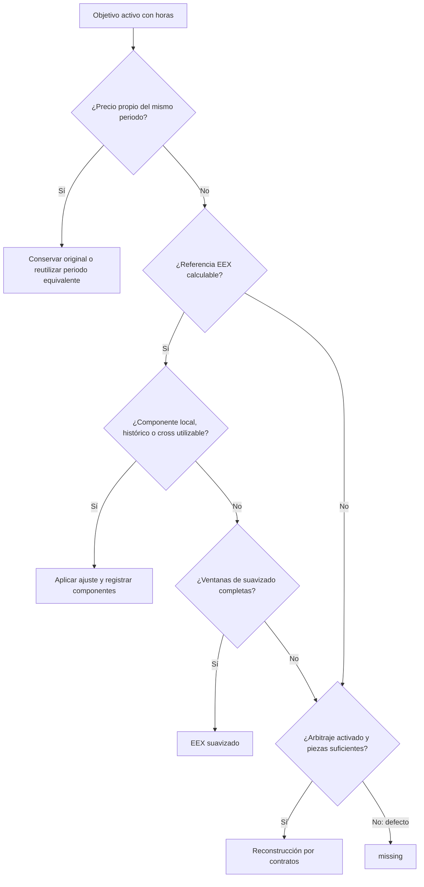

# Algoritmo de relleno de la curva de power


[Diccionario de outputs](OUTPUT.es.md) · [Output dictionary](OUTPUT.md)
[English version](ALGORITHM.md)

Cómo se genera, cada día, la curva completa de un producto (por ejemplo DE Base) a partir de
**tus VWAPs**, que cubren solo algunos puntos, y de los **settlements de EEX**, que cubren casi todo.

> La sección 0 contiene ejemplos didácticos con supuestos explícitos. Las tablas numéricas
> anteriores que aparecen después proceden de una ejecución con DE Base del 29-sep-2026 y
> VWAPs sintéticos; no se han recalculado. Ninguno demuestra precisión predictiva sobre datos
> reales: explican la mecánica y deben distinguirse de un backtest validado.

---

**Lectura rápida:** [casos paso a paso](#09-cada-caso-explicado-paso-a-paso) · [configuración completa](#14-referencia-completa-de-configuración-qué-controla-cada-decisión) · [auditoría de una fila](#12-auditoría-de-una-fila).

## Qué necesitas configurar y qué puedes dejar con los valores iniciales

Las 58 entradas de `config.toml` no son 58 parámetros que debas optimizar: 19 son rutas,
nombres de columnas y zonas horarias. Para un primer uso, basta con revisar las rutas,
el mapping de identidades, los tenors objetivo y mantener el modo `auto`. Las capas
`correlation`, `cross` y `arbitrage` permanecen desactivadas. Los controles avanzados se documentan
para que una modificación sea consciente y auditable, no para exigir ajustes manuales.
`tune` compara por defecto solo `auto`, `ratio` y `additive`; ampliar la búsqueda a sus
otros cinco controles requiere indicarlo expresamente. El resto del TOML permanece fijo.

**Cambio de respaldo:** sin ajuste propio utilizable, EEX se suaviza con ventanas completas de publicaciones; nunca se copia directamente como respaldo. La sección 16 explica medias, cascada mensual, controles y auditoría.

**Capa shape:** la sección 17 y [SHAPE.es.md](SHAPE.es.md) explican la etapa opcional implementada después del relleno. Los casos y fórmulas siguientes describen el precio previo a shape, que también es el final con `shape.mode="off"` por defecto. El input bruto siempre se conserva; solo se pueden mover precios propios finales con `shape.adjust_originals=true`. La capa activa añade valores previos y trazas específicas.

## 0. Entender el producto antes de leer las fórmulas

### 0.1. Qué problema resuelve

Imagina una tabla de precios propios en la que, para una fecha, tienes M+1, M+2 y M+4,
pero falta M+3. Falta **una fila**, no necesariamente una celda vacía. El programa reconstruye
los puntos objetivo usando precios propios y una referencia EEX comparable. Una estimación
siempre queda identificada como estimación; no se convierte en una operación.

Una curva corresponde a una fecha y a una identidad exacta **producto + región + unidad**.
`Base load / DE / EUR/MWh` y `Base load / GB / GBP/MWh` son curvas independientes: no se mezclan
sus precios ni se convierten divisas. El mapeo decide cuáles se procesan y su fuente EEX.
Sus filas nuevas empiezan apagadas: hay que revisarlas y activar expresamente `fill` o
`helper`, con un archivo EEX asignado.

Se entregan dos vistas: una **curva calculada**, con un punto por objetivo, y el **input
enriquecido**, con originales, filas añadidas y trazabilidad. Para consumir precios se utiliza
`curve_price`; `data_origin` distingue `original`, `estimated` y `missing`, y
`estimation_method` explica cómo se estimó. Un VWAP original inválido no se sobrescribe:
su posible estimación vive en `curve_price`.

| Palabra | Traducción a negocio |
|---|---|
| Objetivo o tenor | Periodo que queremos valorar, por ejemplo el mes siguiente, M+1 |
| Hueco | Precio no observado: fila ausente o precio original no utilizable |
| Ancla | Observación propia comparable con EEX que pasa los filtros para medir una diferencia |
| Ajuste o basis | Diferencia propia frente a EEX: porcentaje en ratio, unidades de precio en additive |
| Local | Lo que dicen las anclas de la misma fecha, con más influencia de las cercanas |
| Historia | Memoria de diferencias anteriores; no es copiar el precio de ayer |
| Peso local `w` | Fracción del ajuste local frente al respaldo; no es probabilidad de acierto |
| Strip | Componer un periodo con piezas que cubren exactamente sus horas |
| Residuo | Deducir una parte restando al periodo completo otra parte conocida |

La sección 14 contiene **todo `config.toml`**, sus valores por defecto y efectos de cambiarlos.
Las secciones 1–13 desarrollan fórmulas, archivos y auditoría.

### 0.2. Una fecha, una curva y tres resultados distintos

Ejemplo didáctico de `Base load / DE / EUR/MWh`, con las capas por defecto:

| Tenor | Input propio | Referencia | Resultado |
|---|---:|---:|---|
| M+1 | 105 | EEX 100 | 105, `original`: no se sustituye el precio propio |
| M+2 | Fila ausente | EEX 120 | 125.28, `estimated`, bajo los supuestos de pesos e historia de la sección siguiente |
| M+3 | Fila ausente | Sin EEX ni combinación suficiente | `missing`: no se inventa un precio |

El 105 puede ayudar a otros puntos si pasa los filtros. Conservar un original y permitirle
influir como ancla son decisiones diferentes: cero, negativo o volumen bajo no eliminan
el original, aunque puedan impedir que se utilice para estimar otros precios.

### 0.3. La misma explicación con números: cuánto de hoy y cuánto de antes

Supongamos un ancla propia **105** frente a **EEX 100**, objetivo **EEX 120**, evidencia local
agregada **W=4** y `shrink_k=1`: `w=W/(W+k)=4/5=0.8`. W depende de los pesos de las anclas;
**4 es un supuesto didáctico, no un valor fijo del programa**. Cross está apagado.

En **ratio**, el ancla dice `105/100−1=0.05`: +5 %. Si la historia vigente y permitida dice
+2 %, la mezcla es `0.8×5 % + 0.2×2 %=4.4 %`. Precio: **`120×1.044=125.28`**.

En **additive**, el ancla dice `105−100=5` unidades. Si la historia aditiva vigente y permitida
es +2, la mezcla es `0.8×5 + 0.2×2=4.4`. Precio: **`120+4.4=124.4`**. No se suman porcentajes
a precios: los modos mantienen memorias y estadísticas separadas.

| Evidencia permitida | Ratio | Additive |
|---|---:|---:|
| Ancla aplicada íntegra, sin reducirla: comparación didáctica | `120×1.05=126` | `120+5=125` |
| Local W=4 + historia, k=1: cálculo implementado del ejemplo | **125.28** | **124.4** |
| Local W=4 sin historia: respaldo de ajuste cero | `120×(1+0.8×0.05)=124.8` | `120+0.8×5=124` |
| Sin anclas, solo historia permitida | `120×1.02=122.4` | `120+2=122` |
| Sin ajuste local, histórico ni cross utilizable | Respaldo EEX suavizado de la sección 16; sin ventana, arbitraje opcional/missing | Igual: no se aplica ratio/additive al respaldo |

Por eso copiar íntegramente el factor de un mes conocido no describe siempre el cálculo.
`shrink_k` reduce el ajuste local. Cuanto mayor es W frente a k, más se acerca al ajuste
íntegro. Sin historia no se fuerza w=1: el resto corresponde a ajuste cero. Si cross está
activo, su contribución se añade al respaldo antes de mezclar.

### 0.4. Nueve situaciones para interpretar los precios

Son familias de casos, no nueve pasos obligatorios. La selección auto de la fila 8 interviene
dentro de los casos que utilizan EEX.

| Caso | Qué hay | Qué hace el programa | Qué revisar |
|---|---|---|---|
| 1. Original válido | VWAP numérico y finito | Conserva el precio, también cero/negativo | Puede no servir como ancla. Una entrega sin horas no recibe precio de curva, pero su original sigue intacto |
| 2. Hueco con anclas de hoy | EEX y observaciones admisibles | Mezcla ajuste local con historia/cross permitidos, o con cero | Modo, peso, anclas, filtros y antigüedad EEX |
| 3. Hueco con historia | EEX, sin ajuste local, memoria vigente/permitida | Aplica memoria; cross opcional puede contribuir | La memoria precede a la fecha y no está caducada |
| 4. Solo referencia EEX | EEX, sin ajuste utilizable | Suaviza EEX con ventana completa; sin ella, arbitraje opcional/missing | Precios y spreads históricos; no copia el último settlement |
| 5. Falta EEX exacto | Piezas EEX suficientes | Construye EEX por strip/residuo y después aplica la lógica de ajuste | Cobertura horaria y amplificación del residuo |
| 6. No se puede obtener EEX | Contratos propios o ya calculados suficientes | Con `arbitrage=true`, construye por strip/residuo | No toda combinación es posible ni se fuerza la consistencia global |
| 7. Información insuficiente | Ni referencia ni construcción válida, o entrega sin horas | Deja `missing` y un motivo | Un resultado sin precio puede estar correctamente procesado |
| 8. Ratio no cumple las reglas | EEX objetivo pequeño, solo anclas aditivas o solo historia aditiva permitida | Auto elige additive con motivo; un modo forzado conserva su fórmula | Auto no detecta todos los outliers ni busca el modo de menor error |
| 9. Fuera del alcance activado | Sin mapeo, `off` o `eex_file` vacío | No genera su curva estimada; conserva originales del enriquecido solicitado | Revisar mapping. Un tenor fuera de targets tampoco se crea si falta |

Una ruta EEX **asignada pero sin datos** mantiene activa la curva: puede usar originales y, si está activado,
arbitraje. **Sin fuente asignada**, queda excluida. Si no hay publicación EEX de hoy, puede
utilizarse la última anterior según `[eex]`, nunca una futura. Se registra antigüedad y ese
día no entrena memoria con esa referencia antigua.

El strip pondera por horas y requiere cobertura contigua completa. El residuo calcula la
cola: `(precio_padre×horas_padre−valor_cabeza)/horas_cola`. Una cola pequeña amplifica errores
por `horas_padre/horas_cola`; actualmente no hay un límite específico para esa amplificación.
Los diagnósticos reportan inconsistencias sin alterar originales para forzar agregados.

### 0.5. El árbol de decisión contado como revisión humana

1. **Alcance y calendario.** Comprueba identidad activada y fuente asignada. Resuelve tenor,
   zona horaria y horas antes del precio. Sin horas, la curva queda sin precio.
2. **Original.** Si existe precio propio válido para el periodo, prevalece. Si el original
   es inválido, queda intacto y se busca estimación para `curve_price`.
3. **Referencia.** Intenta EEX exacto, strip o residuo, admitiendo publicación pasada según
   configuración. Sin EEX utilizable, intenta arbitraje permitido; sin información, `missing`.
4. **Fórmula.** `ratio` y `additive` fuerzan un modo. En `auto` gana la primera regla:
   `abs(EEX objetivo)<ratio_eex_floor` → additive; ninguna ancla ratio y alguna aditiva →
   additive; ninguna ancla de ambos modos y solo historia aditiva vigente/permitida → additive;
   en cualquier otro caso → ratio.
5. **Ajuste.** Combina local, historia permitida y cross habilitado usando w. Escribe precio,
   origen, método y evidencias. El relleno inicial no cambia originales; shape solo puede ajustar su precio de curva con permiso explícito.
6. **Aprendizaje posterior.** Después de predecir la fecha, actualiza memorias con originales
   admisibles y EEX de esa misma fecha. Nunca aprende de estimaciones.

Por defecto, un ancla ratio necesita `abs(EEX)>=1`, `Own/EEX>0` y `abs(Own/EEX−1)<=1`.
Así, −10 frente a −12 puede servir; 2 frente a 0, propio cero o signos opuestos no. Una
desviación ratio excesiva también la excluye. Additive admite diferencias finitas que pasen
filtros comunes. `max_ratio_deviation` protege ratio; `max_anchor_dev`, si se activa, ambos.

Ejemplo cerca de cero: propio 2 y EEX 0 dan diferencia aditiva +2. Un objetivo EEX 1 daría 3
**si se aplicara íntegramente ese ajuste**; el motor conserva la mezcla con w e historia.
EEX objetivo 0 activa additive en auto. Con un ajuste ratio disponible, `0×(1+ajuste)` sigue siendo 0; sin componentes se usa el respaldo de la sección 16:
el filtro de denominadores de anclas no modifica el precio EEX del objetivo.

### 0.6. La historia y los dos significados de «auto»

La historia recuerda **diferencias**, por tipo, grupo y curva, separadas por modo. No arrastra
el precio propio de ayer. Con media ratio anterior +2 %, nueva observación diaria +4 % y
vida media 10, el peso nuevo es aproximadamente 0.066967: la media pasa a **2.133934 %**.
Aplicada después a EEX actual 150, da **153.200901**. El EEX actual aporta el nivel; la
memoria, la diferencia habitual.

Esa vida media cuenta días **con observaciones válidas**: diez días sin datos no son diez
actualizaciones. `hist_max_age_days=60`, en cambio, elimina cada media cuando transcurren más
de 60 días naturales desde su última observación válida. No aprende de estimados, EEX futuro
ni de una publicación antigua reutilizada para hoy.

`basis_mode=auto` elige **la fórmula**. `hist=auto` decide **si permite usar la memoria de
un modo/grupo**, comparando errores pasados contra EEX solo; durante el calentamiento permite
historia vigente. Puede rechazar memoria ratio y admitir aditiva, influyendo así en la tercera
rama de basis-auto. La predicción usa memoria anterior; la observación de ese día se aprende
después. La sección 7 explica las comparaciones y la sección 14 sus controles.

### 0.7. Ayuda entre curvas: cross, explicado sin confundirlo con un proxy

`cross=false` por defecto. Habilitarlo requiere memoria propia del objetivo, EEX del objetivo
y relaciones suficientes entre **sorpresas de ajustes**. No es «precio ES = alfa + beta ×
precio FR» ni resuelve una curva sin ninguna historia propia comparable.

Ejemplo ratio: media del objetivo −0.8 %; un ayudante sorprende hoy con −1 punto porcentual
respecto a su media y beta es 0.8. Aporta −0.8 puntos. Sin local y con historia permitida,
el ajuste sería −1.6 %; con EEX objetivo 100, precio **98.4**. Es una ilustración, no una
relación de mercado demostrada. Si hist está apagado/rechazado, esa media no se suma, aunque
cross pueda usar memoria interna vigente para medir sorpresas. Ratio y additive no se mezclan.

Correlación, regresión beta y medias exponenciales son técnicas estadísticas estándar;
su combinación, filtros y flujo aquí son una implementación propia. Se relacionan curvas
en la **misma fecha**, no se calcula una correlación con retardos buscando que un mercado
anticipe otro. `correlation=false`, la otra extensión, cambiaría pesos entre grupos de tenors;
no es la misma capa que cross. Ambas deben justificarse con validación antes de activarlas.

### 0.8. Leer la prueba de un precio y elegir cómo ejecutar

Para auditar el **125.28** anterior, estas columnas deben ser coherentes:

| Campo enriquecido | Valor didáctico | Qué comprueba |
|---|---|---|
| `data_origin` / `estimation_method` | `estimated` / `ratio_local_history` | Estimación local con historia |
| `curve_configured_basis_mode` / `curve_basis_mode` | `auto` / `ratio` | Configurado y efectivamente aplicado |
| `curve_eex_settle` | 120 | Referencia antes de ajustar |
| `curve_basis_local` / `curve_basis_hist` | 0.05 / 0.02 | Fracciones, no precios |
| `curve_local_weight` / `curve_basis` | 0.8 / 0.044 | Mezcla y ajuste final |
| `curve_price` | 125.28 | `120×(1+0.044)` |

Revisa también identidad, entrega, fecha/método EEX y flags. `curve_anchors` muestra solo
tres anclas: reproducir W necesita input, EEX, mapping y config de esa ejecución.
`confidence` es heurística: 0.8 no significa 80 % de probabilidad de acierto.

| Necesidad operativa | Comando | Qué recalcula |
|---|---|---|
| Hoy o una fecha concreta | `python run.py daily` o `daily --date 2026-09-30` | La fecha, aunque ya existan resultados |
| Recuperar ejecuciones pendientes | `python run.py catchup` | Solo grupos fecha/identidad pendientes hasta hoy; acepta `--from` y `--to` |
| Reconstruir un intervalo | `python run.py refill --from 2026-09-01 --to 2026-09-30` | Todo el rango, aunque ya esté procesado |

En catchup falta procesamiento si un objetivo resoluble está ausente en cualquiera de los
dos históricos, calculado/enriquecido. Un registro existente `missing` ya cuenta procesado;
para revisarlo con nueva información usa daily/refill. Catchup solo exporta las curvas `fill`
pendientes y conserva los demás resultados existentes; daily/refill permiten enriquecer todos
los originales del rango. Todos necesitan input original acumulado: los CSV de resultados
no alimentan el aprendizaje. La sección 5 detalla estos tres usos.

---

### 0.9. Cada caso explicado paso a paso

**Cómo leer esta sección.** Todos los ejemplos suponen una identidad exacta activada como
`fill`, archivo EEX asignado y entrega con horas positivas. Son números didácticos, no
operaciones reales. Para hacer visible cada suma, los ejemplos de ajustes fuerzan
`basis_mode="additive"`; el valor entregado sigue siendo `auto`.

No son nueve modelos que compiten por el mejor precio. El motor sigue una **secuencia de
disponibilidad**. Conserva lo propio; si falta, intenta la referencia EEX con los componentes
permitidos; sin componentes intenta suavizado; solo un objetivo pendiente puede pasar a
arbitraje si lo activas. **`arbitrage=false` es el valor por defecto.**



`ratio`, `additive` y `auto` deciden **cómo expresar un ajuste**. Local, historia y cross
deciden **de dónde sale la información**. Ratio +10 % con EEX 100 y peso local 0.6 da 106;
additive +10 unidades da también 106 en ese ejemplo, pero con EEX 200 ya no son equivalentes.
Auto elige fórmula por sus reglas, no por cuál predice mejor cada punto. El suavizado EEX y
la reconstrucción de contratos son otras rutas: no aplican una fórmula de basis.

`source` resume la ruta o componente dominante. `estimation_method` enumera los componentes
disponibles que intervinieron; que aparezca `history` no significa que su valor sea distinto
de cero. La columna `data_origin` del enriquecido clasifica la **fila física recibida o añadida**.

#### Pregunta frecuente: «¿cuáles son los dos modos y qué decide auto?»

Hay tres controles con nombres parecidos, pero funciones distintas:

| Control | Opciones | Qué decide |
|---|---|---|
| `method.basis_mode` | `ratio`, `additive`, `auto` | Fórmula del ajuste propio; auto selecciona una de las dos fórmulas |
| `eex_fallback.price_method` | `simple`, `ewma` | Cómo promediar precios EEX cuando faltan componentes; elección explícita, **sin opción auto** |
| `layers.hist` | `on`, `off`, `auto` | Si se permite sumar la memoria de un modo/grupo; su auto compara errores anteriores |

El selector de fórmula aplica **la primera regla que encaje**, en este orden:

1. `abs(EEX objetivo) < ratio_eex_floor`, por defecto 1 → **additive**.
2. No queda ninguna ancla ratio válida, pero sí alguna aditiva → **additive**.
3. No hay anclas de ninguno de los dos modos y solo existe historia aditiva vigente y
   permitida por hist → **additive**.
4. En cualquier otro caso → **ratio**.

Con objetivo de magnitud al menos 1 y una única ancla admisible, Own 110 / EEX 100 permite
ratio; Own −110 / EEX −100 también puede permitirlo: ambos negativos dan factor positivo.
Own 3 / EEX 0 no permite ratio, pero su diferencia aditiva puede ser válida. Un propio cero
o signos opuestos tampoco permiten ancla ratio. Si quedan **otras** anclas ratio válidas,
rechazar una no basta para pasar a additive; la primera regla sobre el objetivo sigue mandando.

Auto evalúa disponibilidad y guardas, **no el error desconocido del hueco ni cuál precio
parece más convincente**. Forzar ratio mantiene sus filtros y no cambia automáticamente a
additive cuando una ancla falla. El filtro común puede rechazar una observación para ambos
modos. La sección 3, paso 3b, desarrolla límites, flags y casos de selección; la sección 16
explica simple/EWMA, y la sección 7 explica hist-auto.

#### Caso 1. Hay un original válido: se conserva durante el relleno

La etapa shape posterior también lo mantiene fijo por defecto. Con `shape.mode="adjust"` y `shape.adjust_originals=true`, puede cambiar su precio final de curva dentro de los límites; el VWAP del input queda intacto. Véase la sección 17.

**Qué significa y cuándo entra.** La fila contiene un VWAP numérico y finito. Supongamos
M+1 propio **110**, aunque EEX para ese periodo sea **100**. El enriquecido conserva 110 en
`vwap` y `curve_price`: no lo reduce a 100 ni a una media. Cero y negativos finitos siguen
siendo originales. Poco volumen o rechazo como ancla no autoriza a sustituirlos.

**Pasos y salida.** Resuelve fecha/identidad/entrega; reconoce el precio propio; conserva la
observación. En este ejemplo de una sola observación: `data_origin=original`,
`curve_source=own`, `estimation_method=none`, `curve_price=110`. La curva interna puede
agregar duplicados/alias; el enriquecido conserva cada fila individual con su propio valor.

**Límite y siguiente paso.** Original no significa validado como precio de mercado. Si la
celda es inválida, sigue intacta pero ya no aporta precio utilizable: se intenta estimación
para `curve_price`. Si no existe la fila, se trata como hueco. Una entrega de cero horas
no se estima en la curva, aunque su original físico siga conservado.

#### Caso 2. La fila falta, pero el mismo periodo propio existe con otra etiqueta

**Qué significa y qué necesita.** Se reutiliza una observación propia de la misma fecha,
producto, región y unidad cuyo intervalo de entrega coincide exactamente. No se necesita
una semejanza estadística entre contratos ni se copia el precio de otra fecha.

**Ejemplo.** Para referencia **29-09-2026**, perfil Base y convención diaria calendar,
`D+1` entrega el 30-09-2026. `BOM` también entrega desde el 30-09 hasta el 01-10 exclusivo.
Hay una fila original D+1 a **80** y no hay fila BOM.

1. El motor resuelve ambas etiquetas al mismo intervalo.
2. Encuentra el precio propio 80 del periodo.
3. Añade BOM a 80 si BOM es objetivo; no calcula ratio, historia ni EWMA para esa copia.

**Salida.** D+1 permanece `original / own / none`. La fila BOM añadida lleva
`data_origin=estimated`, `curve_source=own`, `estimation_method=own_equivalent_period`
y `curve_price=80`. En la curva del motor el periodo se considera propio; en el enriquecido
la nueva fila es estimated porque **esa fila física no contenía un original**, no porque el
80 sea una predicción estadística. Una fila BOM original inválida puede recibir el mismo
tratamiento en `curve_price` manteniendo intacta su celda `vwap`.

**Límite y siguiente paso.** Solo vale equivalencia real de entrega y horas. No reutiliza
automáticamente un Weekend como BOW Peak sin horas. Sin periodo propio equivalente, pasa a EEX.

#### Caso 3. Hay ajuste local, pero no historia permitida ni cross

[La investigación sobre anclas](ANCHORS.es.md) compara relevancia por familia/horizonte,
cambios de ruta con anclas débiles y contraejemplos controlados. Distingue LOCAL actual de
las políticas propuestas: no establece un ancla ganadora universal ni una nueva política de producción.

**Qué significa y qué necesita.** Hoy existen otros contratos propios comparables con EEX.
Sus diferencias admitidas permiten mover el objetivo, aunque no se haya operado ese objetivo.
Supongamos EEX objetivo **100**, ajuste local ponderado `b_local=10`, evidencia `W=1.5`
y `shrink_k=1`. Así `w=1.5/(1.5+1)=0.6`. Esos pesos son supuestos del ejemplo.

1. Las anclas de otros periodos producen una diferencia local de +10 unidades; por ejemplo,
   un propio 210 frente a su EEX 200 aporta +10.
2. Sin historia/cross permitido, el respaldo del **ajuste** es cero.
3. `basis=0.6×10+0.4×0=6`; precio **100+6=106**.

**Salida.** `estimated / eex+local / additive_local`; `curve_basis_local=10`,
`curve_basis_hist` vacío, `curve_local_weight=0.6`, `curve_basis=6`.

**Límite y siguiente paso.** No transfiere +10 íntegro: modera evidencia local. No utiliza
EEX suavizado como el 40 % restante; ese porcentaje se aplica a ajuste cero. Si las anclas
no existen, son rechazadas o local está apagado, prueba historia/cross permitidos; sin ningún
componente intenta suavizado. Si falta EEX objetivo, ni siquiera +10 permite valorar por esta ruta.

<a id="local-month-quarter-example"></a>

**Nota comprobada: por qué un trimestre puede pesar más que un mes.** Las anclas locales
no se separan estrictamente por familia: un Month puede ayudar a un Quarter y viceversa,
siempre dentro de la misma identidad y pasando los filtros. No se exige que sus entregas
se solapen. Tampoco se elige una única ancla ganadora: se mezclan todas las admisibles con
peso positivo. Los porcentajes siguientes pertenecen a un experimento concreto, no son
porcentajes fijos del algoritmo ni una conclusión sobre qué ancla predice mejor.

**Datos del experimento.** Fecha de referencia **30-09-2026**, Base DE, EUR/MWh y zona
Europe/Berlin. Tanto los propios como EEX son sintéticos:

| Ancla propia disponible | Entrega | EEX | Propio | Volumen | Ajuste aditivo | Ajuste ratio |
|---|---|---:|---:|---:|---:|---:|
| M+1 | Octubre 2026 | 100 | 110 | 100 | +10 | +10 % |
| Q+2 | Enero–marzo 2027 | 150 | 120 | 100 | −30 | −20 % |

Se usa `tau_log=0.5`, `other_kind_weight=0.6` y `shrink_k=1`. Historia, correlation,
cross y arbitrage están apagados **solo para aislar la prueba local**; esto no cambia los
valores de producción. Los precios originales M+1=110 y Q+2=120 se conservan.

**Cómo calcula la cercanía.** El plazo `t` es el número de días naturales desde la
referencia hasta la mitad del intervalo de entrega, no el número de la etiqueta M/Q.
En esta fecha:

| Contrato | Papel | t: días hasta la mitad de la entrega | 1+t |
|---|---|---:|---:|
| M+1, octubre | Ancla | 16.5 | 17.5 |
| M+2, noviembre | Hueco | 47 | 48 |
| M+3, diciembre | Hueco | 77.5 | 78.5 |
| Q+2, enero–marzo | Ancla | 138 | 139 |

```text
distancia_log = abs(ln(1 + max(t_hueco, 0.5)) − ln(1 + max(t_ancla, 0.5)))
factor_distancia = exp(−distancia_log / tau_log)
peso_ancla = factor_volumen × factor_tipo × factor_distancia
participación_local = peso_ancla / suma_de_pesos
```

Aquí ambos volúmenes aportan `ln(101)=4.615121`. El factor de tipo es 1 para Month→Month
y 0.6 para Quarter→Month. Se aplica **antes** de normalizar: 0.6 no significa el 60 % del
precio ni garantiza que el trimestre pese menos que un mes. Con volumen desconocido o no
positivo, el factor de volumen de un ancla admitida sería 1.

| Hueco | Ancla | Distancia log | Factor distancia | Factor tipo | Peso sin normalizar | Participación local |
|---|---|---:|---:|---:|---:|---:|
| M+2, noviembre | M+1 | 1.009000 | 0.132921 | 1 | 0.613446 | **65.0076 %** |
| M+2, noviembre | Q+2 | 1.063273 | 0.119248 | 0.6 | 0.330208 | 34.9924 % |
| M+3, diciembre | M+1 | 1.500898 | 0.049698 | 1 | 0.229361 | 20.6162 % |
| M+3, diciembre | Q+2 | 0.571375 | 0.318941 | 0.6 | 0.883169 | **79.3838 %** |

**Por qué cambia el ancla dominante.** Para noviembre, ambas distancias logarítmicas son
parecidas y octubre, además, es del mismo tipo: M+1 acaba pesando aproximadamente **65 %**.
Para diciembre, el factor de distancia del trimestre es mucho mayor y supera su penalización
de tipo: Q+2 acaba pesando aproximadamente **79.4 %**. La distancia usa proporciones del
plazo: diciembre frente a octubre compara `78.5/17.5≈4.49`, mientras que enero–marzo frente
a diciembre compara `139/78.5≈1.77`. Aunque las separaciones naturales son casi iguales
—61 y 60.5 días—, no son iguales en esta escala logarítmica. **Diciembre ni siquiera forma
parte de Q+2**: el código mide esta cercanía, no pertenencia al trimestre ni acierto histórico
demostrado. El nivel del precio propio cambia el ajuste aportado; con las mismas anclas
admitidas, no cambia estos pesos de volumen, tipo y distancia.

**Participación local y peso final son cosas distintas.** Para M+3, la evidencia total es
`W=0.229361+0.883169≈1.112531`, por lo que `w=W/(W+1)=0.526634`. Primero se mezclan
los ajustes y después se aplica ese peso local:

```text
aditivo local = 0.206162×10 + 0.793838×(−30) ≈ −21.753534
ajuste final = 0.526634×(−21.753534) ≈ −11.456152
precio M+3 = EEX diciembre 120 − 11.456152 = 108.543848

ratio local = 0.206162×0.10 + 0.793838×(−0.20) ≈ −0.13815150
ratio final = 0.526634×(−0.13815150) ≈ −0.07275529
precio M+3 = 120×(1 − 0.07275529) ≈ 111.269366
```

Los resultados se calculan sin redondear los pasos intermedios. El 79.4 % es un coeficiente
de la **mezcla local de ajustes**, no el 79.4 % del precio ni de su cambio monetario neto:
las dos anclas aportan ajustes de magnitudes y signos distintos. En este caso, el 47.3366 %
que queda fuera del peso local corresponde a **ajuste cero**, porque no hay historia/cross.
En M+2, `w=0.485505`; los precios resultantes son **108.059446 aditivo** y
**109.734182 ratio**, partiendo de EEX noviembre=110. Ratio y aditivo usan aquí los mismos
pesos porque admiten las mismas anclas; si sus filtros admitieran anclas distintas, la mezcla
también podría cambiar. Auto elige ratio con estos datos.

**Qué cambia al separar tipos.** Con `other_kind_weight=0` y `correlation=false`, un
trimestre deja de aportar ajuste local a los meses, incluso a sus propios meses componentes.
En este experimento M+3 aditivo pasa de 108.543848 a **121.865694**, pues solo queda M+1.
Esto no garantiza mayor precisión ni impone coherencia trimestral. Historia y otras capas
siguen sus propias reglas; correlation activada puede aportar un peso medido entre grupos.

**Cómo auditarlo.** `curve_anchors` identifica hasta tres anclas principales, pero no exporta
los pesos individuales de todas ellas. Para reproducir esta tabla hacen falta las fechas
de entrega, los volúmenes, los filtros y la configuración, además de la fórmula anterior.
El [chequeo de consistencia](#quarter-month-consistency-example) muestra otra consecuencia
del mismo experimento: conservar un trimestre no obliga a que sus meses estimados lo reproduzcan.

#### Caso 4. Hay ajuste local e historia permitida

Mantén EEX **100**, local **+10** y `w=0.6`; ahora existe historia aditiva vigente y
permitida de **+4**, aprendida antes de la fecha. Cross está apagado.

1. La señal de hoy aporta `0.6×10=6`.
2. La memoria anterior aporta `0.4×4=1.6`.
3. Ajuste total **7.6**; precio **107.6**.

**Salida.** `estimated / eex+local / additive_local_history`; local 10, historia 4, peso 0.6,
basis 7.6. La fuente sigue siendo local porque domina su peso, pero el método revela ambas partes.

**Qué no significa.** No suma íntegramente 10+4 ni promedia precios propios de contratos
distintos sin EEX. La historia es una diferencia comparable de esa identidad/modo, no el precio
de ayer. Si caduca o hist-auto la rechaza, vuelve al caso local con respaldo cero: 106 bajo
estos mismos supuestos. Si desaparece local pero la historia sigue válida, pasa al caso siguiente.

La [nota de meses y trimestres](#local-month-quarter-example) también se aplica a la parte
local de esta estrategia. Activar historia no restringe las anclas de hoy al tipo del objetivo.
Manteniendo modo, anclas admisibles y parámetros, se conservan sus participaciones locales,
W y w. Cambia el respaldo: `basis=w×local+(1−w)×historia_permitida`, en vez de cero en
el segundo término, si cross sigue apagado. En aquel ejemplo la historia recibiría un peso
de **0.514495 para M+2** y **0.473366 para M+3**. No sustituye ni renombra las dos anclas.

#### Caso 5. Hoy no hay ajuste local, pero sí historia permitida

**Qué necesita.** EEX objetivo **100**, memoria aditiva anterior **+4** vigente y admitida por
`hist=on` o por hist-auto; cross apagado. No necesita una operación propia hoy.

Con `w=0`, `basis=4`, precio **104**. Salida:
`estimated / eex+hist / additive_history`; `curve_basis_hist=4`,
`curve_basis_local` vacío, `curve_local_weight=0`.

La memoria se formó con pares originales Own/EEX de la misma fecha, después de predecir cada
día anterior. Su EWMA aprende diferencias en días observados; caduca por días naturales.
**Histórico +4 sin EEX objetivo no produce 4 ni 104**: falta el nivel al que sumarlo. No se
arrastra el último precio. Sin historia utilizable, intenta cross si está habilitado y tiene
evidencia; sin componentes, suavizado EEX. Sin EEX, solo queda reconstrucción opcional o missing.

**Cuánto histórico utiliza y cómo se configura.** No guarda «solo los últimos diez días».
Estos controles de `config.toml` resuelven preguntas distintas:

| Control | Defecto | Qué significa y efecto de cambiarlo |
|---|---|---|
| `method.ewma_halflife_days` | `10` | Memoria exponencial: cuenta actualizaciones de días con observaciones válidas. Tras 10 actualizaciones la influencia del estado anterior se reduce a la mitad; tras 20, a un cuarto. Mayor valor conserva más influencia antigua y reacciona más despacio; menor reacciona antes. No es una ventana fija de 10 días |
| `method.hist_max_age_days` | `60` | Caduca cada media de tipo/grupo/global, por identidad y modo, al superar 60 días naturales desde su último original admisible emparejado con EEX de la misma fecha. Mayor permite usar memoria sin actualizar durante más tiempo; menor la retira antes. No elimina individualmente todas las observaciones de más de 60 días |
| `run.warmup_days` | `0` | Reconstruye el estado anterior al intervalo calculado reproduciendo toda la historia original suministrada. Solo los pares admisibles con EEX del mismo día actualizan estas medias. Un N positivo limita el arranque a N días naturales previos; entre valores positivos, mayor incorpora más contexto y menor lo reduce. No descarga datos ausentes y puede producir diferencias entre daily y un refill largo; véase sección 5 |

Ejemplo de aprendizaje: la media anterior es **+4** y las anclas válidas de una nueva fecha
producen un ajuste diario **+10**. Con vida media 10,
`alpha=1−2^(−1/10)≈0.066967`; la actualización es
`(1−alpha)×4+alpha×10 = 4.401802`. Ese nuevo estado sirve para **fechas posteriores**:
primero se predice el día con la memoria anterior y después se aprende su observación.
Días sin pares válidos no son actualizaciones, aunque sí cuentan para la caducidad natural.
La influencia antigua se atenúa mientras la media siga vigente; no hay un corte automático
al cumplir diez observaciones.

`method.hist_auto_min_obs=10` es otro umbral: masa efectiva de comparaciones previas para
que hist-auto decida permitir o rechazar historia frente al benchmark EEX. Subirlo retrasa
la decisión; bajarlo permite decidir antes. No guarda una ventana de diez precios ni cambia
por sí solo la caducidad; durante ese calentamiento se permite la historia vigente.

Esto es diferente de `eex_fallback.price_window=5` y
`eex_fallback.ewma_halflife=2`: esos controles promedian **precios EEX** en una ventana
finita de cinco publicaciones. El histórico propio aprende **diferencias entre Own y EEX, relativas o aditivas,** mediante
una memoria recursiva. La sección 16 explica ese respaldo separado.

#### Caso 6. Cross aporta información de otras curvas

**Qué es.** `cross=false` por defecto. Al activarlo, relaciones históricas entre sorpresas
de diferencias Own−EEX —o Own/EEX−1 en ratio— permiten ajustar el respaldo. Requiere EEX y
memoria interna vigente del objetivo y suficiente evidencia conjunta de un ayudante activo.
No copia un precio extranjero ni realiza conversión de moneda.

**Ejemplo con las tres partes.** EEX objetivo 100, local +10, historia permitida +4 y w=0.6.
El ayudante presenta una sorpresa de +4 frente a su propia media de basis; una beta aprendida
de 0.5 aporta `cross_adj=0.5×4=2`. Son supuestos didácticos de una relación ya admisible.

1. Respaldo corregido: `historia+cross=4+2=6`.
2. Mezcla: `0.6×10+0.4×6=8.4`.
3. Precio: **108.4**. Salida `estimated / eex+local / additive_local_history_cross`.

El nombre `source=eex+local` no oculta que cross contribuyó: local pesa 0.6 y el método
enumera los tres componentes. Si local faltara, historia+cross daría **106** con
`source=eex+cross` y `additive_history_cross`.

**Interruptores y límites.** Con hist apagado/rechazado, no se suma +4; cross aún puede usar
memoria interna para calcular sorpresas. Con local 10 y w=0.6, solo respaldo cross +2 daría
**106.8**, método `additive_local_cross`. Sin cross válido, vuelve a local/hist; sin ningún
componente, al suavizado. `correlation`, también apagada, cambia pesos entre grupos de tenors;
es distinta de cross, que incorpora información de otras identidades. Ninguna asegura mejora.

#### Caso 7. No hay ajuste propio utilizable: respaldo EEX suavizado

**Cuándo entra.** Falta precio propio del periodo; existe referencia EEX admitida, pero no
hay local, historia permitida ni cross utilizable. No copia el settlement del último día.
Exige las ventanas completas de la sección 16; si falta una publicación necesaria no la
salta ni usa una ventana parcial.

**Ejemplo de precio.** Para un mes ancla, las cinco últimas publicaciones del mismo mes
absoluto valen **100,102,104,106,108**. Con `price_method=ewma` y vida media 2 observaciones,
los pesos, de antiguo a reciente, son aproximadamente **0.088947,0.125790,0.177894,0.251580,0.355788**.
La suma ponderada da **105.318945**. Con simple daría **104**.

**Ejemplo de meses lejanos.** Por defecto los dos meses ancla son M0 y M1 desde el mes natural
de referencia; cada uno se promedia individualmente. M2 parte de la media de M1, no de la
media de M0 y M1 juntas. Si las nueve diferencias simultáneas M2−M1 son 10,11,…,18, su media
simple es 14: **M2=105.318945+14=119.318945**. Spreads siempre crudos y de la misma publicación;
no se vuelve a suavizar el último spread. Un Q se promedia como Q, sin forzarlo a igualar meses.

**Salida.** `estimated / eex+smooth / eex_price_ewma` para el mes ancla;
`eex_month_cascade_ewma` para M2. Basis y peso local vacíos; JSON
`curve_eex_fallback_trace` contiene toda la evidencia. El precio EEX crudo queda como referencia
en `curve_eex_settle`; el modo ratio/additive seleccionado no se aplica a esta media.

**Dos EWMA distintas.** La historia propia promedia **diferencias entre Own y EEX, relativas o aditivas,** mediante una
actualización recursiva y tiene caducidad. Este respaldo promedia **precios EEX del mismo
contrato** sobre una ventana finita con pesos normalizados. No comparten memoria ni datos de
aprendizaje. El respaldo no convierte estimaciones anteriores en observaciones.

**Si falta información.** Marca `eex_fallback_unavailable`; con arbitraje apagado queda
missing. Si activas arbitraje, puede intentar las piezas del caso siguiente. Ventanas completas
pueden reducir cobertura y el suavizado puede retrasar cambios reales: no garantiza mejor precio.

#### Caso 8. Reconstrucción opcional por contratos: arbitrage

**Estado inicial.** `[layers].arbitrage=false`. Activarlo con `true` autoriza una vía adicional
para objetivos **todavía pendientes**: EEX no puede valorarlos, o no había ajuste propio
utilizable y falló la ventana suavizada. No es un candidato que compita con historia ni una
fase que reemplace cualquier precio por uno supuestamente más coherente.

Por eso activar esta capa tampoco corrige automáticamente el [trimestre original a 120
cuyos meses estimados promedian 130.637302](#quarter-month-consistency-example): esos
precios ya están resueltos. Una reconstrucción de un hueco y una reconciliación global
de la curva son operaciones distintas; la segunda no se implementa en esta capa.

**Ejemplo sin EEX utilizable.** Hay precios propios de octubre, noviembre y diciembre,
todos a **120**; falta Q4. Los meses cubren exactamente Q4 y tienen horas positivas.
Aunque la memoria diga +4, sin EEX Q4 no puede convertirla en precio.

- Con el valor por defecto `false`: Q4 queda **missing**.
- Con `true`: combina por horas, no por número de meses:
  `(120×H_oct+120×H_nov+120×H_dic)/(H_oct+H_nov+H_dic)=120`.
  Salida `estimated / arbitrage / contract_strip`, precio **120**.
- Si, en cambio, sí existe EEX Q4 **100**, historia permitida **+4** y no hay local/cross,
  el resultado es **104**, `eex+hist / additive_history`, incluso con arbitrage=true.
  No compara 104 contra 120 para elegir ni reemplaza el precio ya resuelto.

**Qué piezas y qué límites.** Las piezas pueden ser propias o precios ya estimados ese día.
Un strip requiere cobertura contigua completa y pondera horas del perfil. Un residuo resta
una cabeza cubierta a un contrato padre para obtener su cola; no es un solucionador general
de cualquier sistema de contratos. Una cola pequeña amplifica errores. Un precio construido
puede heredar errores de piezas estimadas y no hace toda la curva libre de arbitraje.

**Dos construcciones distintas.** `arbitrage=false` **no desactiva** el Pricer que obtiene la
referencia EEX por exact/strip/residual antes de ajustar, ni el que valora cada publicación
del respaldo suavizado. Desactiva la reconstrucción final con precios propios/ya rellenados.
Si está apagada o faltan piezas admisibles, el objetivo sigue missing. Si resolvió tras fallar
el suavizado, puede conservar `eex_fallback_unavailable`: explica el intento previo.

#### Caso 9. No hay precio justificable: missing

**Ejemplo.** Falta el VWAP del objetivo; no hay EEX utilizable, aunque quede historia aditiva +4;
arbitraje está apagado. O existe EEX, pero no hay ajustes y solo hay tres publicaciones cuando
la ventana pide cinco. No hay precio final.

En la curva: `source=missing`, `data_origin=missing`, `estimation_method=unavailable` y
precio vacío. En el enriquecido: `data_origin=missing`, `estimation_method=none` y
`curve_price` vacío. Si falló la ventana, aparece su flag; una entrega sin horas lleva
`zero_delivery_hours`.

Missing **no significa cero**, ni fallo técnico, ni permiso para inventar un settlement.
El resto de la curva puede calcularse. Un registro missing ya cuenta como procesado para
catchup; cuando llegue evidencia nueva, usa daily/refill para revisarlo. Si quieres ampliar
cobertura, revisa datos, mapping, ventanas y —solo si aceptas esa vía— activa arbitraje.

| Caso con supuestos anteriores | Precio | Origen enriquecido | Fuente | Método |
|---|---:|---|---|---|
| Original M+1 | 110 | original | own | none |
| BOM reutilizado desde D+1 equivalente | 80 | estimated | own | own_equivalent_period |
| Local | 106 | estimated | eex+local | additive_local |
| Local + historia | 107.6 | estimated | eex+local | additive_local_history |
| Solo historia | 104 | estimated | eex+hist | additive_history |
| Local + historia + cross | 108.4 | estimated | eex+local | additive_local_history_cross |
| Media EWMA del mes ancla | 105.318945 | estimated | eex+smooth | eex_price_ewma |
| Mes siguiente por cascada | 119.318945 | estimated | eex+smooth | eex_month_cascade_ewma |
| Q4 desde meses propios, arbitraje activado | 120 | estimated | arbitrage | contract_strip |
| Información insuficiente / vía apagada | vacío | missing | missing | none |


---

## 1. Qué entra y qué sale

**Entradas**

| Fuente | Qué es | Qué aporta |
|---|---|---|
| Tus VWAPs | Media de lo operado durante el día, contrato a contrato | **Tu nivel** real, pero solo donde has operado |
| EEX | Precio de cierre (settlement) de cada contrato, cada día | **La forma** de la curva entera: cuánto vale Nov respecto a Oct, Q1 respecto a Cal… |

**Curva calculada**: para cada día y combinación **`(product, region, unit)`** con `use = fill`
y un `eex_file` asignado,
un precio por tenor objetivo:

```
D+1..D+3 | WE..WE+3 | BOW, W+1..W+4 | BOM, M+1..M+10 | Q+1..Q+8 | Sum+1..3, Win+1..3 | Cal+1..3
```

Cada celda indica además de dónde sale (`source`), con qué confianza y qué anclas la han movido.

**Fichero enriquecido en daily/refill**: conserva todas las columnas y filas originales del rango solicitado,
incluidos orden, duplicados, tenors fuera de objetivos y productos sin mapear o desactivados.
Añade al final los tenors calculados cuya clave fecha/producto/region/unit/etiqueta no figuraba en el input.
La curva calculada puede agregar varias observaciones del mismo periodo; el fichero enriquecido
conserva cada observación original por separado. En este documento, una curva o producto
procesado significa siempre la combinación completa, no solo el nombre `product`.

Por ejemplo, `("Base load", "DE", "EUR/MWh")` y `("Base load", "FR", "EUR/MWh")` son curvas
distintas; cambiar solo `unit` también crea otra identidad. No se juntan sus observaciones,
anclas, volúmenes ni memorias porque tengan el mismo nombre. Cada combinación tiene su mapeo
EEX y sus resultados. La ayuda entre curvas solo interviene mediante la capa cross explícita.

Internamente se recortan espacios al principio y al final de los tres identificadores;
se respetan mayúsculas y escritura. Los valores originales del fichero siguen intactos.
Un `region` o `unit` vacío es el valor literal `""`, nunca un comodín que coincida con todos.
Un `product` vacío es un error de entrada.

- `data_origin`: `original` si el VWAP de la fila era numérico y finito, `estimated` si el motor
  aporta el precio que faltaba, o `missing` si no hay precio utilizable.
- `estimation_method`: método concreto aplicado, por ejemplo `ratio_local_history`, `eex_price_ewma` o
  `contract_strip`; `none` en originales válidos y huecos sin estimar.
- `curve_price`: precio utilizable. Si un VWAP original está vacío o es inválido, su celda original
  sigue intacta y la estimación, si existe, aparece aquí.
- `curve_row_type`: `original`, `original_invalid` o `added`. El resto de la trazabilidad vive en
  `curve_*`: fuente, EEX utilizado, fechas de entrega, anclas, ajustes y avisos.

Las filas nuevas no inventan volumen ni identificadores de operaciones. Usan `region` y `unit`
de su identidad exacta y solo heredan los demás atributos inequívocos de esa misma curva;
una unidad vacía no se inventa y se señala.

### 1.1. Tu fichero: una fila por observación, no una columna por vencimiento

El formato de entrada es **largo**. Las columnas que aparecen en los ejemplos del fichero son:

| Columna | Papel en el programa |
|---|---|
| `reference_date` | Día al que pertenece el VWAP. Se interpreta como fecha; `02/01/2025` significa 2 de enero de 2025 |
| `weekday` | Texto descriptivo del día; no decide la fecha ni el calendario de entrega |
| `product` | Nombre de producto; junto con `region` y `unit` forma la clave exacta del mapeo |
| `country` | Atributo del producto; se conserva |
| `region` | Parte de la identidad de curva; columna obligatoria, aunque puede contener el valor literal vacío |
| `classification` | Atributo del producto; se conserva |
| `unit` | Unidad declarada y parte de la identidad; columna obligatoria, sin conversión automática; un vacío es literal |
| `periodicity_2` | Etiqueta de periodicidad; no sustituye a la resolución del tenor |
| `tenor2` | Tenor relativo de la observación: por ejemplo `M+1` |
| `vwap` | Precio observado; es lo que debe conservarse en las filas originales |
| `total_volume` | Volumen para ponderar y, si se configura, filtrar anclas; puede faltar |
| `n_trades` | Información original; no interviene en la estimación ni se inventa para filas nuevas |
| Índice u otras columnas opcionales | Se conservan como parte del input; no identifican un contrato en el motor |

Los nombres usados por el motor se asignan en `[vwap_columns]`; con el config actual, `tenor`
apunta a `tenor2`, `volume` a `total_volume`, `region` a `region` y `unit` a `unit`.
Las seis columnas obligatorias son fecha, producto, región, unidad, tenor y VWAP. Si el fichero
antiguo no tiene región/unidad, hay que añadir sus columnas con los valores correctos o usar
sus nombres reales mediante los aliases; no se deducen silenciosamente. Un valor de fecha
inválido detiene la carga. Un VWAP vacío o no finito
se conserva en el enriquecido y no se usa como observación del motor.

El hueco habitual es **una fila ausente**. Si para DE Base el 02/01/2025 aparecen `M+1`, `M+2`,
`M+3` y `M+5`, falta crear `M+4`; no hace falta que exista una fila `M+4` con `vwap` vacío.
La detección se hace contra `[targets].tenors` por fecha/producto/region/unit/etiqueta. Si la fila ya existe
con VWAP vacío, se conserva esa fila y se añade su precio utilizable en `curve_price`, sin
crear otra copia. Si existe varias veces, se conservan todas las copias.

El config actual crea `D+1..D+3` y `WE..WE+3`, entre los demás objetivos del bloque inicial.
Los `D+4` y `WE+4..WE+6` que puedan aparecer en el fichero **se conservan si ya existen**, y
sus observaciones válidas pueden ayudar al motor, pero no se crean automáticamente cuando
faltan. Para incluirlos en el relleno hay que añadir sus etiquetas a `[targets].tenors`.
Esa lista de `config.toml` se puede editar a mano: conserva los objetivos que quieras seguir
creando y añade o elimina etiquetas según el alcance deseado; no requiere cambiar el código.

### 1.2. Fichero EEX y cobertura realmente disponible

El programa lee el CSV **largo**, por ejemplo `DE/Base.csv`, bajo `eex_curves_dir`. El fichero
inspeccionado contiene las columnas:

```text
tradeDate,relativeTenor,tenor,maturityType,deliveryStart,shortCode,maturity,
settlPx,totVolTrdd,grossOpenInt,netOpenInt,currency,uOM
```

El lector usa solo `tradeDate`, `maturityType`, `deliveryStart` y `settlPx`. Reconstruye el
periodo de entrega a partir del tipo y su inicio; no cruza el VWAP con `relativeTenor` ni con
la etiqueta EEX. Los ficheros `*_wide` no son la entrada de este lector.

En los ficheros locales revisados durante esta implementación, DE Base cubre del
**10/08/2026 al 30/09/2026**; los ficheros revisados de ES, FR y GB empiezan el **17/08/2026**.
Estas fechas describen esa copia local, no una disponibilidad histórica garantizada del
proveedor. Los ejemplos del input de **enero de 2025 no tienen EEX contemporáneo en esa
copia**. Para rellenarlos con forma EEX hace falta aportar el histórico correspondiente;
el programa no utiliza EEX de 2026 para reconstruir 2025.

También hay que comprobar unidades y monedas: la curva revisada de GB declara **GBP/MWh**.
El lector no convierte monedas ni comprueba `currency`/`uOM` frente a la unidad de tu VWAP.
El mapeo debe unir precios comparables; conservar `unit` en la salida no realiza esa comprobación.

---

## 2. La idea en una línea

El precio parte de EEX y se corrige con tus observaciones. Hay **tres modos configurables**:

| `[method].basis_mode` | Qué hace |
|---|---|
| `auto` (por defecto) | Para cada hueco decide entre ratio y additive según su EEX, las anclas admisibles y la memoria disponible; el árbol exacto está en el paso 3b |
| `ratio` | Con ajuste disponible, usa un ajuste relativo: `basis = Own/EEX − 1`, `precio = EEX × (1 + basis)` |
| `additive` | Siempre usa una diferencia en unidades de precio: `basis = Own − EEX`, `precio = EEX + basis` |

`auto` no es una tercera fórmula: selecciona una de las otras dos y deja registrado cuál.
No modifica los VWAPs originales. Los ejemplos iniciales siguientes explican la rama ratio:

```
precio_hueco = EEX_hueco × ratio        con   ratio ≈ tu_VWAP / EEX   (en contratos donde sí tienes VWAP)
```

- **EEX pone la forma y el nivel.** Se usa la curva del día o, si falta, la última publicación
  anterior admitida por la configuración, con su fecha registrada.
- **Tus VWAPs ponen la corrección** (el ratio): cuánto se separa tu precio del cierre de EEX.

Es tu fórmula del papel, generalizada:

```
Own_M2 = Own_M1 × (EX_M2 / EX_M1)  =  EX_M2 × (Own_M1 / EX_M1)  =  EX_M2 × ratio_M1
```

Aquí `ratio_M1` representa el **factor** `Own_M1/EX_M1`. En el código y en las columnas `basis`,
el ratio representa la **desviación** de ese factor respecto a 1: `Own_M1/EX_M1 − 1`.

La implementación no reproduce necesariamente la fórmula pura: combina varias anclas,
reduce su influencia según `shrink_k` y puede incorporar historia. Por ejemplo, con
`Own_M1 = 100`, `EEX_M1 = 102` y `EEX_M2 = 110`:

```text
Fórmula pura:        100 / 102 × 110 = 107.843137...
Ratio local:        100 / 102 − 1   = −0.019607843...

Si no hay historia, W = 1 y shrink_k = 1:
    w = 1 / (1 + 1) = 0.5
    ratio final = 0.5 × (−0.019607843...) + 0.5 × 0
    precio M2 = 110 × (1 − 0.009803921...) = 108.921568...
```

`W = 1` es una hipótesis didáctica sobre la suma de pesos, no un peso fijo de M+1. En una
ejecución se calcula con volumen, distancia de entrega y tipo. Sin historia, la estimación
se acerca a `107.843137` cuando `w` se acerca a 1; con `w = 0.9` sería `108.058824`.
También coincide con la fórmula pura si el respaldo histórico tiene exactamente el mismo ratio
que el local. La diferencia frente al papel es una decisión del algoritmo que debe medirse
en el backtest, no atribuirse a redondeo.

¿Por qué pueden separarse VWAP y EEX? Tu VWAP es la media del día y EEX es el cierre. Si el
mercado sube por la tarde, el VWAP puede quedar por debajo del cierre en varios contratos a la
vez. Es una hipótesis que puede hacer informativo el ratio de contratos vecinos, no una regla
universal: depende de qué se operó, cuándo y en qué parte de la curva, y debe medirse con datos.

**No hay tablas fijas de relaciones entre productos de EEX.** La relación Nov/Oct en EEX pasó de
1.094 (10-ago) a 1.037 (29-sep): una tabla fija se habría equivocado unos 9 €/MWh. Las relaciones
de EEX se leen de la curva disponible en cada fecha. Lo que se estima con historia es **tu
diferencia frente a EEX**, relativa en ratio y en unidades de precio en additive.

> `[method].basis_mode = "auto"` decide la fórmula; `[layers].hist = "auto"` decide si conviene
> usar el histórico de esa fórmula. Son dos decisiones independientes, detalladas más abajo.

---

## 3. El algoritmo, paso a paso

Para cada día T, área y perfil:

### Paso 0 — Traducir los tenors a fechas de entrega

Tú hablas en offsets relativos (`M+3`, `Q+1`) y EEX también, **pero no siempre significan lo
mismo**. Por eso todo se traduce a fechas reales de entrega `[inicio, fin)` y el cruce se hace por
fechas.

Reglas (día de negociación T = martes 29-sep-2026):

| Tenor | Regla | Ejemplo |
|---|---|---|
| D+n | T + n días naturales (o hábiles, según config) | D+1 = 30-sep |
| WE+n | Próximo fin de semana (sáb-dom) + n semanas | WE = 3-4 oct, WE+3 = 24-25 oct |
| BOW | De T+1 al domingo de esta semana | 30-sep → 4-oct |
| W+n | Semana ISO de T + n | W+1 = 5-11 oct |
| BOM | De T+1 a fin de mes (no existe el último día del mes) | 30-sep |
| M+n | Mes de T + n | M+3 = dic-26 |
| Q+n | Trimestre de T + n | Q+1 = oct-dic 26 |
| Sum+n / Win+n | n-ésimo verano (abr-sep) / invierno (oct-mar) que aún no ha empezado | Win+1 = Win-26/27 |
| Cal+n | Año de T + n | Cal+1 = 2027 |

**Por qué hace falta: el cascading de EEX.** En los datos, el Q4-26 de EEX cotiza hasta el 28-sep y
el 29-sep desaparece: poco antes de entregar, EEX convierte el trimestre en sus tres meses. Ese
día, tu `Q+1` (oct-dic 26) **no existe en EEX**. Y lo que EEX etiqueta como `Q+2` ese día
(Q1-27) será tu `Q+1` dos días después. Si se cruzase por etiqueta se mezclarían contratos
distintos; cruzando por fechas no hay ambigüedad.

### Paso 1 — Curva de EEX del día

- Se toman los settlements de EEX del día T.
- **Si EEX aún no ha publicado T**, se usa el último día publicado y se registra en el log:
  `EEX for 2026-10-01 is unavailable; using EEX from 2026-09-29 (2 days earlier)`.
  A partir de `warn_stale_days` días de antigüedad el aviso pasa a ERROR. Ese nivel del log no
  convierte por sí solo la ejecución en fallida; `max_stale_days` decide si se admite la curva.
- Se añaden fijaciones de contratos Day ya entregados dentro de los 45 días previos a la fecha
  de curva seleccionada (`asof`). Para cada entrega se toma la última publicación con fecha
  **menor o igual a `asof`**, aunque se publicase después de entregar. Nunca se usa una revisión
  futura. Estas fijaciones permiten construir residuos como BOM y BOW (paso 2).

### Paso 2 — Precio EEX de cualquier periodo (incluidos los que EEX no tiene)

Para cada periodo (tus anclas y los huecos) se busca su precio EEX, por este orden:

| Vía | Cuándo | Ejemplo |
|---|---|---|
| `exact` | EEX tiene ese periodo | M+3 = dic-26 → 159.66 |
| `strip` | Se puede cubrir con piezas contiguas de EEX. Media ponderada por horas, con las menos piezas posibles | Q4-26 = Oct 157.70 × 745 h + Nov 163.61 × 720 h + Dic 159.66 × 744 h → **160.29** |
| `residual` | Es la cola de un contrato mayor | BOM del 1-sep = (M+0 sep × H_mes − días ya entregados × sus horas) / horas restantes |

Así salen el Q+1 tras el cascading, todas las Seasons en DE (EEX no las lista: Win = Q4 + Q1,
Sum = Q2 + Q3), el BOW (días que quedan de la semana) y el BOM.

En Base se cuentan las horas reales según la zona horaria, incluidos cambios de hora: octubre
del ejemplo tiene 745 h. En `Peak`, los contratos **Day y Weekend cuentan 12 h por cada día de
entrega**, incluidos sábados y domingos; Week, Month y los demás cuentan 12 h de lunes a viernes.
`Peak7` cuenta 12 h todos los días. Al construir un strip o un residuo manda la convención del
contrato objetivo: un Day Peak de sábado no aporta horas a un Month Peak de lunes a viernes.
Un objetivo con cero horas de entrega no recibe una estimación: el motor devuelve `missing`
con `zero_delivery_hours`. Por ejemplo, un BOW Peak compuesto solo por sábado y domingo no
hereda el precio de un Weekend Peak aunque compartan fechas. Si había una observación original
de ese BOW, el enriquecido la conserva igualmente para revisión.

Un residuo puede amplificar errores: si `H_padre / H_cola = 30`, un error de 1 en el precio
del padre desplaza el residuo en 30, manteniendo fija la cabeza. El método no impone un límite
específico a esa amplificación. Un BOM con pocas horas restantes merece revisar las piezas
y fijaciones que lo sostienen, aunque el cálculo algebraico cuadre.

### Paso 3 — Anclas: tu diferencia frente a EEX donde tienes VWAP

Un VWAP del día con precio EEX (paso 2) puede ser un **ancla** si supera los filtros:

```
ratio_ancla    = tu_VWAP / EEX − 1    # sin unidad, por ejemplo 0.02 = +2 %
additive_ancla = tu_VWAP − EEX        # unidad del precio, por ejemplo +2 EUR/MWh
```

`min_volume` excluye del cálculo las anclas con volumen conocido inferior al umbral;
`max_anchor_dev`, si se activa, excluye desviaciones extremas. En modo ratio se exige además
`abs(EEX) >= ratio_eex_floor`, factor `VWAP/EEX > 0` y desviación absoluta del factor respecto
a 1 no mayor que `max_ratio_deviation`. El modo additive no divide por EEX.
**Estos filtros no sustituyen ni eliminan un VWAP original.**

**Cero y precios negativos.** Un VWAP original finito, incluido 0 o un precio negativo,
siempre se conserva en el enriquecido. Otra decisión es si sirve para calcular un ratio:

| Comprobación en modo ratio | Regla | Ejemplo |
|---|---|---|
| Denominador EEX del ancla | `abs(EEX) >= ratio_eex_floor`, por defecto 1 | Own = 10, EEX = 0.1: se excluye; dividir produciría un factor inestable |
| Factor del ancla | `Own/EEX > 0` | Own = 0 con EEX distinto de 0, o signos opuestos: se excluye |
| Desviación del factor | `abs(Own/EEX − 1) <= max_ratio_deviation`, por defecto 1 | Factores demasiado alejados de 1 se excluyen |
| Ambos precios negativos | Se aplican las mismas reglas | Own = −10, EEX = −12: factor 0.833333, admisible si pasa los demás filtros |
| Precio EEX del objetivo en `ratio` forzado | El floor no cambia ni recorta ese precio | Con ajuste ratio utilizable: EEX = 0 da `0 × (1 + basis) = 0`; sin componentes aplica sección 16. En `auto` selecciona additive |

Se construyen dos listas de anclas. Ambas pasan los filtros comunes de volumen y desviación
configurada; additive admite después los pares Own/EEX finitos, mientras ratio exige además
las guardas de la tabla. Un ancla descartada para ratio puede seguir siendo válida para
additive. No se suma nunca un porcentaje a un precio: cada fórmula utiliza sus propias anclas
y su propia historia, con unidades coherentes.

| Ancla | Tu VWAP | EEX | Ratio | Volumen |
|---|---|---|---|---|
| M+1 | 155.995 | 157.70 | −1.081 % | 71 |
| M+2 | 162.183 | 163.61 | −0.872 % | 20 |
| M+4 | 170.734 | 172.23 | −0.869 % | 41 |
| M+5 | 165.441 | 166.06 | −0.373 % | 60 |
| W+3 | 152.004 | 152.40 | −0.260 % | 93 |
| WE+4 | 130.525 | 131.39 | −0.658 % | 175 |

Dentro del motor, las observaciones del mismo periodo **y la misma identidad completa**
(incluidos alias con distintas etiquetas) se reúnen en una cotización ponderada por volumen.
Nunca se agregan regiones o unidades distintas. En la salida enriquecida se mantienen
todas las filas originales con sus valores individuales.

### Paso 3b — Elegir la fórmula: `auto`, `ratio` o `additive`

Si se configura `ratio` o `additive`, se usa ese modo y no hay cambio automático. Con
`basis_mode = "auto"`, para un hueco que tiene precio EEX el orden es exactamente este:

```text
1. ¿abs(EEX del objetivo) < ratio_eex_floor?
   Sí → additive; flag auto_additive_low_eex.
2. En caso contrario: ¿no hay anclas ratio hoy, pero sí anclas additive?
   Sí → additive; flag auto_additive_no_ratio_anchors.
3. En caso contrario: ¿no hay anclas de ninguno de los dos modos,
   no hay histórico ratio permitido/vigente y sí histórico additive permitido/vigente?
   Sí → additive; flag auto_additive_history_only.
4. En cualquier otro caso → ratio.
```

Los límites se comparan con el valor absoluto: un EEX de −12 no es pequeño solo por ser
negativo. Con floor = 1, un EEX de 1 o −1 no activa la primera rama, porque la comparación
es estrictamente `<`. El floor protege divisiones de anclas y, en auto, también decide la rama
de objetivos próximos a cero; no modifica el settlement original.

Las anclas de este árbol son las admisibles del producto en ese día, después de los filtros.
No se cambia a additive solo porque se haya descartado **alguna** ancla ratio: si quedan otras
válidas y el EEX objetivo supera el floor, puede mantenerse ratio. Tampoco se escoge el modo
por tener menor error pasado: el árbol es una regla determinista, no un modelo que aprende a
elegir entre fórmulas. El backtest permite evaluar esa regla.

El rechazo ratio también puede deberse a `max_ratio_deviation`, no solo a cero o signos
opuestos. Ese límite no se aplica a additive; `max_anchor_dev` es el filtro común, apagado por
defecto. Auto puede utilizar una diferencia aditiva grande si pasa esos filtros: no es un
detector de outliers ni una selección automática del modelo local con menor error.

La rama `history_only` consulta las memorias vigentes **y permitidas por `[layers].hist`**:
con `hist = off` ninguna está permitida; con `hist = auto` se consulta la puntuación propia de
cada modo. Si no hay anclas, EEX no es pequeño e hist está apagado, se selecciona ratio;
sin cross utilizable se intenta el respaldo EEX suavizado aunque quede memoria aditiva interna. Las capas local/cross también conservan sus
interruptores: seleccionar un modo no enciende una capa apagada. Cross puede utilizar su
memoria interna para una sorpresa aunque la capa hist no añada su media, como indica la sección 10.

Los originales se conservan sin estimarlos y no reciben flags de selección automática.
Sin precio EEX, queda `missing` salvo que actives la construcción por contratos (`arbitrage`);
auto no crea una curva EEX que falte. Con cero horas de entrega se mantiene `missing` en el motor.

**Ejemplos auditables.** En las tres filas con ancla local se supone que el peso total del
modo elegido es `W = 1`, `shrink_k = 1`, no hay histórico ni cross y local está encendido.
Así `w = 0.5`. En una ejecución real W se calcula; no está fijado a 1.

| Caso | Decisión auto | Cálculo del hueco |
|---|---|---|
| Ancla Own = 100, EEX = 102; objetivo EEX = 110 | ratio: hay ancla admisible y objetivo no pequeño | `b_local = 100/102 − 1`; `b = 0.5 × b_local`; precio `108.921568...` |
| Ancla Own = 102, EEX = 100; objetivo EEX = 0 | additive por `auto_additive_low_eex` | `b_local = 2`; `b = 1`; precio `0 + 1 = 1` |
| Ancla Own = 2, EEX = 0; objetivo EEX = 1 | additive por `auto_additive_no_ratio_anchors` | `b_local = 2`; `b = 1`; precio `1 + 1 = 2`; sin shrink la diferencia pura daría 3 |
| Sin anclas hoy, sin historia ratio permitida y con historia additive = 2 permitida/vigente; objetivo EEX = 150 | additive por `auto_additive_history_only` | `w = 0`; `b = 2`; precio `150 + 2 = 152` |
| Sin anclas ni historia; objetivo EEX = 150 | ratio por la última rama | Sin cross, respaldo suavizado `eex+smooth`; no puede deducirse su precio solo del 150 actual |

Forzando `ratio`, el objetivo EEX = 0 del segundo ejemplo seguiría valiendo 0; forzando
`additive`, todos los huecos con EEX usan diferencias, aunque ratio fuera estable. La selección
automática evita divisiones inadecuadas en sus ramas, pero no garantiza que la diferencia
aditiva prediga bien: con `max_anchor_dev = 0` puede admitir diferencias grandes. La mejora
predictiva se comprueba con el backtest, no por el mero hecho de disponer de un resultado.

### Paso 4 — Ajuste para cada hueco en el modo elegido

Cuatro piezas:

Las fórmulas y tablas de ejemplo que usan `ratio` describen esa rama. En additive se hacen
las mismas ponderaciones y mezcla con `Own − EEX`; el resultado se suma al precio en lugar
de multiplicarlo. Ni anclas, ni medias, ni sorpresas se mezclan entre unidades distintas.

**a) Ratio local: tus anclas de hoy.** Media ponderada de los ratios de las anclas del día:

```
L(t) = ln(1 + max(t, 0.5))
peso_i = ln(1 + volumen_i) × tipo_i × exp( −| L(t_hueco) − L(t_i) | / tau_log )
```

- `ln(1+volumen)`: el peso crece más despacio que el volumen positivo; no limita la
  participación máxima de un ancla. Con volumen desconocido o no positivo se usa peso 1.
- `tipo_i`: 1 si el ancla es del mismo tipo que el hueco (Month con Month); `other_kind_weight`
  (0.6) si no.
- `t`: días hasta la mitad del periodo de entrega. La distancia logarítmica compara plazos
  relativos, no trata igual cada día adicional. D+1 frente a D+3 y M+1 frente a M+3 no son
  pares de igual distancia en general: importan sus fechas y duraciones. La
  [nota de meses y trimestres](#local-month-quarter-example) muestra cómo esta distancia
  puede superar la penalización por ser de otro tipo.

Ejemplo ilustrativo anterior, hueco M+3 (referencia 29-09-2026, dic-26, t = 78.5 días):

| Ancla | ln(1+vol) | Tipo | Distancia | Peso | % del total |
|---|---|---|---|---|---|
| M+4 | 3.74 | 1 | 0.518 | 1.935 | 31 % |
| M+5 | 4.11 | 1 | 0.322 | 1.326 | 21 % |
| M+2 | 3.04 | 1 | 0.380 | 1.157 | 19 % |
| WE+4 | 5.17 | 0.6 | 0.183 | 0.567 | 9 % |
| W+3 | 4.54 | 0.6 | 0.095 | 0.259 | 4 % |
| M+1 | 4.28 | 1 | 0.054 | 0.232 | 4 % |
| … | | | | | |

```
ratio_local = −0.723 %        evidencia total W = Σ pesos = 6.19
```

**b) Ajuste histórico: tus días anteriores.** Para cada tipo de contrato (Day, Weekend, Week,
Month, Quarter, Season, Year) se guardan **dos medias exponenciales separadas** de los días
anteriores: una de `Own/EEX − 1` y otra de `Own − EEX`. El modo elegido consulta solo la suya.
En la rama ratio:

```
ratio_dia(tipo) = media ponderada por ln(1 + volumen) de los ratios de las anclas de ese tipo ese día
ratio_hist(tipo) = α · ratio_dia + (1 − α) · ratio_hist_anterior         α = 1 − 0.5^(1 / ewma_halflife_days)
```

- **Es tu ratio contra EEX, no un precio.** El histórico no dice "hoy el M+3 vale lo de ayer";
  dice "normalmente sales un 0.76 % por debajo de EEX en Months". El precio se calcula sobre la
  curva de EEX disponible para hoy, cuya antigüedad se registra.
- Solo se alimenta de **VWAPs reales**, nunca de valores rellenados, para que no se retroalimente.
- Solo se alimenta de días en que EEX era **del mismo día**. Con EEX atrasado, el ratio mezclaría
  el movimiento del mercado.
- Si un tipo no tiene historia se usa la de su grupo (short = Day/WE/Week/BOW, month, quarter,
  long = Season/Year) y, si tampoco, la global.
- Cada media caduca cuando pasan más de `hist_max_age_days` días naturales desde su última
  observación real (60 por defecto). Después se prueba el respaldo de grupo o global que siga
  vigente; si ninguno existe, no se aplica factor histórico.
- La EWMA del ratio avanza por observaciones válidas; el plazo de caducidad se mide en días
  naturales. Con volumen ausente o no positivo, el peso de un ancla admitida es 1.

Ejemplo: `ratio_hist(Month) = −0.759 %`.

**Qué significa aprender historia, con números pequeños.** Supón que la media histórica del
ratio era +2 % y que las nuevas anclas válidas de un día anterior dieron un ratio diario de
+4 %. Con `ewma_halflife_days = 10`, `α = 1 − 0.5^(1/10) ≈ 0.066967`:

```text
nuevo ratio histórico = (1 − α) × 0.02 + α × 0.04 = 0.02133934...
                     = +2.133934 %
Si hoy EEX = 150 y se usa solo ese histórico:
precio estimado = 150 × (1 + 0.02133934...) = 153.200901...
```

Se guarda una media suavizada de tus diferencias relativas, no el último precio. En additive
la misma mecánica guarda diferencias `Own − EEX` y luego las suma al EEX actual. Solo entran
observaciones previas originales con EEX de su mismo día; no entran estimaciones ni información
futura. Con `hist = auto` se decide usar esa memoria comparando sus errores anteriores con los
de EEX sin corregir. La memoria caduca a los 60 días naturales por defecto, como se explicó arriba.

En additive, si la media anterior era +2 y el nuevo ajuste diario es +4, con la misma α
la nueva media es +2.133934 en unidades de precio. Aplicada sola a EEX = 150 da
`150 + 2.133934 = 152.133934`, no `153.200901`: ese último resultado pertenecía al ejemplo
porcentual. Esta separación de unidades se mantiene también en el modo auto.

**Orden exacto de aprendizaje.** Antes de calcular un día se caducan las medias antiguas y
se preparan las dos listas de anclas. Se selecciona el modo de cada hueco y se predice usando
solo memoria anterior. Después se compara, para cada modo y grupo, la predicción histórica
con EEX sin corregir sobre las anclas admisibles de ese modo; se actualizan sus puntuaciones
de `hist = auto` y sus relaciones de sorpresas. Por último se actualizan ambas EWMA con las
anclas originales del día, siempre que EEX sea de ese mismo día. La primera observación de
una media la inicializa; las siguientes aplican α. Este aprendizaje de ambos modos ocurre
aunque ese día los huecos hayan utilizado solo uno, y también al forzar ratio o additive.

La memoria ratio, la additive, las puntuaciones de hist-auto, las covarianzas entre grupos
y las relaciones cross se almacenan por separado, identificando cada curva mediante
`(product, region, unit)`. Un VWAP estimado no se convierte en ancla
para el día siguiente. Los originales sin EEX contemporáneo no actualizan esta memoria.

**Ejemplo de un día sin VWAPs.** Piensa en `tu precio = EEX × factor`; el factor es tu "tipo
de cambio" respecto a EEX. Precios EEX de dic-26 reales; tus VWAPs, de ejemplo:

- 22-sep: EEX 165.26, tu VWAP 163.77 → factor 163.77 / 165.26 = **0.991**
- 23-sep: EEX 162.40, tu VWAP 161.26 → factor **0.993**
- 24-sep: EEX 167.40, tu VWAP 166.06 → factor **0.992**
- 25-sep: EEX 163.11, tu VWAP 161.81 → factor **0.992**

El precio sube y baja entre 162 y 167, pero **el factor casi no se mueve (~0.992)**. Por eso lo
que se recuerda de un día para otro es el factor, no el precio.

28-sep, no operas diciembre:
- EEX publica diciembre a **165.94** (hoy);
- el factor que recuerdas es **0.992**;
- tu precio estimado es 165.94 × 0.992 = **164.61**.

EEX aporta el precio de hoy; tus días anteriores aportan solo el factor. Si en cambio se repitiese
tu último precio (161.81), te quedarías 4 € por debajo del mercado, que hoy ha subido.

**c) Corrección cross (mejora 2, opcional).** Si el producto tiene pocas anclas o ninguna, el
histórico se corrige con lo que hoy se han desviado **otros productos correlacionados**. Detalle en
la sección 10.

```
ratio_hist_corregido = ratio_hist + β · sorpresa_hoy_del_otro
```

**d) Mezcla.** Cuánto fiarse de hoy frente al histórico depende de cuánta evidencia hay hoy:

```
w = W / (W + shrink_k)
ratio = w · ratio_local + (1 − w) · ratio_hist(_corregido)   (sin historia permitida, ratio_hist = 0; con local sigue habiendo ajuste)
```

Ejemplo: `w = 6.19 / (6.19 + 1) = 0.861`, luego `ratio = 0.861 × (−0.723 %) + 0.139 × (−0.759 %) = −0.728 %`.

```
M+3 = 159.66 × (1 − 0.00728) = 158.50
```

### Paso 5 — Precio final y fuente

En la tabla, `P_ajustado` significa `EEX × (1 + basis)` si el modo aplicado es ratio, o
`EEX + basis` si es additive. `basis_mode` registra el modo aplicado y `configured_basis_mode`
la opción del config; pueden ser distintos cuando se configura auto.

| Situación | Precio | `source` |
|---|---|---|
| Tienes VWAP válido del contrato y horas de entrega positivas, cualquiera que sea su volumen | Tu VWAP (agregado por periodo en la curva) | `own` |
| Hay EEX y anclas hoy; `w ≥ 0.5` o no hay respaldo histórico/cross | P_ajustado | `eex+local` |
| Hay EEX, poca o ninguna ancla hoy, y otro producto correlacionado sí tiene VWAPs hoy (mejora 2) | P_ajustado | `eex+cross` |
| Hay EEX y poca o ninguna ancla hoy, pero hay historia | P_ajustado | `eex+hist` |
| Hay EEX y no hay ajuste local, histórico ni cross disponible | Respaldo de ventanas completas (sección 16); si falla, arbitraje opcional/missing | `eex+smooth` si se obtiene precio |
| No hay EEX utilizable o falla la ventana del respaldo, y activas arbitrage | Piezas de lo ya rellenado ese día (strip/residual) | `arbitrage` |
| Nada de lo anterior | vacío | `missing` |

Los objetivos con cero horas se dejan `missing` en la curva antes de aplicar esta cascada;
las filas originales siguen conservadas en el enriquecido.

En modo ratio, el ajuste final se limita a `±max_ratio_deviation`; si se recorta queda el aviso
`ratio_adjustment_limited`. `source` resume la contribución dominante; `estimation_method` y
las columnas de ajustes permiten ver la combinación concreta. En el enriquecido se respeta
siempre el VWAP bruto de cada fila original, aunque la curva agregada tenga otro valor. Su `curve_price` final solo puede moverse con shape y permiso explícito para ajustar originales.

### Paso 6 — Chequeo de consistencia

Se compara cada Q con sus meses, cada Season con sus Q y cada Cal con sus Q, todo ya rellenado. La
desviación va a `consistency_history.csv`. **Con shape off se reporta, no se corrige**: tus VWAPs no tienen por
qué cuadrar exactamente. Shape activa añade etapas antes/después y penalizaciones suaves, sin garantizar igualdad.

<a id="quarter-month-consistency-example"></a>

**Nota comprobada: influir en los meses no obliga a reproducir el trimestre.** En el
[experimento M+1/Q+2](#local-month-quarter-example), los precios EEX mensuales y trimestrales
de partida sí cuadran por horas. El propio Q+2=120 se conserva, mientras que cada mes
faltante de enero–marzo recibe su propia mezcla local y reducción del ajuste:

| Mes de entrega | EEX | Horas Base Europe/Berlin | Precio estimado aditivo | Precio estimado ratio |
|---|---:|---:|---:|---:|
| Enero 2027, M+4 | 150 | 744 | 132.239522 | 132.447322 |
| Febrero 2027, M+5 | 150 | 672 | 128.569541 | 128.664736 |
| Marzo 2027, M+6 | 150 | 743 | 130.903094 | 130.987924 |

EEX vale **150 en cada uno de los tres meses**, además de 150 en el trimestre. Los
resultados agregados del experimento son:

| Modo | Q+2 propio conservado | Precio ponderado por horas de sus meses estimados | Q+2 menos precio desde meses |
|---|---:|---:|---:|
| Aditivo | 120 | 130.637302 | −10.637302 |
| Ratio / auto en este ejemplo | 120 | 130.767734 | −10.767734 |

El precio desde meses es `sum(precio_mes×horas_entrega)/sum(horas_entrega)`, no una media
simple de tres precios. Para esta entrega Base Europe/Berlin, enero tiene 744 horas,
febrero 672 y marzo 743; se contempla el cambio horario. Aunque el trimestre tenga mucho
peso como ancla, no se impone la ecuación «trimestre = agregado de meses» al estimarlos.

El diagnóstico del experimento, ejecutado sin shape, muestra la diferencia; no cambia el original 120 ni obliga a que los meses
estimados lo reproduzcan. La capa opcional posterior se describe en la sección 17. Activar arbitrage tampoco reconcilia precios ya resueltos:
el [caso 8](#caso-8-reconstrucción-opcional-por-contratos-arbitrage) solo intenta objetivos
pendientes. Son resultados de una prueba de funcionamiento, no una clasificación por
precisión ni una garantía de coherencia económica de la curva.

---

## 4. Todos los casos

| # | Caso | Qué pasa |
|---|---|---|
| 1 | Tienes VWAP del contrato | Se conserva en el enriquecido; en la curva es `own` si el contrato tiene horas positivas |
| 2 | VWAP válido con volumen < `min_volume` | Se conserva como original; con horas positivas es `own` en la curva, pero no es ancla para ajustar otros contratos |
| 3 | Te falta el contrato pero tienes otros VWAPs hoy | EEX ajustado con anclas admisibles del modo elegido (`eex+local`) |
| 4 | **Ningún VWAP del producto hoy** | Se elige el modo y `[layers] hist` permite su ajuste histórico (`eex+hist`) o intenta el respaldo EEX suavizado (sin ventana: arbitraje opcional/missing); hist-auto compara errores previos por modo/grupo (sección 7) |
| 4b | Ningún VWAP hoy, pero sí en un producto correlacionado (mejora 2 activada) | EEX de hoy × (1 + histórico + β · sorpresa del otro) (`eex+cross`, modo ratio) |
| 5 | Nunca ha habido VWAPs (arranque) | Respaldo EEX suavizado `eex+smooth`; ventanas insuficientes llevan a arbitraje opcional/missing |
| 6 | EEX no tiene el contrato (cascading, Seasons en DE, BOW/BOM) | Se construye con piezas de EEX y luego se aplica 3/4/5 (`eex_method` = strip/residual) |
| 7 | EEX no ha publicado hoy | Último día de EEX publicado + aviso en el log; confianza ×0.9; no alimenta el histórico |
| 8 | Hay un `eex_file` asignado, pero el archivo no existe o no tiene cotizaciones para esa fecha | Tus VWAPs; arbitraje solo si se activa (aviso en el log) |
| 8b | `eex_file` está vacío, aunque `use = fill` o `helper` | Identidad sin asignar: se indica y se excluye del motor; originales conservados, sin crear su curva |
| 9 | Días anteriores a que exista EEX (antes del 10-ago-2026) | Tus VWAPs; arbitraje solo si se activa; el resto `missing` |
| 10 | EEX no llega tan lejos (p. ej. Sum+3 sin Q3-29) | Se intenta construir con la información disponible si `arbitrage` está activo; sin cobertura queda `missing` |
| 11 | BOM el último día de mes, BOW el domingo | El motor no crea ese tenor; si había una fila original, el enriquecido la conserva |
| 12 | El mismo contrato con dos etiquetas | Una sola cotización/ancla interna; ambas filas originales se conservan en el enriquecido |
| 13 | Error inesperado en un producto un día | El motor lo registra en `RunResult.errors` y continúa el diagnóstico; la CLI devuelve 1 y no escribe resultados de la ejecución |
| 14 | Identidad sin mapear, con `use = off` o sin archivo EEX asignado | No se procesa ni se estima su curva; originales conservados y situación indicada |

**Confianza** (columna `confidence`, de 0 a 1): `own` = 1. Por EEX = 0.5 + 0.4·w (0.4 si no hay
ninguna información de ajuste), ×0.85 si el EEX está construido, ×0.9 si es de un día anterior.
`arbitrage` = 0.4. `missing` = 0.

Es una **puntuación heurística de procedencia y evidencia**, no una probabilidad de acierto,
un intervalo estadístico ni una garantía de calidad del dato. `own = 1` significa que se
conserva la observación propia; no certifica que esa observación esté libre de errores.

---

## 5. Tres usos: daily, catchup y refill

Los tres comparten **el mismo motor de precios** y reconstruyen memoria desde originales.
Daily recalcula una fecha; refill recalcula un rango; catchup recupera solo grupos pendientes.

```powershell
python run.py mapping
python run.py daily
python run.py daily --date 2026-09-30
python run.py catchup
python run.py catchup --from 2026-09-01 --to 2026-09-30
python run.py refill --from 2026-09-01 --to 2026-09-30
python run.py status
```

### Cómo decide catchup qué falta

Sin `--from`, empieza en la primera fecha disponible de input/EEX; sin fechas disponibles,
pide un inicio explícito. `--to` es hoy por defecto: rechaza fechas futuras y rangos invertidos.
Considera laborables y fechas observadas de input activo/EEX, incluidos fines de semana.
Una identidad `fill` activa está pendiente si algún tenor objetivo resoluble falta en
`filled_history.csv` **o** en `enriched_history.csv`, por fecha/identidad completa/tenor.
Un registro presente con precio `missing` cuenta como procesado.

Si falta un punto, recalcula la curva completa de esa fecha/identidad y conserva grupos
completos. No los actualiza por nuevas cotizaciones: usa daily/refill para eso. Añadir targets
puede hacer que un grupo vuelva a estar pendiente. Sin curvas fill activas o sin grupos
pendientes, informa que no hay trabajo.

El enriquecido catchup incluye **solo grupos fill pendientes**. No incorpora por primera vez
originales helper/off/sin mapeo; conserva otros resultados existentes. Para enriquecer todo
el input histórico, usa refill. Reproduce originales de todas las curvas activas según warmup;
no aprende de históricos de resultados. Valida esquemas de históricos y archivos afectados
antes de escribir.


- **Memoria reconstruida desde los originales.** `warmup_days = 0`, valor por defecto, utiliza
  toda la historia previa disponible sin escribirla. Para que `daily` reconstruya la misma
  memoria que `refill`, debe recibir el fichero acumulado o un patrón de ficheros con los VWAPs
  originales anteriores, además de las mismas curvas y configuración. Un input con solo el día
  actual no contiene esa historia. Con N > 0 se limita el calentamiento a N días y se avisa de
  que los resultados pueden diferir de un refill largo.
- **Reejecución por día/identidad.** Las salidas de cada fecha y combinación
  `(product, region, unit)` procesada sustituyen sus versiones anteriores y conservan las
  demás, incluidas otras regiones/unidades del mismo producto. En el enriquecido se preservan los duplicados
  originales, sin agregarlos ni ordenar sus filas. Si EEX publica tarde, se puede relanzar
  `daily --date <día>`.
- **Salidas** (`output/`):
  - `filled/<fecha>.csv`: curva completa del día.
  - `filled_history.csv`: todo acumulado.
  - `enriched/<fecha>.csv`: originales del día con trazabilidad y filas nuevas al final.
  - `enriched_history.csv`: salida enriquecida acumulada.
  - `consistency_history.csv`: desviaciones Q/Season/Cal.
  - `_logs/vwaps_<fecha>.log`: qué se ejecutó, avisos y qué día de EEX se usó.

Si el motor devuelve errores, `daily`, `catchup`, `refill` y `backtest` terminan con código 1 antes de
escribir sus resultados. Los ficheros existentes no se reemplazan por una ejecución parcial;
el log sí se escribe para diagnosticarla. Un hueco `missing` previsto por falta de cobertura
no es, por sí solo, uno de esos errores.

Las salidas antiguas sin `region`/`unit` en la curva, o sin `curve_region`/`curve_unit` en el
enriquecido, no permiten atribuir con seguridad sus filas. La ejecución las rechaza antes de
escribir resultados: configura una carpeta de salida nueva y reconstruye con `refill` a partir
de los originales. No se infieren sus dimensiones ni se fusionan silenciosamente; el log sí
puede escribirse para explicar el problema.

Flujo diario recomendado: `eex_scraper` (después de que EEX publique) → `daily` → mirar el
resumen o `status`.

---

## 6. Parámetros (`config.toml`)

Resumen de controles principales. La **sección 14 detalla las 58 claves de config.toml**,
incluidos aliases, zonas horarias, sensibilidad, condiciones de uso y restricciones.

**Qué capas se usan** (`[layers]`). Así se configura la ejecución sin tocar código:

| Parámetro | Defecto | Qué hace |
|---|---|---|
| `local` | true | Ajuste ratio/aditivo de las anclas propias de hoy |
| `correlation` | false | Mejora 1: peso entre grupos medido (sección 10) |
| `cross` | false | Mejora 2: sorpresa de otros productos correlacionados (sección 10) |
| `hist` | auto | `on` usa el histórico vigente; `off` no lo usa; `auto` lo decide por grupo según errores previos. Controla también el respaldo de la mezcla local |
| `arbitrage` | false | Opt-in: construir pendientes con contratos propios/ya rellenados; no desactiva Pricer de referencias EEX |

**Resto de parámetros:**

| Sección | Parámetro | Defecto | Qué hace | Subirlo implica |
|---|---|---|---|---|
| `paths` | `vwap_input` | `data/vwaps.xlsx` | Fichero(s) originales; admite patrón `vwaps_*.xlsx` | |
| | `mapping` | `mappings/products.csv` | Conexión (product, region, unit) → EEX (sección 9) | |
| | `eex_curves_dir` | `../eex_scraper/output/curves/POWER` | Raíz de las curvas de EEX | |
| | `output_dir` | `output` | Salida | |
| `eex` | `max_stale_days` | 0 (sin límite) | Antigüedad máxima aceptada del EEX | Si se pone N > 0 y EEX es más viejo, ese día no usa EEX |
| | `warn_stale_days` | 3 | Desde aquí el aviso es ERROR | |
| `timezones` | por área | Europe/Berlin | Solo para el borrador del mapeo | |
| `targets` | `tenors` | lista completa | Qué tenors forman la curva | |
| `conventions` | `day` | calendar | D+n en días naturales o hábiles | Comprobar con `detect-conventions` |
| | `weekend_offset` | 0 | Desplaza la numeración WE+n | |
| `method` | `basis_mode` | auto | Selección por objetivo (paso 3b); ratio fuerza ajuste relativo y additive fuerza diferencia de precio | |
| | `min_volume` | 0 | Volumen mínimo conocido para usar un VWAP como ancla; el original se conserva | Menos anclas para ajustar otros contratos |
| | `tau_log` | 0.5 | Alcance de un ancla a lo largo de la curva | Anclas lejanas pesan más (más suave) |
| | `other_kind_weight` | 0.6 | Peso de anclas de otro tipo | Mezcla más Months con Quarters, etc. |
| | `shrink_k` | 1.0 | Cuánta evidencia hace falta para fiarse de hoy | Más peso al respaldo permitido, o a ajuste cero |
| | `ewma_halflife_days` | 10 | Memoria del factor histórico (días con datos) | Más estable, reacciona más lento |
| | `hist_auto_min_obs` | 10 | Con `hist = auto`: días efectivos de comparación antes de decidir (antes se usa el histórico vigente) | Decide más tarde, con más datos |
| | `max_anchor_dev` | 0 (desactivado) | Excluye anclas si abs(VWAP − EEX) / max(abs(EEX), ratio_eex_floor) supera el límite; conserva originales | Admite más desviación |
| | `ratio_eex_floor` | 1.0 | Mínimo abs(EEX) de anclas ratio; en auto, un objetivo por debajo elige additive | Excluye más anclas ratio y amplía los objetivos additive |
| | `max_ratio_deviation` | 1.0 | Máximo abs(VWAP/EEX − 1) en anclas y límite del ajuste ratio final | Admite ajustes mayores |
| | `hist_max_age_days` | 60 | Caducidad por tipo/grupo/global desde la última observación real, en días naturales | Mantiene más tiempo el respaldo histórico |
| `correlation` | `halflife_days` | 20 | Ventana de la correlación (mejora 1) | Más estable, reacciona más lento |
| | `prior_obs` | 8 | Días en común a partir de los cuales manda la correlación medida | Más prudente |
| `cross` | `min_corr` | 0.5 | Correlación mínima reciente para usar un producto (mejora 2) | Menos ayudantes admitidos; no garantiza precisión |
| | `min_obs` | 8 | Días efectivos en común mínimos | Tarda más en activarse |
| | `halflife_days` | 20 | Ventana de correlación y β | |
| `run` | `warmup_days` | 0 | 0 usa toda la historia original disponible; N > 0 limita los días previos | Con N > 0 limita la memoria frente al valor 0 |
| `vwap_columns` | … | esquema de `power_row_…` | Aliases de `reference_date`, `product`, `region`, `unit`, `tenor` (`tenor2`), `vwap` y `volume` (`total_volume`) | |

---

## 7. Cómo saber si funciona

- **`python run.py detect-conventions`**: compara tus D+n y WE+n con EEX bajo cada convención.
  Las diferencias menores orientan la elección; confirma el significado de las etiquetas y
  configura `[conventions]`.
- **`python run.py backtest`**: *leave-one-out*. Oculta cada VWAP tuyo, lo predice con el resto y
  mide el error de cada método, por grupo de tenor:
  - `eex`: benchmark EEX sin corregir, exclusivamente para comparación de errores; no es una fuente de producción.
  - `local_*`, `hist_*` y `blend_*`: variantes analíticas en `ratio` y `additive`.
  - `local_corr_*` y `blend_corr_*`: mejora 1.
  - `hist_cross_*`: mejora 2, simulando que ese día no tuvieras anclas propias. Se compara con `hist_*`.
  - `pipeline_configured`: llama al mismo relleno usado por `daily`/`refill`, con las capas,
    filtros y límites del config, después de retirar la cotización y todas las anclas del periodo
    ocultado, incluidos sus alias **en ambos modos**. Con auto, vuelve a elegir la fórmula
    después de ocultarlos; no conserva una decisión basada en la observación que intenta predecir.
    Es la referencia para evaluar la configuración desplegada.

  Las mejoras se evalúan aunque estén apagadas, así que se decide con datos si encenderlas. La
  mejora 2 necesita varios productos en el mapeo (`use = fill` o `helper`).

El resumen guarda `n`, `mae`, `bias` y `rmse`, agrupados por unidad, método y familia de tenor;
no promedia errores EUR/MWh con GBP/MWh. Para comparar justamente con EEX, añade
`n_paired`, `mae_paired`, `mae_eex_paired` y `mae_improvement`: solo cuentan las mismas
observaciones con predicción de ambos métodos. `mae_improvement > 0` significa que el método
reduce el error absoluto respecto a EEX en esos casos. La comparación usa fecha, producto,
región, unidad, tenor y, si existe, escenario; las variantes con distinta cobertura no se comparan por sus MAE
globales sin emparejar. El detalle y resumen se guardan en `backtest_loo.csv` y
`backtest_report.csv`.

La comparación con verdad sintética también se separa por unidad, y `detect-conventions`
presenta sus diferencias por unidad. Mantener identidades separadas no convierte monedas.

### ¿Permitir historia según su comparación contra el benchmark EEX? (`[layers] hist`)

EEX sin ajustar es aquí un **benchmark de evaluación**, no el respaldo de producción. Si
hist-auto rechaza la historia y no queda local/cross, se usa la sección 16, o arbitraje opcional/missing.
Las siguientes cifras antiguas ilustran el criterio, no el rendimiento del nuevo respaldo.

El factor histórico solo ayuda si tu desviación frente a EEX **se repite de un día a otro**.

- **Se repite** (sales a 0.992, 0.991, 0.993, 0.992…): el factor de ayer es buena pista para hoy.
  EEX × 0.992 acierta más que EEX tal cual.
- **No se repite** (sales a 0.985, 1.006, 0.991, 1.009…, alrededor de 1): el factor de ayer no dice
  nada de hoy. Aplicarlo solo añade ruido y **EEX tal cual acierta más**.

Con `hist = auto` no hace falta adivinarlo. Cada día con VWAPs se comprueba, en tus propias anclas,
qué habría acertado más, `EEX × factor histórico` o `EEX tal cual`. Se lleva la cuenta por grupo
(Days, Months, Quarters, largos) y, en los días sin VWAPs, se usa lo que va ganando. Hasta tener
`hist_auto_min_obs` días efectivos de comparación se usa el histórico que siga vigente.

Esta comparación se mantiene separada para ratio y additive. Por cada modo/grupo se promedian
los errores absolutos de sus anclas del día y se acumulan con decaimiento exponencial. Cuando
la masa efectiva alcanza `hist_auto_min_obs`, se permite historia si su error acumulado no
supera el de EEX. Un empate la permite. Esto decide si usar historia dentro de un modo;
no elige entre ratio y additive, que corresponde a `basis_mode` y al árbol del paso 3b.

Ejemplo con los datos sintéticos (error medio en el backtest):

| Grupo | `hist_ratio` (factor histórico) | `eex` (benchmark crudo) | Implicación ilustrativa para hist-auto |
|---|---|---|---|
| Days/Weeks | 0.82 | **0.74** | Rechazar historia; usar otras capas o respaldo suavizado |
| Months | 0.77 | **0.71** | Rechazar historia; usar otras capas o respaldo suavizado |
| Quarters | **0.62** | 0.63 | histórico (casi empate) |
| Seasons/Cals | **0.53** | 0.56 | histórico |

Con tus datos reales puede salir al revés. Por eso `auto` es el valor por defecto.
- Con datos sintéticos (`make-synthetic` + `backtest --truth data/synthetic_truth.csv`) se valida la
  mecánica. **Las conclusiones de rendimiento requieren tu fichero real.** La generación usa
  ratio por defecto y favorece ese modo por construcción; `--mode additive` permite generar
  también un escenario aditivo.

---

## 8. Limitaciones actuales

- Antes de que exista EEX (10-ago-2026 en DE) no hay forma de curva: solo VWAPs; arbitraje únicamente si se activa.
- La historia de EEX que puede consultar el motor es la que existe en los ficheros locales;
  el relleno no descarga ni recupera publicaciones ausentes.
- Un fichero diario aislado no permite reconstruir el factor histórico: hace falta la historia
  original de entrada. Los valores rellenados no se usan como nuevas observaciones.
- Tras `hist_max_age_days` sin observaciones válidas caduca el factor correspondiente; la
  estimación depende entonces de los respaldos vigentes, de anclas de hoy o del respaldo EEX suavizado; sin cobertura, arbitraje opcional/missing.
- Las mejoras 1 y 2 necesitan semanas de historia común para activarse (`prior_obs`, `min_obs`).
- La cobertura EEX local revisada empieza en agosto de 2026; los datos del input de 2025
  necesitan otros ficheros EEX para beneficiarse de esta forma de curva.
- El programa no convierte moneda/unidad, no toma una curva de otra área como sustituta y
  no ajusta automáticamente los VWAPs para hacer cuadrar meses, trimestres y años.
- Los objetivos ausentes fuera de `[targets].tenors` no se crean. Un tenor desconocido se
  conserva como original, pero el motor no sabe asociarle una entrega ni estimarlo.
- Las métricas sintéticas comprueban la mecánica bajo supuestos elegidos al generar los datos.
  **Queda pendiente medir el resultado con el fichero real del usuario y EEX del mismo periodo**,
  especialmente en días sin anclas, precios próximos a cero, Peak y residuos de fin de mes.

---

## 9. Capa de conexión: (product, region, unit) → EEX (`mappings/products.csv`)

Tu fichero trae muchos productos (`DE_Base load`, `FR_Peak load`, `GB_Other_Block_1_2`…). Para
cada combinación de producto, región y unidad hay que saber **dónde están sus datos de EEX**.
Eso lo dice una tabla editable (en Excel, por ejemplo), con una fila por identidad completa:

| Columna | Qué es | Ejemplo |
|---|---|---|
| `product` | Nombre exacto; no identifica por sí solo una curva | `DE_Base load` |
| `region` | Región exacta del input; vacío coincide solo con vacío | `DE` |
| `unit` | Unidad exacta del input; no se convierte ni se usa como comodín | `EUR/MWh` |
| `use` | `fill` = calcula curva · `helper` = ayuda a otras · `off` = excluida; fill/helper requieren además `eex_file` asignado; originales conservados en todos los casos | `fill` |
| `area`, `profile` | Etiquetas para la salida | `DE`, `Base` |
| `eex_file` | Archivo relativo a `eex_curves_dir`. Vacío = identidad sin asignar, excluida del motor | `DE/Base.csv` |
| `hours` | `Base`: horas reales en zona local; `Peak`: 12 h todos los días para Day/Weekend y L-V para los demás; `Peak7`: 12 h todos los días | `Base` |
| `timezone` | Zona horaria de entrega | `Europe/Berlin` |
| `comment` | Libre | |

**Cómo se usa:**

1. `python run.py mapping` lee tu fichero, **añade las identidades nuevas con `use = off`**,
   propone el fichero EEX por el nombre y conserva las decisiones de las filas ya existentes.
2. Imprime una comprobación por identidad: a qué fichero apunta, si existe, desde qué fecha hay EEX y
   cuántos VWAPs tiene.
3. Revisas y corriges la tabla (`eex_file`, `hours`…) y activas explícitamente las filas deseadas
   con `fill` o `helper`; vuelves a lanzar `mapping` para comprobarla.
4. Los demás comandos solo procesan identidades con `use = fill` (y `helper` como ayuda)
   **y `eex_file` no vacío**. Si en
   tu fichero aparece un producto nuevo sin mapear, se avisa y no se calcula su curva. Sus filas
   originales, igual que las de productos `helper` u `off`, siguen en el fichero enriquecido.

El mapeo controla el alcance: encontrar una curva EEX no activa automáticamente una fila nueva.
Una fila con `use = fill/helper` y `eex_file` vacío queda excluida como `mapping_unassigned`.
Es distinto de tener un archivo asignado que no existe o carece de cotizaciones: en ese caso
la identidad sí está activada, se avisa de la falta de datos y puede usar originales y arbitraje si está activado.

La cabecera es `product,region,unit,use,area,profile,eex_file,hours,timezone,comment`.
El mismo nombre puede aparecer varias veces si cambia región o unidad; repetir la combinación
completa es un error. `area` y `profile` son campos del mapeo y no reemplazan a `region` o `unit`.
Las tres claves se comparan tras recortar espacios, conservando mayúsculas y escritura.

**Migración de un mapeo antiguo.** Si faltan las columnas `region` o `unit`, el comando
`mapping` solo las completa automáticamente cuando cada fila antigua corresponde a una única
identidad del input según las columnas que ya tenía. Se conservan `eex_file`, `use`, horas y
las demás decisiones manuales. Si hay cero o varias identidades compatibles, termina con
error y deja el archivo sin reescribir: hay que añadir a mano las columnas y una fila explícita
por combinación. Una columna que ya existe pero contiene vacío no se trata como ausente;
su vacío sigue siendo literal. `daily`/`catchup`/`refill` no ejecutan esa migración por su cuenta.

Qué adivina el borrador:

- `XX_Base load` → `XX/Base.csv`; `XX_Peak load` → `XX/Peak.csv`.
- Si en EEX solo hay otro Peak (ES: `PeakMo-Su`), lo propone con `hours = Peak7` y un comentario
  para que confirmes que es el mismo producto.
- Sin curva de EEX (p. ej. BE Peak) → `eex_file` vacío, `use = off` y un comentario.
- Productos que no son Base/Peak (bloques `Other`) → `use = off`, para revisar a mano.

Todos los borradores empiezan en `off`, también los Base/Peak con un fichero propuesto.

Si mañana los datos de EEX vienen de otro sitio (DataSource, otra carpeta…), basta con cambiar
`eex_file` o `eex_curves_dir`. El fichero solo necesita las columnas `tradeDate`, `maturityType`,
`deliveryStart` y `settlPx`.

**Ejemplos de huecos por cobertura de EEX** de una prueba anterior con 8 áreas × Base/Peak.
La tabla describe los ficheros de aquella prueba; no garantiza la cobertura actual de cada
producto. El motor puede estimar únicamente con las cotizaciones que recibe.

| Hueco | Dónde | Por qué |
|---|---|---|
| M+7 … M+10 | ES, IT, NL, BE | EEX solo lista unos 7 meses |
| WE+2, WE+3 | todas | EEX lista pocos fines de semana por delante |
| casi todo | BE Peak (y otras sin Peak en EEX: BG, DK, FI, GR, IE, nórdicos) | EEX no tiene Peak |
| M+4…, D+n Peak | GB | EEX GB tiene pocos contratos |
| Sum+3 | todas | los quarters de EEX no llegan tan lejos |

Posible solución (no implementada): **forma prestada de otra área**. Se toma el nivel de un
contrato que sí existe en el área y se reparte con la forma de un área de referencia que sí tiene
el detalle:

```
ES M+8      = ES Q (que contiene M+8) × (DE M+8 / DE Q)
BE Peak M+1 = BE Base M+1 × (FR Peak M+1 / FR Base M+1)
```

---

## 10. Mejoras (implementadas, apagadas por defecto)

Se activan en `config.toml`, `[layers] correlation` y `[layers] cross`; sus parámetros están en `[correlation]` y `[cross]`. El backtest las evalúa siempre.

**Concepto clave: la sorpresa.**

```
sorpresa(modo, día, producto, grupo) = basis del día en ese modo − su basis histórico hasta ayer
```

Es lo que hoy te has desviado de lo normal. Si el mercado se ha movido mucho durante el día, casi
todos tus productos tienen sorpresa del mismo signo. Las dos mejoras miden **cuánto se mueven
juntas** esas sorpresas y lo aprovechan. No miran la correlación de los precios: eso ya lo recoge EEX.

La correlación y la β se calculan con memoria exponencial (`halflife_days`). Al incorporar una
nueva pareja, se descuenta de la masa previa `n` el tiempo natural transcurrido desde la pareja
anterior, incluidos los días sin observaciones conjuntas. Solo se incorporan parejas con VWAPs
reales y EEX de ese mismo día; las medias históricas del ratio tienen además su propia caducidad.

Se calculan por separado en ratio y additive: las sorpresas ratio son fracciones y las
aditivas son diferencias de precio. Las covarianzas, correlaciones, β y puntuaciones de historia
de un modo nunca se reutilizan como si tuvieran las unidades del otro. Los ejemplos porcentuales
de esta sección muestran ratio; en additive se sigue la misma mecánica con diferencias.

### Mejora 1 — Pesos entre grupos medidos (`[correlation]`)

Sin la mejora, un ancla de otro grupo (un Day para rellenar un Quarter) pesa siempre
`other_kind_weight` = 0.6. Con la mejora, pesa según la correlación medida entre las sorpresas de
los dos grupos:

```
a = n / (n + prior_obs)                   n = días efectivos en común
peso_tipo = a · max(corr, 0) + (1 − a) · other_kind_weight
```

- Con pocos datos manda el 0.6 de siempre. Con muchos, la correlación medida.
- Si tus Days van por libre (correlación ≈ 0 con Quarters), un D+1 dejará de mover los Quarters.
- Se mide por grupos (Days / Months / Quarters / largos), no por contrato, porque no hay datos para
  cada par.

### Mejora 2 — Días sin VWAPs: usar otro producto correlacionado (`[cross]`)

Un día sin VWAPs de DE Base (o con muy pocos), pero con VWAPs de FR Base.

Esta capa corrige **sorpresas del basis**, no ajusta una regresión de precios brutos del tipo
`precio_ES = alpha + beta × precio_FR`. Necesita una curva EEX para el objetivo, historial
propio vigente del objetivo y una relación estimada con las sorpresas del ayudante. No puede
rellenar un producto que nunca tuvo historia propia o que carece de EEX solo porque otro país
cotice hoy. En el config actual está apagada (`cross = false`), igual que `correlation`.

`hist = off`, o un rechazo de `auto`, no apaga por sí solo la capa cross: si existe memoria
interna vigente y cross está activado, puede aplicarse su sorpresa. El respaldo usado es
`(histórico permitido, o 0) + cross_adj`; el término histórico solo se suma si la capa hist
lo permite. Por eso puede haber `cross_adj` con `basis_hist` vacío.

**Paso a paso (ejemplo ilustrativo, Months):**

1. Sorpresa de FR hoy: tu ratio de FR hoy −1.5 %, lo normal −0.5 % → **sorpresa = −1.0 %**.
2. Histórico de los últimos días en que tuviste VWAPs de DE y de FR a la vez:
   - correlación de sus sorpresas = **0.8** (≥ `min_corr` 0.5 → FR es válido);
   - β = cuánto se mueve la sorpresa de DE por cada 1 % de FR = **0.8**.
3. Ratio de DE hoy:
   ```
   ratio = histórico DE + β × sorpresa FR = −0.8 % + 0.8 × (−1.0 %) = −1.6 %
   ```
4. Precio:
   ```
   M+3 DE = EEX dic DE × (1 − 0.016)
   ```

Detalles:

- Si hay varios productos válidos (FR, NL, DE Peak…), se combinan ponderando por corr².
- Se usa la sorpresa del mismo grupo (Months con Months). Si el otro no tiene ese grupo hoy, se usa
  su sorpresa global.
- Si ningún producto supera `min_corr` con `min_obs` días en común, no se toca nada y se queda en
  `eex+hist`.
- También actúa, con menos peso, cuando el producto tiene pocas anclas: se mezcla con el ratio
  local según `w` (paso 4d).
- La columna `cross_from` indica qué productos se usaron y con qué correlación, p. ej. `FR_Base(0.82)`.

**Resultado con datos sintéticos** (DE Base con ayuda de FR/NL/AT, en celdas de días sin VWAPs de
DE): el error pasa de 0.75 (`eex+hist`) a 0.57 en las celdas donde actuó `eex+cross`. La mejora 1
apenas cambia nada en sintético (0.411 frente a 0.411). Son datos generados con esos
co-movimientos a propósito: **decide con el backtest de tus datos reales**.

---

## 11. Uso diario, recuperación de pendientes y relleno histórico

Los tres usos comparten el mismo config, cuyo input por defecto es `data/vwaps.xlsx`. Para
probar por separado un histórico sintético que hayas generado, selecciona ese fichero
explícitamente; no se incluye en el paquete portable:

```powershell
.\.venv\Scripts\python.exe run.py refill --from 2026-08-10 --to 2026-09-30 --vwap data/synthetic_vwaps.csv
.\.venv\Scripts\python.exe run.py daily --date 2026-09-30 --vwap data/synthetic_vwaps.csv
```

`refill` recorre el rango y `daily` procesa una fecha; ambos reconstruyen la memoria previa
disponible y generan las salidas `filled` y `enriched`. No hace falta cambiar de algoritmo.
La fecha final del ejemplo corresponde a la cobertura local revisada. Estos comandos de
demostración no validan por sí solos los VWAPs reales y no cambian el input por defecto del config.

Cuando se use el fichero real, la preparación y revisión son las siguientes:

1. Coloca el fichero original acumulado en una ruta conocida, por ejemplo
   `data/vwaps.xlsx`. Si está en otra ruta, cambia `[paths].vwap_input` o usa `--vwap` en cada
   comando. Las rutas relativas se resuelven
   respecto al fichero de configuración.
2. Confirma `[vwap_columns]`, incluidas región y unidad, y ejecuta `mapping`. Revisa las identidades completas,
   `use`, `eex_file`, `hours` y `timezone`. Verifica también moneda/unidad y que las fechas
   EEX cubran el periodo que se quiere estudiar.
3. Ajusta `[targets].tenors` si deben crearse vencimientos adicionales. Ejecuta
   `detect-conventions` en un periodo con observaciones comparables; su diferencia agregada
   ayuda a detectar una convención, pero hay que confirmar el significado de las etiquetas.
4. Ejecuta `refill` para el rango disponible. Abre `enriched_history.csv` para trabajar con
   el formato original ampliado y `filled_history.csv` para revisar la curva agregada.
5. Ejecuta `backtest` y revisa `pipeline_configured` contra EEX en los mismos casos
   (`mae_improvement`, `n_paired`). Para decidir una capa, conserva el mismo conjunto de datos
   y compara configuraciones. Una cifra mejor en muy pocos casos no demuestra una mejora
   general en todos los huecos.
6. En el uso diario, entrega el fichero original acumulado para reconstruir la memoria y
   ejecuta `daily`. Comprueba el log, `missing`, antigüedad EEX y métodos aplicados.

Ejemplos de comandos, sustituyendo ruta y fechas por las que realmente existan:

```powershell
.\.venv\Scripts\python.exe run.py mapping --vwap data/vwaps_reales.xlsx
.\.venv\Scripts\python.exe run.py detect-conventions --vwap data/vwaps_reales.xlsx
.\.venv\Scripts\python.exe run.py refill --from 2026-08-17 --to 2026-09-30 --vwap data/vwaps_reales.xlsx
.\.venv\Scripts\python.exe run.py backtest --from 2026-08-17 --to 2026-09-30 --vwap data/vwaps_reales.xlsx
.\.venv\Scripts\python.exe run.py daily --date 2026-09-30 --vwap data/vwaps_reales.xlsx
.\.venv\Scripts\python.exe run.py status --last 10
```

Para elegir otro config, el argumento global va antes del comando:
`.\.venv\Scripts\python.exe run.py --config config_real.toml daily --date 2026-09-30`.
También se admite un patrón como `--vwap "data/vwaps_*.csv"`; todos sus ficheros deben ser
originales compatibles. No incluyas a la vez un acumulado y sus partes, porque duplicarías
observaciones del motor. El enriquecido no es una entrada de entrenamiento: sus columnas
reservadas `data_origin`, `estimation_method` y `curve_*` se rechazan al intentar enriquecerlo.

## 12. Auditoría de una fila

### 12.1. Qué significa cada campo añadido

`filled_history.csv` usa los nombres del motor sin prefijo. En `enriched_history.csv`, esa
trazabilidad se añade bajo `curve_*` para no pisar columnas originales. Las tres decisiones
son distintas: **origen del precio** (`data_origin`), **fuente resumida** (`curve_source`) y
**método concreto** (`estimation_method`). Una fila nueva siempre tiene origen `estimated`
o `missing`, aunque su precio proceda de un alias de un contrato propio ya observado.

| Campo del enriquecido | Cómo interpretarlo |
|---|---|
| `data_origin` | `original`, `estimated` o `missing`, según el precio utilizable de esta fila |
| `estimation_method` | Combinación aplicada, por ejemplo `ratio_local_history_cross`, `additive_local`, `eex_price_ewma`, `contract_residual` u `own_equivalent_period` si se reutiliza un periodo propio con otra etiqueta |
| `curve_reference_date` | Fecha normalizada de la observación; no es la fecha de entrega |
| `curve_product` | Nombre normalizado del producto para el cruce |
| `curve_region` | Región normalizada de la identidad; vacío es un valor literal |
| `curve_unit` | Unidad normalizada de la identidad; no implica conversión monetaria ni de unidades |
| `curve_tenor` | Etiqueta relativa de la fila |
| `curve_row_type` | `original`, `original_invalid` o `added`, según su relación con el input |
| `curve_price` | Precio final utilizable. Los propios quedan fijos por defecto; shape con permiso explícito puede cambiarlo conservando el VWAP bruto. Los inválidos pueden recibir estimación. |
| `curve_source` | `own`, `eex+local`, `eex+hist`, `eex+cross`, `eex+smooth`, `arbitrage` o `missing`; un cambio shape añade `+shape`, incluido `own+shape` |
| `curve_area` | Área asignada por el mapeo |
| `curve_profile` | Perfil asignado por el mapeo |
| `curve_kind` | Tipo de contrato resuelto: Day, Month, Quarter, etc. |
| `curve_period` | Nombre legible del periodo de entrega resuelto |
| `curve_delivery_start` | Inicio de entrega, incluido |
| `curve_delivery_end` | Fin de entrega, excluido |
| `curve_hours` | Horas del contrato objetivo bajo su perfil y zona horaria |
| `curve_confidence` | Puntuación heurística descrita en la sección 4; vacía en precios cambiados por shape |
| `curve_basis_mode` | Selección `ratio`/`additive`; en originales y `eex+smooth` no indica una fórmula de basis aplicada |
| `curve_configured_basis_mode` | Opción solicitada en config: `auto`, `ratio` o `additive` |
| `curve_own_vwap` | Observación propia; en una fila original válida se refleja su valor individual |
| `curve_own_volume` | Volumen propio de la fila cuando está disponible; no es volumen estimado |
| `curve_eex_settle` | Precio EEX del periodo objetivo, directo o construido |
| `curve_eex_method` | Método exact/strip/residual de la referencia EEX. Si el respaldo falla y acaba en arbitraje, conserva ese método si había referencia; sin ella, usa el método de arbitraje. La construcción final está en `estimation_method=contract_*` |
| `curve_eex_asof` | Fecha de la curva EEX seleccionada; permite medir su antigüedad |
| `curve_eex_fallback_trace` | JSON completo del respaldo suavizado: precios, pesos, publicaciones y cascada mensual; vacío fuera de esa rama |
| `curve_basis` | Ajuste EEX previo a shape, después del límite ratio; shape tiene un delta aditivo separado |
| `curve_basis_local` | Ajuste calculado con las anclas de hoy |
| `curve_basis_hist` | Histórico que se ha permitido usar por las capas y su vigencia |
| `curve_cross_adj` | Corrección adicional de productos relacionados, si se aplicó |
| `curve_local_weight` | Peso `w` de la parte local en la mezcla |
| `curve_anchors` | Hasta tres etiquetas de las anclas más influyentes; no es la lista completa de todas las anclas |
| `curve_cross_from` | Productos que aportaron corrección cross, con su correlación |
| `curve_flag` | Avisos del motor: `anchor_excluded`, `ratio_adjustment_limited`, `zero_delivery_hours`, `eex_fallback_unavailable` y motivos `auto_additive_low_eex`, `auto_additive_no_ratio_anchors`, `auto_additive_history_only` |
| `curve_flags` | Avisos del motor y del enriquecido: VWAP inválido, identidad sin mapear/desactivada, `mapping_unassigned` si falta asignar EEX, unidad vacía u otros metadatos ambiguos |

Si una fila original no tiene equivalente en la curva calculada, algunas columnas del motor
quedan vacías. Eso no borra el original ni indica que su valor se haya estimado. Un
`anchor_excluded` junto a `data_origin = original` es compatible: se conserva el dato pero se
rechaza como ancla para ajustar otros contratos.

### 12.2. Cómo reconstruir el cálculo

**Auditoría de shape:** si está activa, reconstruye primero el cálculo previo con
`curve_price_before_shape` y `curve_source_before_shape`. Después revisa
`curve_shape_adjustment` o la propuesta audit contra `curve_shape_trace`. Basis y respaldo
siguen explicando el precio anterior. El [diccionario de shape](OUTPUT.es.md#shape-output)
define los once campos añadidos; la sección 17 explica su efecto sobre originales.

Si `curve_source=eex+smooth`, sigue directamente el JSON descrito en la sección 16 y el
diccionario OUTPUT; los pasos de basis siguientes corresponden a local/hist/cross.

Para una fila estimada de `M+4`, la revisión se puede hacer en este orden:

1. **Identidad y origen.** Localiza fecha/producto/region/unit/tenor. Comprueba en el input si faltaba la
   fila (`curve_row_type = added`) o si había una fila inválida (`original_invalid`). Comprueba
   `data_origin`, `estimation_method` y los avisos. Si es `original`, el resultado esperado es
   su VWAP individual, sin aplicar un ajuste para hacerlo coincidir con el modelo.
2. **Entrega.** Resuelve `M+4` desde la fecha de referencia y compara inicio, fin y horas con
   `curve_delivery_*` y `curve_hours`. Para Peak comprueba el tipo del contrato, no solo su perfil.
3. **EEX.** Verifica `curve_eex_asof`, el precio `curve_eex_settle` y `curve_eex_method`.
   Si es `strip`, reconstruye la media por horas de las piezas contiguas. Si es `residual`,
   revisa padre, cabeza y cola, y que las fijaciones Day ya estuvieran publicadas en `asof`.
4. **Anclas.** En el input de esa fecha y la misma identidad completa reúne las observaciones
   por periodo, aplica filtros
   de volumen/desviación y prepara las listas admisibles ratio y additive. Comprueba
   `curve_configured_basis_mode`, `curve_basis_mode` y, si es auto, la rama del paso 3b y su
   flag. La selección `history_only` requiere historia permitida además de vigente.
   Calcula para cada ancla del modo elegido `VWAP/EEX − 1` o
   `VWAP − EEX`. Obtén sus pesos con el volumen, el tipo y la distancia de entrega del paso 4a.
   `curve_anchors` facilita la revisión de las principales, pero para recalcular hacen falta todas.
5. **Historia y cross.** Reconstruye la memoria con originales anteriores y EEX contemporáneo,
   expirando cada media según `hist_max_age_days`. Comprueba que `hist = off/auto` permite el
   respaldo registrado y, si aparece `curve_cross_adj`, qué productos y relaciones lo aportaron.
   La actualización con los datos del día ocurre después de predecir ese día.
6. **Mezcla y precio.** Verifica `w = W/(W + shrink_k)` y
   `basis = w × basis_local + (1 − w) × (basis_hist + cross_adj)`, interpretando un respaldo
   ausente como 0 y usando solo componentes disponibles. Sin anclas locales, `w = 0`.
   Aplica el límite ratio configurado si procede y compara el resultado con `curve_basis`.
   Finalmente, en ratio calcula `EEX × (1 + basis)`; en additive calcula `EEX + basis`.
7. **Consistencia.** Si el precio forma parte de un mes/trimestre/año, consulta
   `consistency_history.csv`. Con shape off, las desviaciones son diagnósticas. Con shape activa,
   compara las etapas antes/después (o propuesta) y `curve_shape_trace`: la penalización suave
   puede reducir discrepancias, sin garantizar igualdad. Las fórmulas previas reproducen
   `curve_price_before_shape`; los originales solo se mueven con permiso explícito.

Para `source = eex+smooth`, reconstruye la media y cada spread de `curve_eex_fallback_trace`; no apliques la fórmula de basis al settlement registrado. Para `arbitrage`, hay que reconstruir
el strip o residuo con los precios disponibles del día, porque no se aplicó la mezcla de basis.
Para `missing`, no existe un precio que auditar: revisa qué cobertura o información faltaba.

El CSV no guarda las piezas completas de cada strip/residuo ni una copia del config y de las
anclas. Para una auditoría reproducible hay que conservar **los originales, los CSV EEX, el
mapeo, el config, la versión del código y el log de aquella ejecución**. Si esos ficheros cambian,
una reejecución puede cambiar aunque se solicite la misma fecha.

### 12.3. Qué demuestra el backtest y qué queda por validar

El leave-one-out prueba contratos donde sí hubo observación propia y precio EEX: oculta ese
periodo y trata de recuperarlo. Las variantes `hist_*`/`hist_cross_*` exploran la predicción
sin anclas propias del día, pero esa simulación no garantiza que los días realmente ilíquidos
tengan la misma distribución de errores. `pipeline_configured` permite evaluar el cálculo
desplegado y las columnas emparejadas compararlo con EEX sobre observaciones iguales.

Para validar el uso real hay que medir, como mínimo, cobertura y errores por producto y
familia de tenor, distinguiendo días con anclas y sin anclas, EEX actual y atrasado, y precios
exactos frente a strips/residuos. Esa evaluación con los datos reales y su histórico EEX
correspondiente sigue pendiente; las tablas sintéticas anteriores no la sustituyen.

La [guía de backtest y forma de curva](BACKTEST.es.md) detalla qué parámetros compara tune,
sus límites y las alternativas locales todavía no implementadas. La
[investigación de forma](BACKTEST.es.md#shape-investigation) incluye fuentes primarias y
27 pruebas de sensibilidad: el trimestre puede crear un valle mensual por su representación
mediante el punto medio, aunque los tres EEX mensuales sean iguales.

## 13. Traslado a la máquina donde están los datos reales

El input real vive en otra máquina. No hace falta copiarlo a la máquina de desarrollo:
el programa y esta documentación se trasladan a donde ya están los datos.

El paquete `dist/vwaps-portable.zip` contiene el código, dependencias declaradas, configuración
y documentación. No incluye `.venv`, los datos sintéticos, las salidas generadas ni el mapeo
de demostración. El `config.toml` del paquete tiene rutas iniciales relativas:

```toml
[paths]
vwap_input = "data/vwaps.xlsx"
mapping = "mappings/products.csv"
eex_curves_dir = "../eex_scraper/output/curves/POWER"
output_dir = "output"
```

Son valores de partida que se adaptan a las rutas de la máquina de destino. La carpeta EEX
debe contener los CSV largos por área/perfil, por ejemplo `DE/Base.csv`. Pueden usarse rutas
absolutas; en TOML para Windows es práctico escribir `C:/datos/vwaps.xlsx`.

### 13.1. Instalación

1. Descomprime el paquete en una carpeta de trabajo de la máquina de destino.
2. Comprueba que dispone de **Python 3.11 o posterior**.
3. Instala las dependencias desde esa carpeta con una de estas opciones:

```powershell
# Si uv ya está instalado:
uv sync

# Alternativa con Python y pip:
python -m venv .venv
.\.venv\Scripts\python.exe -m pip install numpy pandas openpyxl
```

`uv sync` utiliza la declaración de dependencias y el bloqueo del proyecto. La alternativa
con pip instala las dependencias necesarias para CSV y XLSX, pero no fija las mismas versiones.
No se debe copiar el entorno `.venv` de la máquina de desarrollo.

### 13.2. Configuración y primera ejecución

1. Edita `[paths]` para apuntar al fichero real acumulado, las curvas EEX, el mapeo y la carpeta
   de salida. Si las columnas reales tienen otros nombres, ajusta `[vwap_columns]`.
2. Ejecuta `mapping` para crear el mapeo desde las combinaciones producto/región/unidad de ese input. No reutilices sin
   revisión una tabla procedente de datos sintéticos.
3. Las filas nuevas empiezan en `off`: activa solo las deseadas con `fill`/`helper` y `eex_file`
   asignado. Revisa área, perfil, horas y zona horaria. Confirma la
   moneda/unidad y el rango de fechas disponible. La asignación inicial es una propuesta basada
   en nombres y ficheros, no una certificación del producto.
4. Ejecuta `refill` para el rango histórico que exista en esa máquina. Las fechas siguientes
   son ejemplos; sustitúyelas por el rango real:

```powershell
.\.venv\Scripts\python.exe run.py mapping
.\.venv\Scripts\python.exe run.py refill --from 2025-01-02 --to 2025-01-31
.\.venv\Scripts\python.exe run.py status --last 10
.\.venv\Scripts\python.exe run.py backtest --from 2025-01-02 --to 2025-01-31
```

Si solo existen curvas EEX de 2026, ese refill de 2025 conservará las observaciones y podrá
construir algunos precios con ellas, pero no dispondrá de la forma EEX de 2025. No se corrige
esa ausencia ampliando `warmup_days`: hace falta la historia EEX correspondiente.

### 13.3. Ejecución diaria

Mantén `warmup_days = 0` y deja que `vwap_input` apunte a los originales acumulados, o a un
patrón que incluya la historia previa sin duplicarla. Después de actualizar las curvas EEX
y el input, ejecuta:

```powershell
.\.venv\Scripts\python.exe run.py daily
# O una fecha concreta para repetir/revisar:
.\.venv\Scripts\python.exe run.py daily --date 2025-02-03
```

Sin `--date` se usa la fecha local de la máquina. Un fichero que contenga únicamente las filas
del día no proporciona la memoria previa. No utilices `enriched_history.csv` como nuevo input.

Revisa `output/enriched/<fecha>.csv`, `output/enriched_history.csv` y el log. `data_origin`
y `estimation_method` permiten distinguir observaciones y estimaciones. Un código de salida 1
requiere consultar el log; si el motor registró errores, no habrá reemplazado los resultados
existentes con una ejecución parcial. Para reproducir una revisión conserva también la versión
del paquete, el config, el mapeo y los ficheros de entrada utilizados.


Para recuperar pendientes hasta hoy, utiliza `python run.py catchup`, opcionalmente con
`--from` y `--to`. Solo exporta curvas fill pendientes; usa daily/refill para revisar resultados
ya procesados o enriquecer todo el input. Consulta la sección 5.


---

## 14. Referencia completa de configuración: qué controla cada decisión

Este capítulo documenta las **58 claves del `config.toml` entregado**. Los valores por defecto se refieren a ese archivo, no a una configuración parcialmente omitida. Edita las secciones TOML existentes sin duplicarlas. Cambiar un parámetro modifica el modelo o la selección de datos; aumentarlo no implica que el precio suba ni que la estimación mejore.

Las tablas separan el efecto del parámetro de las condiciones en las que interviene. El cargador y el motor validan tipos, números finitos y límites obligatorios. Se rechazan booleanos entre comillas y una cadena única en lugar de la lista de tenors. Los rangos de calibración recomendados siguen siendo orientativos: una configuración válida no implica precisión predictiva.

### Rutas: elegir la evidencia y los resultados

| Clave | Valor entregado | Qué controla y efecto de cambiarla | Cuándo interviene / restricciones |
|---|---|---|---|
| `paths.vwap_input` | `"data/vwaps.xlsx"` | Observaciones originales acumuladas. Un patrón CSV/Excel más amplio incorpora archivos e historia; uno más limitado puede quitar anclas y evidencia histórica. | Comandos que leen el input. Ruta relativa al config; `--vwap` la sustituye para un comando. Usa originales, no enriquecidos, y evita snapshots solapados que dupliquen operaciones. |
| `paths.mapping` | `"mappings/products.csv"` | Asignaciones exactas `(product, region, unit)` a EEX y decisión `fill/helper/off` de cada curva. Cambiar de archivo puede modificar el universo activo. | Mapeo y cálculos. Los borradores nuevos quedan `off`; `fill/helper` con `eex_file` vacío sigue inactivo. Revisa identidad, divisa y perfil antes de activar. |
| `paths.eex_curves_dir` | `"../eex_scraper/output/curves/POWER"` | Raíz de los `eex_file`, por ejemplo `DE/Base.csv`. Otro conjunto de datos cambia settlements e historia disponible. | Carga EEX. Relativa al config; las rutas del mapeo parten de ella. Campos necesarios: `tradeDate`, `maturityType`, `deliveryStart`, `settlPx`. No descarga datos ni convierte divisas. |
| `paths.output_dir` | `"output"` | Destino de históricos enriquecidos/calculados, archivos diarios, informes y logs. Una carpeta nueva inicia otro histórico de resultados. | Escritura y consulta de resultados. Separa carpetas al comparar configuraciones. Los outputs antiguos sin identidad completa se rechazan antes de escribir resultados. |

Se admiten rutas absolutas. Un archivo EEX ausente se registra y permite utilizar propios o reconstrucciones admisibles. Un archivo presente ilegible/corrupto, settlements contradictorios para una fecha/periodo o un archivo no vacío sin settlements finitos utilizables aborta antes de publicar resultados. Un CSV válido con solo cabecera representa un dataset explícitamente vacío. Las filas inválidas de un archivo mixto se excluyen con aviso, conservando las válidas. La ausencia/vacío permitido sigue siendo un cambio de evidencia: repetir el cálculo puede sustituir estimaciones anteriores por missing.

### Capas: qué información puede influir en una estimación

| Clave | Defecto | Efecto de activar o desactivar | Cuándo interviene / dependencias |
|---|---|---|---|
| `layers.local` | `true` | Activada: los VWAPs originales cercanos de hoy ajustan EEX del objetivo. Apagada: quita ese componente y aumenta la dependencia de historia/cross permitidos o respaldo EEX suavizado. | Objetivos estimados con EEX. Distancia, volumen, tipo y `shrink_k` determinan su influencia. Los originales permanecen intactos. |
| `layers.hist` | `"auto"` | `on`: permite historia vigente. `off`: no suma esa media. `auto`: permite historia salvo que suficientes comparaciones anteriores indiquen que EEX puro fue mejor. | Por modo y grupo, con historia no caducada. `hist_auto_min_obs` retrasa la decisión. Apagarla no borra la historia interna ni apaga cross, que tiene su propio interruptor. |
| `layers.correlation` | `false` | Activada: relaciones medidas entre grupos pueden sustituir parte del peso fijo entre tipos. Apagada: solo pesos fijos de distancia/tipo. | Estimación local entre grupos diferentes. Necesita sorpresas emparejadas; con pocos datos domina el peso previo. No incorpora por sí sola precios de otro producto. |
| `layers.cross` | `false` | Activada: sorpresas correlacionadas de otras curvas activas pueden ajustar el respaldo histórico. Apagada: cada curva utiliza sus observaciones/historia y EEX. | Requiere EEX e historia interna del objetivo, sorpresas válidas del ayudante, suficientes parejas y correlación. Pueden ayudar curvas `fill/helper` con EEX asignado, no `off` ni sin asignación. |
| `layers.arbitrage` | `false` | Activada: intenta reconstruir por strip/residuo con contratos conocidos cuando EEX no valora el objetivo o falla el respaldo suavizado. Apagada: esos objetivos sin resolver quedan missing. | Opt-in, apagado por defecto; no desactiva la construcción de referencias EEX. Necesita calendario de horas compatible y contratos suficientes. No reescribe originales ni obliga a eliminar todas las inconsistencias. |

Elegir modo auto no activa ninguna capa apagada. Las historias, puntuaciones, covarianzas y coeficientes de ayuda están separados entre ratio y additive. Correlation y cross permanecen apagados por defecto hasta comprobar su utilidad con datos reales.

### Antigüedad EEX: cobertura frente a frescura

| Clave | Defecto | Qué ocurre al aumentar / disminuir | Cuándo interviene / restricciones |
|---|---|---|---|
| `eex.max_stale_days` | `0` | Cero permite cualquier antigüedad anterior. Entre positivos, aumentarlo admite publicaciones más antiguas y puede ampliar cobertura; reducirlo las rechaza antes. | Selección por fecha de referencia; entero no negativo. Nunca usa publicaciones futuras. Cero **no** significa solo el mismo día. Aprender historia sigue requiriendo EEX del mismo día. |
| `eex.warn_stale_days` | `3` | Aumentarlo retrasa el nivel ERROR en mensajes de antigüedad; reducirlo hace el log más sensible. | Solo logging. Usa entero no negativo. No rechaza settlements, cambia precios ni hace fallar por sí solo una ejecución; la aceptación depende de `max_stale_days`. |

### Zonas horarias: horas de entrega, no un ajuste de precio

Son zonas IANA de entrega. Se usan al proponer mapeos y como respaldo si `timezone` está vacío; un valor explícito del mapeo tiene prioridad. No existe dirección numérica de aumento/disminución: cambiar la zona modifica los cambios de hora y el calendario de entrega. Puede cambiar las ponderaciones por horas sin que el precio se mueva necesariamente en una dirección.

| Clave | Defecto | Ámbito / efecto de sustituirla | Restricciones y dependencias |
|---|---|---|---|
| `timezones.default` | `"Europe/Berlin"` | Respaldo para áreas sin excepción propia. | Zona válida del mercado de entrega; no sobrescribe zonas explícitas de mapeos existentes. |
| `timezones.GB` | `"Europe/London"` | Excepción de borrador/respaldo GB. | Se combina con `hours` del mapeo; no trata divisas. |
| `timezones.IE` | `"Europe/Dublin"` | Excepción de borrador/respaldo IE. | Debe corresponder al mercado; no remapea valores explícitos ya existentes. |
| `timezones.PT` | `"Europe/Lisbon"` | Excepción de borrador/respaldo PT. | Contrástala con el reloj de entrega del contrato. |
| `timezones.GR` | `"Europe/Athens"` | Excepción de borrador/respaldo GR. | Actúa junto a las horas Base/Peak/Peak7 del mapeo. |
| `timezones.RO` | `"Europe/Bucharest"` | Excepción de borrador/respaldo RO. | Usa la zona del contrato, no la del ordenador del operador. |
| `timezones.BG` | `"Europe/Sofia"` | Excepción de borrador/respaldo BG. | Sigue mandando la zona explícita del mapeo. |
| `timezones.FI` | `"Europe/Helsinki"` | Excepción de borrador/respaldo FI. | Se pueden añadir otras áreas siguiendo la misma convención. |

### Objetivos y convenciones de etiquetas

| Clave | Defecto | Efecto de cambiarla | Cuándo interviene / restricciones |
|---|---|---|---|
| `targets.tenors` | Las 40 etiquetas indicadas debajo | Añadir etiquetas solicita más puntos; quitarlas reduce cobertura calculada y puede quitar componentes disponibles para reconstrucción. Ninguna acción elimina originales fuera de la lista. | Curvas activas `fill`. Escribe cadenas soportadas una a una; los duplicados se deduplican. Un tenor solicitado puede seguir missing o carecer de horas de entrega. |
| `conventions.day` | `"calendar"` | `business` desplaza D+n contando lunes a viernes; `calendar` cuenta todos los días. Cambia el contrato de entrega que se empareja, no solo su nombre. | Resolución de días propios y objetivos. El cargador admite únicamente `calendar/business`; no hay calendario de festivos. Contrasta con `detect-conventions`. |
| `conventions.weekend_offset` | `0` | Aumentarlo desplaza WE+n hacia fines de semana posteriores; reducirlo lo adelanta respecto a la convención del próximo fin de semana. | Resolución de fines de semana y correspondencia EEX. Entero; debe representar la convención del input, no elegirse solo para mejorar el ajuste observado. |

La lista entregada es `D+1, D+2, D+3, WE, WE+1, WE+2, WE+3, BOW, W+1, W+2, W+3, W+4, BOM, M+1, M+2, M+3, M+4, M+5, M+6, M+7, M+8, M+9, M+10, Q+1, Q+2, Q+3, Q+4, Q+5, Q+6, Q+7, Q+8, Sum+1, Sum+2, Sum+3, Win+1, Win+2, Win+3, Cal+1, Cal+2, Cal+3`.

### Cálculo e historia: los once controles del modelo

| Clave | Defecto | Aumentar / disminuir o cambiar de modo | Cuándo interviene / restricciones |
|---|---|---|---|
| `method.basis_mode` | `"auto"` | `ratio` utiliza factores proporcionales; `additive`, diferencias de precio; `auto` elige por objetivo según estabilidad y evidencia disponible. Son fórmulas alternativas, no niveles ordenados de agresividad. | El cargador admite exactamente esos tres valores. Conserva precios propios y registra modo configurado/aplicado. Una exclusión ratio no elimina evidencia aditiva que siga siendo válida. |
| `method.min_volume` | `0` | Aumentarlo excluye más observaciones con volumen conocido pequeño; reducirlo admite más. Puede reducir ruido, pero también cobertura y evidencia. | Filtro común previo a ambos modos; usa umbral no negativo en unidades del volumen de entrada. Volumen ausente/inválido es desconocido, no automáticamente inferior al umbral. Originales intactos. |
| `method.tau_log` | `0.5` | Mayor amplía el alcance de las anclas; menor concentra la estimación cerca del objetivo y puede reducir la evidencia local total W. | Distancia exponencial en log tiempo a entrega. El cargador exige >0. Cambia pesos relativos y reducción hacia el respaldo mediante W; no interviene con local apagado. |
| `method.other_kind_weight` | `0.6` | Mayor da más influencia a otro tipo de contrato; menor favorece anclas del mismo tipo. Cero elimina su componente fijo. | Peso local. Usa valor no negativo; 0..1 es un rango prudente de atenuación. Con correlation activo puede persistir un componente medido entre grupos; el peso del mismo tipo es 1. |
| `method.shrink_k` | `1.0` | Mayor reduce el peso de hoy `w=W/(W+k)` y favorece el respaldo permitido; menor confía más en las anclas actuales. Con local y sin previo histórico/cross, reduce ese ajuste hacia cero; sin ningún componente aplica la sección 16. | Mezcla local/historia; el cargador exige >0. La dirección del precio depende de ambos ajustes: mayor k no significa necesariamente menor precio. |
| `method.ewma_halflife_days` | `10` | Mayor hace más lenta la adaptación de la historia y sus puntuaciones; menor reacciona rápido y olvida antes observaciones antiguas. | Historias ratio/additive y errores históricos separados. El cargador exige >0. Cuenta actualizaciones con observaciones válidas, no días naturales transcurridos; la caducidad se controla aparte. |
| `method.max_anchor_dev` | `0` | Cero apaga el filtro. Entre positivos, mayor admite más desviación y menor rechaza más. Pasar de 0 a positivo activa filtrado; no lo relaja. | Filtro común: `abs(Own-EEX)/max(abs(EEX),ratio_eex_floor) > límite`. Usa >=0. El ancla rechazada conserva su precio original, pero deja de ayudar en ambos modos. |
| `method.ratio_eex_floor` | `1.0` | Mayor rechaza más anclas ratio cercanas a cero y selecciona additive en más objetivos pequeños; menor permite divisiones más próximas a cero y más sensibilidad al denominador. | En unidades de precio de la curva; el cargador exige >0. Justo en el umbral es admisible. También entra en el denominador del filtro común. No recorta, sustituye ni cambia el signo de EEX. |
| `method.max_ratio_deviation` | `1.0` | Mayor admite diferencias proporcionales y ajustes ratio finales mayores; menor endurece ambos límites. | Solo ratio; el cargador exige >0. Limita `abs(Own/EEX-1)` y la base ratio final. Los signos opuestos siguen sin servir para ratio. No limita diferencias additive ni sobrescribe originales. |
| `method.hist_max_age_days` | `60` | Mayor permite utilizar medias más antiguas; menor las caduca antes y aumenta la dependencia de hoy o del respaldo EEX suavizado. | Límite positivo en días naturales; el cargador exige >0. Una media de tipo/grupo/global caduca tras más de N días desde su última observación propia válida. Puede seguir vigente un respaldo grupo/global cuando caduca un tipo. |
| `method.hist_auto_min_obs` | `10` | Mayor retrasa la decisión de aceptar/rechazar historia con evidencia; menor permite decidir antes, con más ruido. Antes del umbral se permite historia disponible. | Solo controla `layers.hist="auto"`; usa masa efectiva no negativa. Las puntuaciones por modo/grupo decaen con `ewma_halflife_days`, por lo que no equivale a un número bruto de filas. |

Auto elige additive si el EEX absoluto del objetivo está bajo el umbral; en otro caso ratio si hay anclas ratio válidas; si no, additive si hay anclas aditivas; si tampoco, additive cuando solo existe historia aditiva vigente y permitida; en el resto, ratio. Un objetivo sin ajuste utilizable intenta el respaldo EEX suavizado; el modo seleccionado no transforma ese respaldo. La historia aprende únicamente de anclas originales con EEX del mismo día, después de predecir; los estimados no entrenan el modelo.

### Respaldo sin ajuste (`[eex_fallback]`)

Se activa solo sin componentes local/hist/cross. La sección 16 explica las fórmulas y las ventanas completas.

| Clave | Defecto | Qué cambia y qué límites tiene |
|---|---|---|
| `eex_fallback.price_method` | `"ewma"` | `simple` da el mismo peso a las N observaciones; `ewma` favorece las recientes. Solo esas dos opciones. No cambia la media simple de spreads |
| `eex_fallback.price_window` | `5` | Entero ≥2. Mayor usa más publicaciones y puede suavizar más, pero exige mayor cobertura; menor responde con menos memoria. No son días naturales |
| `eex_fallback.ewma_halflife` | `2.0` | Finito >0. Mayor reparte más peso hacia observaciones antiguas; menor concentra en las recientes. Solo cambia precios con método ewma; debe seguir siendo válido con simple |
| `eex_fallback.spread_window` | `9` | Entero ≥2. Ventana completa de diferencias mensuales simultáneas. Mayor usa más historia y exige más cobertura. Solo interviene en cascadas mensuales |
| `eex_fallback.anchor_months` | `2` | Entero ≥1 desde M0. Mayor promedia más meses individualmente y retrasa el inicio de la cascada; no es un número de VWAPs propios |

### Correlación y ayuda entre curvas

| Clave | Defecto | Qué ocurre al aumentar / disminuir | Cuándo interviene / restricciones |
|---|---|---|---|
| `correlation.halflife_days` | `20` | Mayor conserva más tiempo las parejas y suaviza relaciones cambiantes; menor adapta antes, con masa efectiva menos estable. | Correlación entre grupos con `layers.correlation=true`. Usa >0. La covarianza descuenta días naturales entre parejas válidas, a diferencia del conteo de actualizaciones de la base histórica. |
| `correlation.prior_obs` | `8` | Mayor mantiene más tiempo el peso cerca de `other_kind_weight`; menor entrega antes el control a la correlación positiva medida. | Peso de mezcla `n/(n+prior_obs)`. Usa >=0; cero elimina reducción al previo si hay covarianza utilizable, pero no crea relaciones sin datos. |
| `cross.min_corr` | `0.5` | Mayor admite menos ayudantes y más correlacionados; menor amplía la elegibilidad y puede admitir relaciones débiles. | `layers.cross=true`, varianza y beta utilizables. Normalmente 0..1; superar un umbral no demuestra capacidad predictiva. |
| `cross.min_obs` | `8` | Mayor espera más observaciones conjuntas efectivas; menor permite ayuda antes, con coeficientes menos estables. | Usa >=0. La masa se descuenta con `cross.halflife_days`; no es simplemente un número de filas emparejadas. También debe superarse el umbral de correlación. |
| `cross.halflife_days` | `20` | Mayor conserva durante más tiempo relaciones y beta; menor sigue cambios de régimen antes, pero reduce la evidencia efectiva tras huecos. | Covarianza y beta cross; usa >0. Descuento por días naturales, separado por modo y par ordenado de identidades objetivo/ayudante. No fija la memoria de la base histórica del objetivo. |

Los coeficientes cross llevan la sorpresa del ayudante a la escala de la base del objetivo; no validan divisas ni convierten settlements. Cada serie EEX debe corresponder ya a la unidad, moneda y contrato de su propia curva. Mantén apagadas las capas adicionales hasta que comparaciones fuera de muestra con datos reales justifiquen su uso.

### Reproducir la historia

| Clave | Defecto | Qué ocurre al aumentar / disminuir | Cuándo interviene / restricciones |
|---|---|---|---|
| `run.warmup_days` | `0` | Cero reproduce toda la historia anterior suministrada. Entre positivos, mayor conserva contexto y requiere más trabajo; menor acorta el calentamiento a costa de memoria previa. | El cargador exige entero no negativo. Un límite positivo puede hacer que daily difiera de un refill largo. No busca archivos ausentes: proporciona originales acumulados e historia EEX. |

### Asignación del esquema de entrada

Estos siete valores son **nombres de columnas**, no parámetros numéricos. Cambiarlos redirige el lector; no convierte unidades, modifica precios ni renombra las columnas originales del enriquecido. Elige columnas reales y distintas para cada significado.

| Clave | Columna por defecto | Significado / efecto de sustituirla | Restricciones y dependencias |
|---|---|---|---|
| `vwap_columns.reference_date` | `"reference_date"` | Fecha de observación/referencia de la curva. | Obligatoria, válida y no vacía. No es la fecha inicial de entrega. |
| `vwap_columns.product` | `"product"` | Primer componente de identidad exacta. | Obligatorio y no vacío; se normalizan espacios externos al emparejar, conservando originales. |
| `vwap_columns.region` | `"region"` | Segundo componente: separa productos homónimos por región. | Columna obligatoria; un valor vacío es identidad literal, no comodín ni mercado inferido. |
| `vwap_columns.unit` | `"unit"` | Tercer componente, incluida la moneda/unidad tal como viene. | Columna obligatoria; no convierte FX ni unidades. Cadenas de unidad diferentes forman curvas distintas. |
| `vwap_columns.tenor` | `"tenor2"` | Etiqueta relativa de entrega, por ejemplo M+1. | Columna obligatoria. Etiquetas no soportadas se conservan como originales, pero no aportan anclas resolubles. Depende de las convenciones. |
| `vwap_columns.vwap` | `"vwap"` | Precios observados; cero y negativos numéricos pueden ser originales. | Columna obligatoria. Vacíos, inválidos y no finitos se conservan en sus celdas, pero no sirven de ancla; lee `curve_price` para su valor completado utilizable. |
| `vwap_columns.volume` | `"total_volume"` | Volumen para agregar observaciones y ponderar anclas. | Columna opcional. Ausente/no finito/negativo se trata como desconocido, sin inventar volumen en filas nuevas. El conocido interactúa con `min_volume`; la influencia crece con el log volumen. |

Para comparar configuraciones, cambia una familia cada vez, conserva los mismos originales y mapeo, y utiliza otra carpeta de salida. Compara `pipeline_configured` frente a EEX sobre las mismas observaciones ocultadas y dentro de cada unidad. Superar pruebas mecánicas o mejorar errores sintéticos no demuestra calidad predictiva sobre el dataset real de producción.

Los settlements EEX ausentes/no numéricos/no finitos se excluyen con aviso si quedan válidos;
se rechaza una fuente no vacía sin settlements utilizables. Un resultado calculado no finito
se considera error y evita escribir resultados. El [informe de revisión](CODE_REVIEW.es.md)
detalla la gestión de fallos.


---

### Controles opcionales de forma posteriores al relleno

Estas siete claves implementadas completan el inventario de 58. La sección 17 desarrolla objetivo, ejemplos y procedencia. Sus valores numéricos iniciales no están calibrados.

| Clave | Inicial | Significado y efecto |
|---|---|---|
| `shape.mode` | `"off"` | `off`, `audit` o `adjust`. Mientras está off, los demás controles no afectan a precios. |
| `shape.adjust_originals` | `false` | Booleano. True permite mover precios propios elegibles de la curva; conserva el input bruto. En audit solo cambian propuestas. |
| `shape.smoothness_weight` | `1.0` | Finito, ≥0. Mayor favorece segundas diferencias menores del ajuste mensual Own−EEX. Cero elimina la penalización. No actúa donde falta una referencia válida de tres meses. |
| `shape.coherence_weight` | `10.0` | Finito, ≥0. Mayor favorece concordancia entre agregado y promedio por horas. Cero elimina la penalización. No actúa sobre agregados incompletos. |
| `shape.coherence_tolerance` | `0.01` | Finito, ≥0. Margen diagnóstico absoluto del residuo agregado, en la unidad de precio. Mayor relaja la comprobación; no cambia precios ni impone una restricción. Sin términos agregados aplicables no hay veredicto global. |
| `shape.max_abs_adjustment` | `10.0` | Finito, >0. Movimiento absoluto total máximo por nodo. Mayor permite más cambio, no necesariamente mejores precios. Revisa la unidad; no hay conversión de moneda. |
| `shape.original_weight` | `10.0` | Finito, ≥1. Peso de fidelidad de originales móviles frente a 1 en estimados. Mayor dificulta mover originales. No tiene efecto sobre su movimiento cuando están fijos. |


## 15. Ajustar parámetros con originales reales: `tune`

**La referencia correcta para medir el error es tu VWAP propio ocultado, no EEX.** EEX es
una entrada y una comparación de referencia. Ejemplo: propio real 120, EEX 100; candidato A
predice 102 (error 18), candidato B predice 118 (error 2). B es mejor aunque se aleje de EEX.
El programa no busca que tu curva se parezca más a la curva EEX.

En cada observación evaluada, oculta ese punto propio, lo predice con el pipeline configurado
y compara contra el valor propio que realmente existía. No se esconde toda la curva del día. Para reproducir dependencias de arbitraje, calcula
todos los targets configurados más el punto ocultado y puntúa solo ese punto.
Necesitas originales y EEX que coincidan en fechas y periodos de entrega; un scraper similar
sin ese solapamiento no basta. El comando informa o falla si no hay evidencia emparejada
suficiente: no inventa métricas para las fechas sin datos comparables.

```powershell
python run.py tune
python run.py tune --from 2026-08-01 --to 2026-09-30 --validation-days 10 --basis-modes auto,ratio,additive --tau-log 0.3,0.5 --shrink-k 0.5,1,2 --max-trials 50
```

Las fechas son ejemplos: utiliza el periodo cubierto por los originales y EEX de la máquina
real. **Requiere `run.warmup_days=0`**; no cambia esa opción automáticamente. Con 10 días
reservados exige al menos 12 fechas de observaciones propias válidas, y al menos dos fechas
de calibración con comparaciones realmente emparejadas. El ejemplo prueba 18 combinaciones.

| Opción de tune | Defecto | Efecto |
|---|---|---|
| `--from`, `--to` | Primera/última fecha del input | Intervalo del que se separan calibración y validación; el histórico anterior sigue disponible |
| `--vwap RUTA_O_PATRÓN` | Input configurado | Elige originales acumulados para esta evaluación |
| `--basis-modes` | `auto,ratio,additive` | Fórmulas candidatas, separadas por comas |
| `--tau-log` | Solo el valor configurado | Lista de alcances locales positivos finitos, por ejemplo `0.3,0.5` |
| `--shrink-k` | Solo el valor configurado | Lista de reducciones locales positivas finitas, por ejemplo `0.5,1,2` |
| `--hist-modes` | Solo el valor configurado | Lista de `auto,on,off` para permitir historia |
| `--correlation` | Solo el valor configurado | Lista `off,on` para comparar la extensión de pesos |
| `--cross` | Solo el valor configurado | Lista `off,on` para comparar ayuda entre curvas |
| `--validation-days` | `20` | Número positivo de últimas fechas distintas con observaciones válidas que se reservan; no días naturales consecutivos |
| `--max-trials` | `50` | Límite positivo del producto cartesiano; si se supera, rechaza la rejilla en lugar de truncarla |

El CLI explora **esas seis opciones de modelo**. Los demás controles siguen como estén en
config. Con los valores por defecto se prueban tres modos, conservando los otros cinco campos.
Cambiar parámetros como caducidad o volumen requiere una comparación explícita adicional;
tune no explora automáticamente todo el inventario de configuración.

**Cómo decide cuál es mejor: primero cobertura, después error comparable.**

1. Ordena las fechas propias elegibles de curvas fill activas y reserva las últimas N para
   validación. Calibra todas las combinaciones sobre las anteriores. El holdout no elige ganador.
2. Define un universo idéntico de observaciones con VWAP ocultado y benchmark EEX disponible.
   Los casos sin benchmark EEX no entran en este objetivo relativo. Para cada candidato cuenta
   `n_baseline`, `n_available` (predicciones finitas), `n_missing=n_baseline−n_available` y
   `coverage=n_available/n_baseline`. Las abstenciones por ventanas incompletas son visibles,
   no se eliminan silenciosamente del denominador.
3. Solo son elegibles los candidatos con **máxima cobertura de calibración**. Calcula precisión
   sobre la **intersección de predicciones de todos los candidatos**, incluidos los de menor
   cobertura: son exactamente los mismos casos para todos. `n_paired` puede ser menor que
   `n_available`. Exige al menos dos fechas distintas en esa intersección; si no las hay,
   aborta y pide revisar datos/rejilla en lugar de comparar muestras distintas.
4. Dentro de la máxima cobertura, gana el menor promedio por curva de `MAE_modelo/MAE_EEX`,
   ambos contra el **mismo VWAP propio ocultado**. Cada curva pesa igual. Score 1 iguala EEX;
   0.7 significa un 30 % menos de error normalizado medio por curva, no un 30 % menos de MAE
   global en moneda. Si EEX es perfecto: cociente 1 si el modelo también, infinito si falla.
   Empate de cobertura y score: primer candidato de la rejilla.
5. Evalúa **solo al ganador** en las fechas posteriores, con parámetros fijos. Su memoria
   avanza causalmente con originales observados de fechas anteriores, incluso dentro del
   holdout. El score utiliza sus pares disponibles y reporta cobertura respecto a todo el
   universo EEX. Si no predice ninguno, cobertura 0, `n_paired=0`, errores y score no
   evaluables (vacíos/NaN en CSV, null en JSON); no se inventa un score ni se oculta el fallo
   de cobertura. Las ventanas incompletas son abstenciones; un error interno sigue abortando.

Por ejemplo, un candidato que cubre 90 de 100 casos tiene prioridad sobre otro que cubre
80, aunque este segundo tenga menor error. Entre dos que cubren 90 se compara score en la
intersección común de toda la rejilla. Por ello hay que leer **cobertura y precisión juntas**,
y no asumir que la mejor cifra aislada es el candidato elegido. Los cinco parámetros
`eex_fallback` quedan fijos en la búsqueda, incluidos overrides CLI; no son nuevas dimensiones.

Escribe `output/tuning_calibration.csv`, `tuning_validation.csv` y `tuning_selected.json`.
Los CSV muestran score, `normalized_skill=1-score`, número de parejas y errores MAE/RMSE/sesgo
por unidad; no suma errores absolutos de EUR/MWh y GBP/MWh. El JSON contiene el cambio propuesto,
la configuración base completa, el patrón de input y metadatos con fechas previstas y realmente
emparejadas. Guarda también los archivos de entrada, EEX y mapping para reproducir la evaluación:
una ruta/configuración por sí sola no conserva sus contenidos.

**No edita `config.toml` ni los históricos de curvas.** Revisa la validación y, si la decisión
de negocio la acepta, copia manualmente los valores seleccionados a las secciones existentes.
Un fallo de cualquier candidato aborta la evaluación; no se publica una selección parcial.

Es el mejor candidato **entre los probados, con máxima cobertura de calibración y mejor score común**, no una garantía para el futuro.
La validación oculta puntos que sí tuvieron precio: puede favorecer periodos líquidos y no
demuestra el comportamiento cuando falta una curva diaria entera, ni conoce la verdad de los
huecos reales. No reajustes repetidamente contra el mismo tramo reservado y después lo
presentes como evidencia independiente. Reserva nuevas fechas para evaluar cambios posteriores.


---

## 16. Respaldo EEX suavizado cuando no hay ajuste propio

Este respaldo sustituye la antigua devolución directa del settlement. **Solo interviene
si no hay componente local, histórico permitido ni cross utilizable** y existe una referencia
EEX actual admitida por la regla de antigüedad. Los originales y los ajustes aprendidos siguen
su cálculo habitual. Un ajuste disponible cuyo valor sea exactamente cero sigue siendo un
ajuste: no se cambia de rama por coincidir numéricamente con EEX.

En lenguaje de negocio: cuando no sabemos cómo desplazar EEX hacia tu nivel, evitamos copiar
una sola publicación. Estimamos el nivel a partir de varias publicaciones del mismo contrato;
para meses lejanos, trasladamos desde un mes cercano las diferencias históricas entre meses.
No usamos operaciones propias ni estimaciones anteriores para entrenar este respaldo.

### Ventanas completas, contratos fijos y medias

Se toman las últimas publicaciones distintas del archivo EEX hasta la fecha de referencia,
terminando en el último snapshot permitido por `eex.max_stale_days`. Son **observaciones
publicadas**, no días naturales: repetir un settlement antiguo en varios días sin publicación
no aumenta la muestra. Nunca se toman publicaciones futuras.

Cada precio se refiere al **mismo periodo absoluto de entrega** en todas las publicaciones.
Para cada fecha, Pricer puede obtenerlo por contrato exacto, strip o residuo, con las horas
del perfil. Si falta ese periodo en cualquiera de las últimas N publicaciones globales del
archivo, la ventana falla: no se salta la fecha para buscar una más antigua, no se arrastra
un precio y no se utiliza una ventana parcial.

- `simple`: media aritmética con pesos `1/N`.
- `ewma`, por defecto: media exponencial **finita y normalizada** de N observaciones,
  `peso_j = 2^(-edad_j/halflife) / suma_pesos`; edad 0 es la última publicación,
  1 la anterior, etc. No es la EWMA recursiva del basis propio.
- `ewma_halflife=2` significa que una publicación dos observaciones anterior recibe la mitad
  del peso sin normalizar de la última. No significa dos días naturales.

### Meses: nivel cercano y diferencias entre meses

Con `anchor_months=2`, los meses ancla son **M0, mes natural de la fecha de referencia, y M1**.
Cada uno se promedia por separado durante `price_window=5` publicaciones cuando se solicita.
M2 y siguientes parten del **último mes ancla, M1**, y añaden sucesivamente:

```text
precio(M2) = media_precio(M1) + media_simple_9(EEX(M2) − EEX(M1))
precio(M3) = precio(M2)       + media_simple_9(EEX(M3) − EEX(M2))
...
```

Cada spread utiliza ambos precios de la **misma publicación**, durante las últimas
`spread_window=9` publicaciones. Los spreads son diferencias de precios EEX crudos; no se
sustituye el spread del último día por uno previamente suavizado. Así se evita volver a suavizar un dato ya promediado
y se mantienen separadas la media del nivel y la media de spreads. La media de spreads es siempre simple, incluso con precios EWMA.

Para calcular M3 se necesita la ventana completa de M1 y las ventanas completas M1→M2 y
M2→M3. No hace falta la media de M0, porque su cálculo es independiente. Si falla un eslabón,
no se publica la cascada incompleta. Los meses se cuentan desde la fecha de referencia,
no desde la fecha de una publicación antigua ni desde el primer tenor de targets.
Con `anchor_months=1`, la cascada parte de M0; con 3, parte de M2.

**Límite al cambiar de mes:** mantener el contrato absoluto evita mezclar entregas, pero
no garantiza continuidad del precio estimado. El mes ancla depende de la fecha de referencia.
Cuando noviembre pasa de M+2 el 30 de septiembre a M+1 el 1 de octubre, puede pasar de cascada
a media directa, aunque no exista ninguna publicación nueva. En una prueba sintética del motor,
con las ventanas por defecto, el mismo noviembre pasó de **114 a 116.659473**, manteniendo
el settlement 118 y la publicación del 30 de septiembre. También puede cambiar el mes de
partida de objetivos que continúan en cascada. Un trimestre fijo no usa esta cascada mensual:
en el control Q+2→Q+1 permaneció idéntico. Véase la [auditoría del cambio de mes](BACKTEST.es.md#rollover-audit)
para los datos, el cálculo y los límites de esta comprobación. Es comportamiento actual,
no una corrección implementada ni evidencia de un movimiento real del mercado.

Day, Week, Weekend, Quarter, Season, Year, BOM y BOW se promedian **directamente para su propio
periodo absoluto** durante la ventana de precios. No se sustituyen automáticamente por los
meses suavizados. Por tanto, el método conserva diferencias mensuales históricas pero no
fuerza que un trimestre coincida con el promedio de los meses; las inconsistencias se reportan.

### Ejemplo reproducible: 5 publicaciones de precios y 9 de spreads

Fecha de referencia: 30-09-2026; M1=octubre, M2=noviembre, M3=diciembre. Precios didácticos:

| Publicación | Octubre | Noviembre | Diciembre | Nov−Oct | Dic−Nov |
|---|---:|---:|---:|---:|---:|
| 18-09 | 92 | 102 | 103 | 10 | 1 |
| 21-09 | 94 | 105 | 107 | 11 | 2 |
| 22-09 | 96 | 108 | 111 | 12 | 3 |
| 23-09 | 98 | 111 | 115 | 13 | 4 |
| 24-09 | 100 | 114 | 119 | 14 | 5 |
| 25-09 | 102 | 117 | 123 | 15 | 6 |
| 28-09 | 104 | 120 | 127 | 16 | 7 |
| 29-09 | 106 | 123 | 131 | 17 | 8 |
| 30-09 | 108 | 126 | 135 | 18 | 9 |

Las últimas cinco observaciones de octubre son 100,102,104,106,108. Su media simple es 104.
Con EWMA de vida media 2, los pesos normalizados, del más antiguo al reciente, son
0.088947075, 0.125790159, 0.177894149, 0.251580318 y 0.355788298: media **105.318945**.
El spread medio Nov−Oct de las nueve publicaciones es **14** y Dic−Nov es **5**.
Resultado EWMA: M1 **105.318945**, M2 **119.318945**, M3 **124.318945**.
Con simple: M1 **104**, M2 **118**, M3 **123**.

No se publica noviembre=126 solo por ser el último settlement. Si el cálculo suavizado
coincide con el settlement por casualidad —por ejemplo precios constantes— se conserva
esa coincidencia: no se añade una perturbación artificial. Ventanas largas pueden retrasar
cambios de régimen; ventanas cortas pueden seguir más ruido. Mantener los meses absolutos
evita mezclar etiquetas que rotan, pero no garantiza modelar toda la estacionalidad ni mejorar
la predicción. Se necesita validación real y medir también cobertura.

### Los cinco controles y sus alternativas de CLI

```toml
[eex_fallback]
price_method = "ewma"
price_window = 5
ewma_halflife = 2.0
spread_window = 9
anchor_months = 2
```

| Clave | Defecto | Qué cambia y qué límites tiene |
|---|---|---|
| `eex_fallback.price_method` | `"ewma"` | `simple` da el mismo peso a las N observaciones; `ewma` favorece las recientes. Solo esas dos opciones. No cambia la media simple de spreads |
| `eex_fallback.price_window` | `5` | Entero ≥2. Mayor usa más publicaciones y puede suavizar más, pero exige mayor cobertura; menor responde con menos memoria. No son días naturales |
| `eex_fallback.ewma_halflife` | `2.0` | Finito >0. Mayor reparte más peso hacia observaciones antiguas; menor concentra en las recientes. Solo cambia precios con método ewma; debe seguir siendo válido con simple |
| `eex_fallback.spread_window` | `9` | Entero ≥2. Ventana completa de diferencias mensuales simultáneas. Mayor usa más historia y exige más cobertura. Solo interviene en cascadas mensuales |
| `eex_fallback.anchor_months` | `2` | Entero ≥1 desde M0. Mayor promedia más meses individualmente y retrasa el inicio de la cascada; no es un número de VWAPs propios |

Estos controles no afectan a originales ni a precios con ajuste local/histórico/cross.
Las ventanas de precio y spread son independientes: no se exige que una sea mayor que la otra.
La antigüedad máxima controla el último snapshot permitido, no convierte las ventanas en
ventanas de días naturales. Las 58 claves del config incluyen estos cinco controles.

En `daily`, `refill`, `catchup`, `backtest` y `tune` se pueden sustituir para una ejecución:

| Opción | Control sustituido |
|---|---|
| `--eex-price-method simple` o `ewma` | `price_method` |
| `--eex-price-window N` | `price_window` |
| `--eex-ewma-halflife H` | `ewma_halflife` |
| `--eex-spread-window N` | `spread_window` |
| `--eex-anchor-months N` | `anchor_months` |

Por ejemplo, `python run.py daily --eex-price-method simple --eex-price-window 5`.
Si se omiten, se usa TOML; no se modifica el archivo. En tune por CLI estos valores quedan fijos
para todos los candidatos: no añaden dimensiones a la rejilla de seis controles.

### Resultado, auditoría y actualización de salidas anteriores

La fuente es `eex+smooth`; los métodos son `eex_price_simple`, `eex_price_ewma`,
`eex_month_cascade_simple` y `eex_month_cascade_ewma`. `eex_settle` conserva la referencia
EEX sin suavizar para auditoría. `basis` y `local_weight` quedan vacíos: no describen esta
media. `basis_mode` indica la selección previa ratio/additive, **no una fórmula aplicada
al respaldo suavizado**. El JSON `eex_fallback_trace` —`curve_eex_fallback_trace` en
enriquecido— contiene periodos, fechas, precios, pesos y cada spread: permite rehacer el cálculo.

Sin ventana completa se marca `eex_fallback_unavailable`, se intenta arbitraje solo si lo activaste y, sin una construcción válida, queda `missing`.
Con la configuración entregada, arbitrage=false, queda directamente missing. El flag puede persistir aunque
el arbitraje consiga precio. No se vuelve al settlement crudo. El settlement sin ajustar
sigue siendo el benchmark `eex` del backtest y de hist-auto; benchmark y salida de producción
son conceptos distintos.

Para aplicar este cambio a resultados antiguos, ejecuta `refill --from ... --to ...` o
`daily --date ...` sobre las fechas elegidas. Catchup solo recupera grupos pendientes:
una fila existente, incluso `missing` o una estimación de una versión anterior, ya cuenta
procesada y no se recalcula solo por actualizar el programa.

<a id="shape-layer"></a>

## 17. Capa opcional de forma implementada después del refill

Esta capa implementada se ejecuta **después del relleno normal** y está desactivada por
defecto. Permite inspeccionar o ajustar una curva ya calculada. Busca un compromiso entre
cambiar poco, regularizar el ajuste mensual respecto a EEX y acercar trimestres/años a sus
meses. Una curva más suave no demuestra mayor precisión predictiva.

Las columnas del input, incluido cada `vwap` original, siempre se conservan en el enriquecido.
El precio final utilizable es `curve_price`. Por defecto también está protegido en observaciones
propias; `shape.adjust_originals=true` permite modificarlo expresamente. La memoria histórica
y cross siguen aprendiendo de las observaciones del input, nunca de los resultados ajustados.

### Tres modos de funcionamiento

- `off`: no cambia el cálculo anterior ni el esquema de salida.
- `audit`: calcula propuestas y diagnósticos, pero conserva los precios publicados.
- `adjust`: aplica una solución validada dentro de los límites configurados.

Empieza con `audit` para revisar qué observaciones se moverían y qué discrepancias quedarían.
Es una etapa distinta de `basis_mode=auto|ratio|additive` y de las medias de precios EEX.

### Qué participa

La capa trabaja por fecha e identidad completa `(product, region, unit)`, con el perfil,
zona horaria y horas de entrega del mapping. Considera precios finitos de periodos Month,
Quarter y Year completos. Cuando está activa, el motor incluye también etiquetas propias
de esos tipos fuera de `targets.tenors`, para incorporar agregados originales y permitir
su ajuste trazable cuando esté autorizado por la configuración.

Un trimestre necesita sus tres meses completos y un año sus doce, con horas compatibles.
No crea meses ausentes, no utiliza agregados parcialmente cubiertos ni rellena missing.
Días, semanas, temporadas, BOM y BOW quedan fuera del alcance inicial. Los alias de un mismo
periodo absoluto se deduplican: varias etiquetas no aportan evidencia ni restricciones independientes.

La regularización mensual necesita tres meses consecutivos completos, con referencias EEX
finitas y el mismo `eex_asof`. La referencia es el **`eex_settle` bruto admitido actualmente**,
que puede reconstruir el Pricer de EEX; no es la EWMA ni la cascada del respaldo. No aparece
una nueva ruta de suavizado o respaldo para esa referencia. La ausencia de EEX elimina ese
término de regularización, pero todavía puede usarse la coherencia de un trimestre/año completo.

### Un único objetivo conjunto

Sea `p_i` el precio anterior, `x_i` el propuesto, `E_m` la referencia EEX mensual y
`H_m` las horas de entrega del mes. El solver minimiza una suma de cuadrados:

```text
sum_i peso_fidelidad_i * (x_i - p_i)^2
+ smoothness_weight * sum_trios_validos [(x[m]-E[m]) - 2*(x[m+1]-E[m+1]) + (x[m+2]-E[m+2])]^2
+ coherence_weight * sum_agregados_completos [x_padre - sum_m(H_m*x_m)/sum_m(H_m)]^2
```

Aquí `x[m+1]` denota el precio del mes siguiente.
Se penaliza la segunda diferencia sobre índices mensuales consecutivos del ajuste respecto
a EEX; no se penaliza directamente la curva total ni se exigen precios iguales o positivos.
Esta diferencia aditiva admite ceros y negativos aunque el relleno previo haya usado ratio.
La estacionalidad de EEX sigue siendo referencia de forma, no la verdad que deba copiarse.

Los estimados tienen peso de fidelidad 1. Los originales que pueden moverse usan
`original_weight`. Con `adjust_originals=false` los originales son fijos; con true pueden
moverse dentro del mismo límite absoluto que los demás nodos elegibles. El límite siempre
se mide desde el precio **anterior a shape**: `abs(x_i-p_i) <= max_abs_adjustment`,
en la unidad de precio de esa curva.

La coherencia es suave. Un `coherence_weight` mayor penaliza más la discrepancia, pero ni
un trimestre original ni uno estimado tienen garantizada la igualdad con sus meses.
Originales incompatibles o límites estrechos pueden impedirla. El residuo restante es un
compromiso informado, no necesariamente un fallo del solver. Forma y agregación se resuelven
conjuntamente; no se alternan suavizados y reconciliaciones que deshagan sus efectos.

La implementación usa NumPy y un solver convexo con límites y validación KKT. Si falla el
solver o la solución es inválida, conserva los precios previos e informa el fallo. No acepta
una solución parcial inválida. No interpreta el confidence heurístico como varianza;
los precios cambiados llevan confidence vacío porque su incertidumbre no está calibrada.

**La tolerancia de coherencia es diagnóstica, no una restricción obligatoria.**
`shape.coherence_tolerance=0.01` compara el valor absoluto del residuo
promedio-mensual-menos-padre con 0.01 en la unidad de precio de la curva. Subirla relaja la
comprobación y bajarla la endurece. No cambia el optimizador ni el precio aceptado.
Penalizaciones suaves, originales protegidos y límites de movimiento pueden dejar un resultado
fuera del margen. Audit señala la propuesta; adjust señala el resultado publicado. El trace
informa cada agregado y el resultado global, o null si no hay agregado aplicable. El mismo
valor numérico se interpreta en la unidad de cada curva; no es un porcentaje ni convierte monedas.

### Configuración y opciones de consola

Son claves implementadas en `config.toml`. Los valores numéricos iniciales **no están calibrados**.

| Clave | Inicial | Significado y efecto |
|---|---|---|
| `shape.mode` | `"off"` | `off`, `audit` o `adjust`. Mientras está off, los demás controles no afectan a precios. |
| `shape.adjust_originals` | `false` | Booleano. True permite mover precios propios elegibles de la curva; conserva el input bruto. En audit solo cambian propuestas. |
| `shape.smoothness_weight` | `1.0` | Finito, ≥0. Mayor favorece segundas diferencias menores del ajuste mensual Own−EEX. Cero elimina la penalización. No actúa donde falta una referencia válida de tres meses. |
| `shape.coherence_weight` | `10.0` | Finito, ≥0. Mayor favorece concordancia entre agregado y promedio por horas. Cero elimina la penalización. No actúa sobre agregados incompletos. |
| `shape.coherence_tolerance` | `0.01` | Finito, ≥0. Margen diagnóstico absoluto del residuo agregado, en la unidad de precio. Mayor relaja la comprobación; no cambia precios ni impone una restricción. Sin términos agregados aplicables no hay veredicto global. |
| `shape.max_abs_adjustment` | `10.0` | Finito, >0. Movimiento absoluto total máximo por nodo. Mayor permite más cambio, no necesariamente mejores precios. Revisa la unidad; no hay conversión de moneda. |
| `shape.original_weight` | `10.0` | Finito, ≥1. Peso de fidelidad de originales móviles frente a 1 en estimados. Mayor dificulta mover originales. No tiene efecto sobre su movimiento cuando están fijos. |

```toml
[shape]
mode = "off"
adjust_originals = false
smoothness_weight = 1.0
coherence_weight = 10.0
coherence_tolerance = 0.01
max_abs_adjustment = 10.0
original_weight = 10.0
```

Los cinco comandos `daily`, `refill`, `catchup`, `backtest` y `tune` aceptan las siete
opciones: `--shape-mode`, `--shape-adjust-originals on|off`,
`--shape-smoothness-weight`, `--shape-coherence-weight`, `--shape-coherence-tolerance`,
`--shape-max-abs-adjustment` y `--shape-original-weight`. No reescriben el TOML.

```powershell
python run.py daily --date 2026-09-30 --shape-mode audit
python run.py refill --from 2026-09-01 --to 2026-09-30 --shape-mode adjust --shape-adjust-originals off
python run.py daily --date 2026-09-30 --shape-mode adjust --shape-adjust-originals on --shape-original-weight 20
```

Usa daily/refill para recalcular fechas existentes tras cambiar shape. Catchup considera
procesado un missing existente y no sustituye automáticamente grupos completos.

### Comparación calculada: proteger o mover un original

Este cálculo se comprobó directamente con el solver implementado. Supón enero–marzo de 2027
Base con 744, 672 y 743 horas, tres meses estimados a 100, un trimestre original a 130 y EEX
mensual a 100 con una publicación común. Mantén los pesos iniciales: forma 1, coherencia 10,
fidelidad original 10 y límite de movimiento 10.

| Modo | ¿Permite mover originales? | Meses publicados | Trimestre original publicado | Propuesta mes/trimestre |
|---|---|---|---:|---|
| `adjust` | No | 110, 110, 110 | 130 | 110 / 130 |
| `adjust` | Sí | 110, 110, 110 | 120 | 110 / 120 |
| `audit` | Sí | 100, 100, 100 | 130 | 110 / 120 |

Todos los meses alcanzan el límite +10. Al permitir modificar originales, el trimestre llega
a −10 y su precio final pasa a estimado; el input bruto sigue siendo 130. El residuo
meses-menos-trimestre baja de −30 a −20 con protección, o a −10 sin ella: no desaparece.
Los tres ajustes mensuales son iguales y la penalización de segunda diferencia es cero.
El ejemplo demuestra límites y procedencia, no una mejora predictiva.

### Leer un cambio sin perder la observación

Supón un VWAP original de 120. Sin permiso para ajustar originales, su `curve_price` sigue
siendo 120 aunque se muevan estimados cercanos. Si se permite y la solución validada lo lleva
a 122, `vwap` sigue siendo 120, pero `curve_price=122`, `data_origin=estimated`,
`source=own+shape` y `estimation_method=shape_adjusted_original`. Es un resultado posible
ilustrativo, no una promesa de que el solver elegirá 122.

Si dos filas físicas duplicadas valen 118 y 122 y su agregado del motor se mueve +2, sus
precios finales enriquecidos serán 120 y 124. Cada una conserva su dato bruto y su propio
`curve_price_before_shape`; el trace registra la resolución agregada. No se reemplazan
todos los duplicados por el mismo precio agregado.

En estimados cambiados, source y estimation_method reciben `+shape`. Audit conserva el
precio/source/método finales y solo informa propuestas. La salida activa añade valores
previos, cambios reales/propuestos, indicador de original modificado y trace JSON;
el [diccionario de outputs](OUTPUT.es.md) explica todas las columnas. Basis, anclas y trazas
del respaldo explican el cálculo **previo a shape**, no bastan para reproducir el precio ajustado.

### Histórico y validación

La resolución estructural no necesita una ventana histórica adicional a los datos del
relleno y las referencias de esa fecha. Siguen vigentes los requisitos normales de historia,
antigüedad y ventanas completas de EEX del refill. Elegir pesos y límites necesita evaluación
histórica real por estación, horizonte, bloques ausentes y cambios de calendario; un número
de años por sí solo no garantiza cobertura adecuada.

`pipeline_configured` del backtest incluye shape después de ocultar el periodo evaluado y
sus alias. La memoria continúa aprendiendo solo originales reales después de predecir.
Tune por CLI conserva sus seis dimensiones de búsqueda; shape queda fijo en toda la rejilla y se
guarda en el snapshot de configuración. Comparar distintas configuraciones de shape requiere
ejecuciones controladas sobre los mismos casos.

La capa no garantiza continuidad de un contrato fijo entre fechas. La
[auditoría del cambio de mes](BACKTEST.es.md#rollover-audit) sigue siendo una comprobación temporal
separada. Usar una plantilla EEX suavizada conjuntamente, cambiar la ruta de la cascada mensual
o añadir regularización temporal son propuestas distintas, no funcionalidades de esta capa.

### Por qué es específico de power y qué mostró la muestra EEX

La agregación se justifica cuando un contrato representa la misma entrega que sus componentes,
con especificaciones compatibles. EEX documenta la cascada entre periodos de entrega;
los perfiles y horas de este programa no se trasladan automáticamente a futuros agrícolas.
Por ejemplo, el contrato de maíz CME se define sobre 5.000 bushels, no con esta ponderación
de horas de power. Otro activo exige revisar sus contratos antes de reutilizar la regla.
[Detalles de contratos EEX](https://www.eex.com/en/trading-resources/product-specifications/contract-details-product-codes);
[Especificación de maíz CME](https://www.cmegroup.com/markets/agriculture/grains/corn/specs).

En la copia EEX local examinada, 13 archivos Base/Peak de siete áreas aportaron **1.125
comparaciones completas trimestre/meses**, con publicaciones del 10-08-2026 al 06-10-2026.
Todos los settlements trimestrales difirieron menos de 0.004396 de su promedio mensual
ponderado por horas, por tanto menos de 0.01. Ningún caso tenía el trimestre y los tres
meses iguales dentro de 0.01. Coherencia de agregación no significa curva plana.

Es una conclusión de esa muestra y sus casos completos, no una garantía universal del mercado
ni de concordancia entre VWAPs propios observados por separado. Los artefactos locales son
`output/eex_quarter_audit/summary.csv` y `comparisons.csv`, ignorados por Git y no distribuidos.
No calibran shape ni demuestran mejora al predecir precios ausentes.

## 18. Resultados reproducibles e integridad de ejecución

El [informe de revisión de código](CODE_REVIEW.es.md) distingue fallos corregidos de límites
del modelo. Estas reglas forman parte del algoritmo y de su ejecución:

- **Periodos propios repetidos:** cada observación usa su volumen positivo finito como peso
  del precio; si es cero/desconocido, usa peso uno. Se acumulan por separado los pesos efectivos
  y el volumen informado, de modo que reordenar filas no cambia el agregado. El volumen suma
  los valores conocidos no negativos y queda ausente si todos son desconocidos. Por ejemplo,
  precios 90, 100, 110 sin volumen dan 100 en cualquier orden. El enriquecido conserva las
  filas físicas originales.
- **Aliases propios equivalentes:** un intervalo común usa un tipo de evidencia determinista,
  con prioridad Day, Weekend, Week, Month, Quarter, Season, Year, BOW, BOM. LOO oculta todas
  sus etiquetas y evalúa la correspondiente a ese tipo canónico. Esto estabiliza la evidencia
  observada; todavía no unifica estimaciones de objetivos de distintos tipos.
- **Observaciones rechazadas:** un volumen conocido inferior a `min_volume` no puede alimentar
  arbitrage, incluso sin EEX o si el original aparece entre los targets. El volumen desconocido
  sigue siendo admisible. Se conserva el original. El filtro por desviación sí necesita EEX.
- **Cabecera residual sin horas:** una cabecera cubierta sin horas de entrega aporta energía
  cero. En Peak, retirar una cabecera formada solo por fin de semana deja el precio mensual
  intacto; si faltan precios de horas positivas, el cálculo sigue bloqueado.
- **Fechas y ejecuciones explícitas:** se rechazan números de fecha ambiguos y valores con
  zona horaria, sin adivinarlos. Sí se admiten celdas Excel formateadas como fecha.
  `daily --date` procesa esa fecha aunque sea fin de semana. Refill incorpora fechas de filas
  originales cuyo VWAP es inválido, de acuerdo con el calendario requerido por catchup.
- **Evaluación sintética:** los originales observados siguen excluidos aunque shape los haya
  modificado. Los aliases cuentan una vez por periodo físico cuando alguno de los inputs de
  comparación aporta sus fechas de entrega. Predicciones/verdades contradictorias entre aliases
  producen error explícito; sin metadatos de periodo se conserva el scoring antiguo por etiqueta.
  Las métricas usan cálculos escalados para evitar desbordamientos intermedios evitables.
- **Publicación:** un bloqueo separa escritores durante lectura/fusión/publicación de históricos.
  Se serializan todas las salidas en temporales antes de tocar los destinos. Cada reemplazo
  es atómico. Los fallos e interrupciones manejables intentan restaurar el estado anterior;
  si falla la recuperación se conservan y comunican las copias. No es una transacción de todos
  los archivos frente a un apagado. Los lectores del notebook no toman ese bloqueo.

Estas correcciones cambian resultados en los casos afectados: genera otra carpeta de salida
para compararlos con ejecuciones anteriores. No validan precisión con propios reales que no
tenemos ni seleccionan mejores familias de anclas; véase [la investigación](ANCHORS.es.md).

## 19. Experimentos de parámetros y registro opcional en MLflow

El [notebook de backtest](notebooks/backtest_mlflow.ipynb) y la [guía MLflow](MLFLOW.es.md)
añaden un flujo editable alrededor del evaluador existente. **MLflow registra experimentos;
no entrena un modelo nuevo de machine learning.** Cada candidato ejecuta el mismo motor de
relleno con otra configuración permitida. Las actualizaciones del basis histórico y de las
correlaciones siguen siendo las del algoritmo cronológico existente, no una etapa nueva de MLflow.

El comando CLI `tune` de la sección 15 conserva sus **seis** controles del grid. El notebook/API
de experimentos admite **29** controles del modelo: esos seis, activación local/arbitrage,
peso de otra familia, memoria y umbral histórico, memoria/evidencia de correlación y cross,
los cinco controles del fallback EEX y los siete de shape. La guía enumera sus nombres planos
Python, tipos y límites exactos. Por ejemplo:

```python
PARAMETER_GRID = {
    "basis_mode": ["auto", "ratio", "additive"],
    "layer_hist": ["off", "auto"],
}
```

Esto crea **3 × 2 = 6** candidatos. Las listas forman un producto cartesiano limitado por
`MAX_TRIALS` (24 en el notebook). Lo omitido queda fijo. Se excluyen del grid rutas,
mapping/identidad, targets, convenciones, filtros de volumen/extremos, protecciones del ratio,
antigüedad EEX y fechas de evaluación para conservar un universo común de observaciones.
Admitir un parámetro no significa que convenga optimizarlo ni que tenga efecto en todos los casos.

La evaluación conserva sus reglas: ocultar un periodo físico propio y todos sus alias;
priorizar cobertura máxima en calibración y después minimizar el promedio por curva de
`MAE_model / MAE_EEX` sobre casos predichos por **todos** los candidatos. La verdad es el VWAP
propio ocultado, no EEX. Los errores absolutos se separan por unidad. Se reservan las fechas
elegibles recientes y se evalúa **solo al ganador de calibración**, manteniendo sus parámetros.
Los originales de fechas anteriores pueden seguir actualizando el histórico para las fechas
posteriores. El ejemplo del notebook reserva cinco fechas; el CLI mantiene veinte por defecto.

El registro crea una ejecución padre y sus hijas candidatas, guardando configuración, grid,
fechas, huellas de datos, procedencia del código e informes. `LOG_PREDICTIONS=False` omite los
archivos individuales de predicciones, pero conserva agregados y metadatos. El servicio local
escucha en `127.0.0.1`. La configuración elegida es una propuesta: no cambia automáticamente
el config ni publica curvas de producción. MLflow es opcional: el relleno habitual y el
evaluador CLI no requieren ese servicio ni su grupo de dependencias.

La demo sintética funciona sin input/EEX real y demuestra la ejecución, no la optimalidad
con datos de mercado. Un grid de fallback puede empatar porque local/histórico resuelva todos
los propios ocultados y nunca entre esa rama. El ejemplo `fallback_isolated` apaga expresamente
local/histórico/cross para comparar esa rama de forma controlada. Asimismo, shape en audit y
su tolerancia diagnóstica no modifican precios. Antes de generalizar a desconocidos reales,
evalúa bloques de huecos apropiados y fechas posteriores intactas; registrar experimentos no
elimina esos límites de validación.
